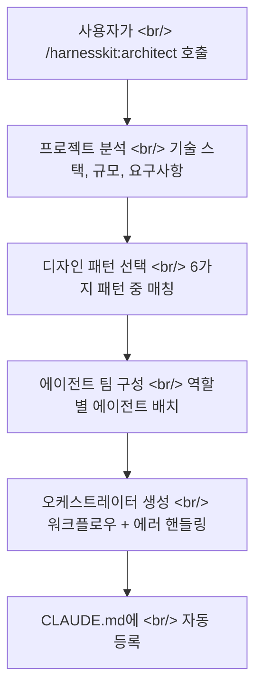
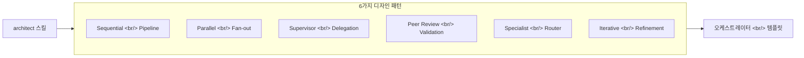
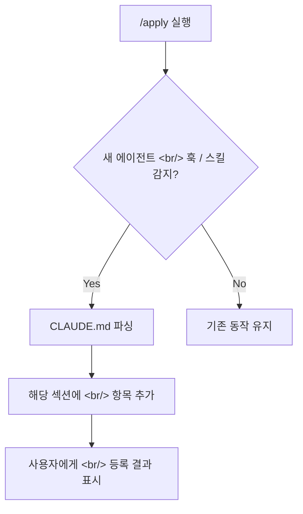

## 개요

[이전 글: #4 — 마켓플레이스 안정화와 v0.3.0 릴리스](/ko/posts/2026-04-02-harnesskit-dev4/)

이번 #5에서는 10개 커밋에 걸쳐 HarnessKit의 핵심 스킬인 `/harnesskit:architect`를 추가하고 v0.4.0을 릴리스했다. 멀티 에이전트 팀을 설계하는 architect 스킬, 6가지 에이전트 디자인 패턴 레퍼런스, 오케스트레이터 템플릿 문서를 새로 만들었다. 또한 `/apply`가 커스텀 에이전트, 훅, 스킬을 CLAUDE.md에 자동 등록하는 기능도 구현했다.

<!--more-->

---

## 경쟁 플러그인 분석에서 출발

세션 초반에 revfactory/harness라는 경쟁 플러그인과 HarnessKit을 비교 분석했다. 두 플러그인이 제공하는 기능 범위, 접근 방식, 차별점을 정리한 뒤, HarnessKit에 부족한 영역을 식별했다. 그 결과 "복잡한 프로젝트를 위한 멀티 에이전트 팀 설계" 기능이 가장 큰 갭으로 드러났고, 이것이 architect 스킬의 출발점이 되었다.

---

## /harnesskit:architect — 에이전트 팀 설계 스킬

### 개념

`/harnesskit:architect`는 복잡한 프로젝트를 분석해 멀티 에이전트 팀 구조를 설계하는 스킬이다. 프로젝트의 기술 스택, 규모, 요구사항을 파악한 뒤 적절한 에이전트 조합과 오케스트레이션 패턴을 추천한다.

### 구현 과정

먼저 커맨드 등록(`/harnesskit:architect`)을 추가해 자동완성을 활성화했다. 이후 스킬 본체를 구현하면서 오케스트레이터 에이전트에 구체적인 워크플로우와 에러 핸들링 로직을 보강했다. 테스트 스위트도 함께 작성해 스킬과 레퍼런스 문서의 정합성을 검증했다.

---

## 에이전트 디자인 패턴 레퍼런스

architect 스킬이 참조하는 6가지 디자인 패턴을 레퍼런스 문서로 정리했다.

각 패턴별로 적합한 프로젝트 유형, 에이전트 구성, 통신 방식을 명시했다. 오케스트레이터 템플릿 문서도 별도로 작성해, 각 패턴에 대응하는 구체적인 구현 템플릿을 제공했다.

---

## CLAUDE.md 자동 등록 — /apply의 진화

### 문제

커스텀 에이전트, 훅, 스킬을 만든 뒤 CLAUDE.md에 수동으로 등록하는 과정이 번거롭고 누락되기 쉬웠다. 등록이 누락되면 Claude Code가 해당 에이전트나 훅의 존재를 인식하지 못한다.

### 해결

`/harnesskit:apply`에 자동 등록 기능을 추가했다. `/apply`가 개선 제안을 적용할 때, 새로 생성된 에이전트, 훅, 스킬을 감지해 CLAUDE.md의 적절한 섹션에 자동으로 등록한다.

---

## v0.4.0 릴리스

`plugin.json` 버전을 0.4.0으로 올리면서 홈페이지 URL, 작성자 URL, 에이전트 관련 키워드도 함께 추가했다. 메타데이터가 충실해야 마켓플레이스 검색에서 노출이 잘 되기 때문이다.

---

## feature_list.json 구축

HarnessKit의 전체 기능 목록을 `feature_list.json`에 체계적으로 정리하고 저장 구현을 완료했다. 이 파일은 `/harnesskit:status`에서 진행 상황 추적, `/harnesskit:insights`에서 기능 분석 등 여러 스킬에서 공통으로 참조하는 기반 데이터가 된다.

---

## 커밋 로그

| 메시지 | 변경 |
|--------|------|
| docs: update installation instructions for plugin menu workflow | docs |
| docs: add agent design patterns reference guide | docs |
| docs: add orchestrator templates reference for 6 patterns | docs |
| feat: register /harnesskit:architect command for autocomplete | commands |
| enhance: orchestrator agent with concrete workflows and error handling | skills |
| chore: bump to v0.4.0, add homepage/author URL and agent keywords | plugin |
| feat: add /harnesskit:architect skill for agent team design | skills |
| feat: auto-register custom agents/hooks/skills in CLAUDE.md via /apply | skills |
| test: add test suite for /harnesskit:architect skill and references | tests |
| feat: populate feature_list.json with HarnessKit features + save implementation | data |

---

## 인사이트

경쟁 플러그인 분석에서 시작해 architect 스킬을 만들기까지, "부족한 것을 찾고 채우는" 과정이 이번 세션의 핵심이었다. 멀티 에이전트 오케스트레이션은 개념적으로는 단순하지만, 실제 구현에서는 디자인 패턴 분류, 템플릿 문서화, 자동 등록까지 연쇄적으로 필요해진다. 특히 자동 등록 기능은 "도구를 만들었지만 등록을 잊어서 못 쓰는" 문제를 근본적으로 해결한다. 도구가 스스로를 등록하게 만드는 것 — 이것이 DX(Developer Experience)의 본질이다.
