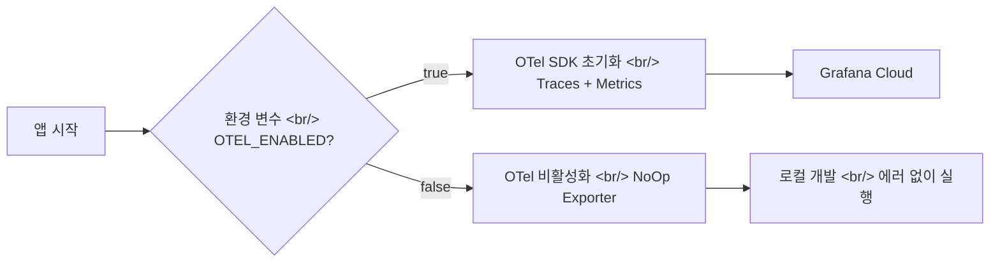

[이전 글: Hybrid Image Search 개발기 #10](/ko/posts/2026-04-07-hybrid-search-dev10/)에서 OTel 메트릭 대시보드를 구축하고 파이프라인 성능을 최적화했다. 이번에는 tone/angle 인젝션 기능의 UX를 대폭 개선하고, EC2 인스턴스를 스케일업한 뒤 배포 자동화 스크립트까지 작성했다.

<!--more-->

## 이번 회차 커밋 로그

| 순서 | 유형 | 내용 |
|:---:|:---:|---|
| 1 | chore | Gemini API 타임아웃을 2분에서 3분으로 증가 |
| 2 | fix | 로컬 환경에서 OTel 익스포터 비활성화하여 연결 에러 해소 |
| 3 | feat | tone/angle 인젝션 재생성 시 카테고리 변경 허용 |
| 4 | fix | EC2 인스턴스 타입을 t3.medium에서 m7g.2xlarge로 변경 |
| 5 | feat | tone/angle 자동 인젝션 활성화/비활성화 토글 추가 |
| 6 | feat | 재생성 시 원본의 인젝션 토글 상태를 자동 반영 |
| 7 | feat | 인젝션 없는 이미지에 인젝션 추가 시 비율 컨트롤 표시 |
| 8 | feat | EC2 셋업 및 배포 스크립트 추가 |

## 배경: 프로덕션을 향한 두 갈래 작업

\#10에서 성능 병목을 잡으면서 두 가지 숙제가 남았다.

1. **UX 문제** — tone/angle 인젝션 기능이 있지만, 재생성할 때 카테고리를 바꿀 수 없고, 토글도 없어서 사용성이 떨어졌다
2. **인프라 문제** — t3.medium으로는 이미지 생성 파이프라인의 리소스 요구를 감당하기 어려웠고, 배포 과정도 수동이었다

이번 회차는 이 두 가지를 병렬로 해결한 기록이다.

## 1단계: Gemini API 타임아웃과 OTel 로컬 에러 수정

### 타임아웃 2분 → 3분

\#10에서 2분 타임아웃을 걸었는데, 실제 운영 중에 Gemini API가 복잡한 이미지 생성 요청에서 2분을 초과하는 경우가 발생했다. 정상적인 처리 중인데 타임아웃으로 잘리는 건 비용 낭비이므로, 3분으로 늘렸다.

### OTel 로컬 환경 연결 에러

OTel 익스포터가 로컬 개발 환경에서도 Grafana Cloud 엔드포인트에 연결을 시도해서 에러 로그가 쏟아지고 있었다. 로컬에서는 OTel 익스포터를 비활성화하도록 조건 분기를 추가했다.

이렇게 하면 환경 변수 하나로 로컬과 프로덕션의 OTel 동작을 깔끔하게 분리할 수 있다.

## 2단계: Tone/Angle 인젝션 UX 개선

이미지 검색 결과에 tone(색조)과 angle(시점)을 주입해서 새로운 이미지를 생성하는 기능이 있다. 기존에는 한 번 생성하면 수정하기 불편했는데, 세 가지 UX 개선을 진행했다.

### 재생성 시 카테고리 변경 허용

기존에는 인젝션을 적용해서 이미지를 재생성할 때, 원래 이미지의 카테고리가 고정되어 있었다. 사용자가 "이 이미지를 다른 카테고리 스타일로 다시 만들어 보고 싶다"고 할 때 대응할 수 없었다.

카테고리 선택 드롭다운을 재생성 모드에서도 활성화하여, tone/angle은 유지하면서 카테고리만 바꿔서 재생성할 수 있게 했다.

### 인젝션 활성화/비활성화 토글

tone/angle 인젝션이 항상 자동으로 적용되는 것이 때로는 불편했다. 토글 스위치를 추가해서 사용자가 인젝션 적용 여부를 직접 제어할 수 있게 했다.

### 재생성 시 원본 토글 상태 자동 반영

인젝션이 적용된 이미지를 재생성할 때, 토글이 기본값(off)으로 초기화되면 원본과 다른 결과가 나온다. 재생성 시 원본 이미지의 인젝션 토글 상태를 자동으로 복원하도록 했다.

### 인젝션 없는 이미지에 인젝션 추가 시

인젝션 없이 생성된 이미지에 나중에 인젝션을 추가하려고 할 때, 비율 조절 컨트롤이 표시되지 않는 문제가 있었다. 인젝션 토글을 켜면 비율 슬라이더가 함께 나타나도록 수정했다.

## 3단계: EC2 인스턴스 스케일업과 배포 자동화

### t3.medium → m7g.2xlarge

\#10에서 확인한 리소스 사용량 데이터를 바탕으로, 인스턴스 타입을 변경했다.

| 항목 | t3.medium | m7g.2xlarge |
|---|---|---|
| vCPU | 2 | 8 |
| RAM | 4 GB | 32 GB |
| 아키텍처 | x86_64 | ARM (Graviton3) |
| 비용 효율 | 범용 | ARM 기반으로 동일 성능 대비 저렴 |

Graviton3 기반 m7g는 x86 대비 가격 대비 성능이 좋고, Python 워크로드와의 호환성도 검증되어 있다. 이미지 생성 파이프라인이 CPU/RAM을 많이 쓰는 만큼, 충분한 여유를 확보했다.

### EC2 셋업 및 배포 스크립트

수동으로 SSH 접속해서 환경을 구성하던 과정을 스크립트로 자동화했다.

- **셋업 스크립트** — Python, 시스템 패키지 설치, 가상 환경 구성, 환경 변수 설정
- **배포 스크립트** — 최신 코드 pull, 의존성 업데이트, 서비스 재시작

이 스크립트들이 있으면 새 인스턴스를 띄울 때도 빠르게 환경을 복제할 수 있고, 코드 업데이트 배포도 한 줄 명령으로 끝난다.

## 정리

| 주제 | 요약 |
|---|---|
| Gemini 타임아웃 | 2분 → 3분으로 조정, 정상 처리 중 타임아웃 방지 |
| OTel 로컬 에러 | 환경 변수 기반으로 로컬에서 OTel 익스포터 비활성화 |
| 인젝션 UX | 카테고리 변경, 토글 추가, 원본 상태 복원, 비율 컨트롤 표시 |
| EC2 스케일업 | t3.medium → m7g.2xlarge (Graviton3, 8 vCPU, 32 GB) |
| 배포 자동화 | EC2 셋업 + 배포 스크립트 추가 |
