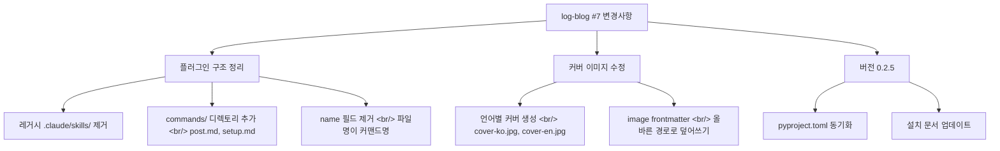

## 개요

[이전 글: log-blog 개발기 #6](/ko/posts/2026-04-03-log-blog-dev6/)

#6에서 marketplace 마이그레이션과 CDP 신뢰성을 정리했다면, 이번 #7은 플러그인 구조를 최종 정리하는 회차다. `.claude/skills/` 디렉토리에 남아 있던 레거시 스킬 파일을 제거하고 플러그인의 `skills/` 디렉토리로 완전 이전했다. 슬래시 커맨드 자동완성을 위해 `commands/` 디렉토리를 추가했고, 이중 언어 블로그에서 커버 이미지가 언어별로 분리 생성되도록 수정했다. 버전은 0.2.5로 올렸다.

<!--more-->

---



---

## 플러그인 구조 정리

### 배경: 이중 경로 문제

log-blog는 원래 `.claude/skills/` 디렉토리에 스킬 파일을 두고 Claude Code가 이를 읽어 동작하는 구조였다. #6에서 marketplace 기반 플러그인으로 전환하면서 스킬 파일이 플러그인의 `skills/` 디렉토리로 이동했다. 그런데 프로젝트 루트의 `.claude/skills/`가 삭제되지 않고 남아 있었다. 두 곳에 같은 스킬이 존재하면 Claude Code가 어느 쪽을 우선할지 모호해지고, 버전 불일치가 발생할 수 있다.

### 해결: 레거시 스킬 제거

`.claude/skills/` 디렉토리를 통째로 삭제하고, 플러그인의 `skills/post/SKILL.md`와 `skills/setup/SKILL.md`만 남겼다. 이제 스킬의 단일 진실 공급원(single source of truth)은 플러그인 디렉토리다.

### commands/ 디렉토리 추가

Claude Code 플러그인은 `commands/` 디렉토리의 마크다운 파일을 슬래시 커맨드로 등록한다. 파일명이 곧 커맨드명이 된다:

```
commands/
├── post.md     → /logblog:post
└── setup.md    → /logblog:setup
```

처음에는 각 파일에 `name:` 필드를 YAML frontmatter로 넣었는데, 이것이 오류를 일으켰다. 커맨드명은 파일명에서 자동 파생되므로 `name` 필드가 불필요했다. 제거 후 정상 동작을 확인했다.

이 변경으로 사용자가 `/logblog:`을 입력하면 자동완성 목록에 `post`와 `setup`이 나타난다. 기존에는 스킬 이름을 정확히 기억해야 했다.

---

## 다국어 커버 이미지 수정

### 문제: 언어별 커버 파일명

이중 언어 블로그에서 한국어 포스트와 영어 포스트가 동일한 `cover.jpg` 경로를 가리키고 있었다. 커버 이미지에 제목 텍스트를 포함하는 경우, 한국어 제목이 들어간 커버와 영어 제목이 들어간 커버가 구분되어야 한다.

### 해결

커버 이미지 생성기에 `language` 파라미터를 전달하도록 수정했다. 언어가 지정되면 파일명이 `cover-ko.jpg`, `cover-en.jpg`로 분리된다:

```
static/images/posts/2026-04-08-example/
├── cover-ko.jpg    ← 한국어 제목
└── cover-en.jpg    ← 영어 제목
```

동시에 `image:` frontmatter도 올바른 언어별 경로로 덮어쓰도록 수정했다. 이전에는 커버를 생성해도 frontmatter의 경로가 갱신되지 않는 버그가 있었다.

---

## 버전 0.2.5와 설치 문서

`pyproject.toml`의 버전을 0.2.5로 동기화하고, 설치 문서를 플러그인 메뉴 워크플로에 맞게 업데이트했다. 이전 문서는 글로벌 설치 방식을 안내하고 있었는데, 이제 marketplace에서 설치하는 흐름으로 교체했다.

---

## 커밋 로그

| 메시지 | 변경 |
|--------|------|
| fix: overwrite image frontmatter with correct cover path and bump to 0.2.5 | 커버 경로 + 버전 |
| fix: pass language to cover image generator for per-language filenames | 다국어 커버 |
| chore: sync pyproject.toml version to 0.2.5 | 버전 동기화 |
| fix: remove old .claude/skills/ — use plugin skills/ directory only | 레거시 제거 |
| feat: add commands/ directory for /logblog:post and /logblog:setup slash commands | 커맨드 추가 |
| fix: remove name field from commands — filename is the command name | name 필드 제거 |
| docs: update installation instructions for plugin menu workflow | 설치 문서 |

---

## 인사이트

이번 회차는 커밋 7개, 코드 변경량은 적지만 "구조를 확정하는" 성격의 작업이었다. 레거시 `.claude/skills/`를 지우는 건 한 줄짜리 결정인데, 이를 미루면 두 디렉토리 사이에서 어느 쪽이 진짜인지 매번 확인해야 한다. 정리 작업은 새 기능보다 눈에 띄지 않지만, 하지 않으면 다음 기능 추가 때 혼란이 쌓인다.

`commands/` 디렉토리의 `name` 필드 삽입-삭제 사이클은 전형적인 "문서보다 먼저 코드를 작성한" 실수였다. 플러그인의 커맨드 등록 규칙을 먼저 확인했다면 한 커밋으로 끝났을 일이다. 빠르게 고쳤지만, 불필요한 커밋이 히스토리에 남았다.

다국어 커버 이미지는 작은 변경이지만 UX 효과가 크다. SNS 공유 시 og:image로 커버가 사용되는데, 영어 포스트에 한국어 제목 커버가 나오면 독자에게 혼란을 준다. 언어별 분리는 이중 언어 블로그의 필수 요소였다.
