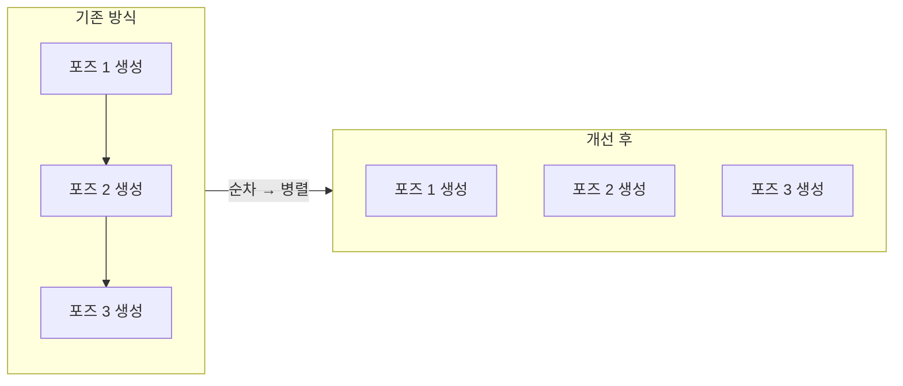
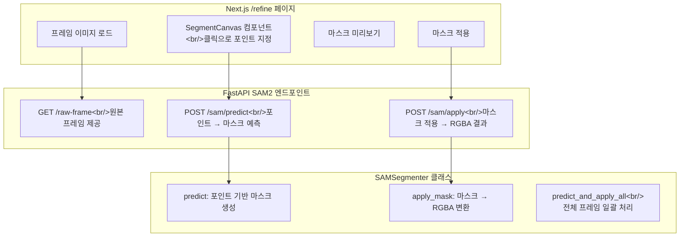

[이전 글: PopCon 개발기 #3](/ko/posts/2026-04-07-popcon-dev3/)

## 개요

PopCon 개발기 네 번째 글이다. 이번에는 두 가지 큰 변화가 있었다. 첫째, VEO 3의 비용 문제로 영상 생성 모델을 Alibaba DashScope Wan 2.2로 교체했다. 둘째, rembg의 배경 제거 품질이 만족스럽지 않아서 SAM 2.1 기반 인터랙티브 세그멘테이션을 직접 구현했다. 사용자가 클릭으로 전경 객체를 지정하면 SAM이 정밀하게 마스크를 생성하는 방식이다.

<!--more-->

## 영상 생성 모델 교체: VEO 3 → DashScope Wan 2.2

### 비용 문제

VEO 3는 품질은 좋지만 비용이 너무 높았다. 이모지 하나에 여러 액션을 생성해야 하는 PopCon 특성상, 영상 생성 비용이 빠르게 누적된다.

대안을 조사했다:

| 옵션 | 장점 | 단점 |
|------|------|------|
| fal.ai Wan 2.1 | 간편한 API | 가격 대비 품질 애매 |
| RunPod GPU | 자유도 높음 | 인프라 관리 필요 |
| **Alibaba DashScope Wan 2.2** | **가격 최저, 품질 양호** | 중국 API |

결국 DashScope Wan 2.2를 선택했다. 가격 대비 품질이 가장 좋았다.

### 함께 진행한 개선

모델 교체와 함께 여러 개선을 진행했다:

- **프론트엔드에서 액션 선택**: 사용자가 원하는 액션만 골라서 생성할 수 있게 변경
- **backbone 생성 제거**: Wan 2.2 전환으로 불필요해진 중간 단계 삭제
- **end pose 생성 제거**: 불필요한 단계를 없애 전체 처리 시간 단축
- **액션 간 throttle 제거**: 불필요한 대기 시간 삭제

## 캐릭터 생성 개선

### 전신 캐릭터 강제

AI 캐릭터 생성 시 상반신만 나오는 경우가 있었다. 이러면 액션별로 하반신이 달라져서 일관성이 떨어진다. 프롬프트를 수정해서 항상 전신이 나오도록 강제했다.

### 레퍼런스 이미지 지원

캐릭터 생성 시 참고할 이미지를 업로드할 수 있게 했다. 기존 캐릭터나 스타일을 기반으로 새 캐릭터를 만들 때 유용하다.

### 기타 개선

- **다양한 이미지 포맷 지원**: WebP, GIF, BMP, TIFF 업로드 가능
- **업로드 캐릭터 배경 제거 옵션**: 직접 업로드한 이미지에도 배경 제거 적용 가능
- **미디어 프리뷰 모달**: 이모지 카드 클릭 시 원본 크기로 미리보기
- **에셋 다운로드 링크**: 생성된 에셋을 바로 다운로드

## 성능 최적화

포즈 생성을 순차에서 병렬로 변경하고, 불필요한 시작 지연과 액션 간 throttle을 제거했다. end pose 생성도 없앴다. 체감 속도가 크게 개선되었다.

## SAM 2.1 인터랙티브 배경 제거

### rembg의 한계

[이전 글](/ko/posts/2026-04-07-popcon-dev3/)에서 rembg로 배경 제거를 구현했지만, 품질 문제가 있었다:

- 복잡한 배경에서 전경 경계가 부정확
- 캐릭터의 일부가 잘리거나, 배경이 남는 경우 빈번
- 자동화된 방식의 한계 — 어떤 부분이 전경인지 모델이 판단하기 어려운 케이스 다수

### SAM 2.1 선택 이유

Meta의 SAM 2.1(Segment Anything Model)은 사용자가 클릭한 포인트를 기반으로 세그멘테이션하는 모델이다. 핵심 장점:

- **인터랙티브**: 사용자가 전경/배경을 직접 지정 → 정확도 향상
- **M1 Mac에서 동작**: 처음에는 RunPod 같은 클라우드 GPU를 고려했지만, PyTorch MPS 백엔드로 M1 Mac에서도 충분히 동작한다는 걸 확인
- **ultralytics 통합**: `ultralytics` 패키지를 통해 간편하게 사용 가능

### 아키텍처

### 워크플로우 변경

기존에는 영상 생성 → 프레임 추출 → 배경 제거가 자동으로 이어졌다. SAM 도입 후에는 중간에 사용자 개입 단계가 추가된다:

1. 영상 생성 → 프레임 추출 (worker stage 3에서 완료)
2. 상태가 `awaiting_refinement`으로 변경
3. 사용자가 `/refine` 페이지에서 클릭으로 배경 제거
4. 완료 후 최종 에셋 생성

`awaiting_refinement` 상태를 새로 추가해서 프론트엔드에서 "배경 제거 대기 중" 상태를 표시하고, Refine Backgrounds 링크를 노출한다. ProgressTracker에서는 이 상태를 생성 완료로 취급한다.

### 구현 세부사항

**백엔드 — SAMSegmenter 클래스**:
- `predict`: 클릭 포인트를 받아 마스크 예측
- `apply_mask`: 예측된 마스크를 원본 이미지에 적용하여 RGBA 이미지 생성
- `predict_and_apply_all`: 전체 프레임에 대해 일괄 처리

**백엔드 — API 엔드포인트**:
- `GET /raw-frame`: 원본 프레임 이미지 제공
- `POST /sam/predict`: 포인트 기반 마스크 예측, RGBA 마스크 반환
- `POST /sam/apply`: 마스크를 프레임에 적용

**프론트엔드 — SegmentCanvas 컴포넌트**:
- 캔버스에 프레임 이미지를 렌더링
- 클릭 이벤트로 포인트 좌표를 수집
- SAM API를 호출해서 마스크 미리보기 표시
- 확정 시 마스크 적용 API 호출

## 커밋 로그

| 메시지 | 변경 사항 |
|--------|----------|
| feat: replace VEO 3 with DashScope Wan 2.2 and remove backbone generation | 영상 생성 모델 교체, backbone 단계 제거 |
| feat: pass selected action names from frontend to backend | 프론트엔드에서 액션 선택 전달 |
| fix: clear character preview when switching between upload and generate modes | 모드 전환 시 프리뷰 초기화 |
| feat: add optional reference image support for AI character generation | 레퍼런스 이미지 업로드 지원 |
| feat: support WebP, GIF, BMP, and TIFF image uploads | 다양한 이미지 포맷 지원 |
| feat: add background removal option for uploaded character images | 업로드 이미지 배경 제거 옵션 |
| perf: remove end pose generation and inter-action throttles | 불필요한 단계 및 대기 제거 |
| feat: enforce full-body character generation and add asset download links | 전신 생성 강제, 다운로드 링크 |
| fix: add media preview modal with close button to emoji cards | 미디어 프리뷰 모달 추가 |
| perf: parallelize pose generation and eliminate startup delay | 포즈 생성 병렬화 |
| docs: add SAM2 interactive background removal design spec | SAM2 설계 문서 |
| docs: add SAM2 interactive background removal implementation plan | SAM2 구현 계획 문서 |
| feat: add ultralytics SAM 2.1 dependency and sam_model config | SAM 2.1 의존성 추가 |
| feat: add awaiting_refinement status to models | awaiting_refinement 상태 추가 |
| refactor: simplify process_video to extract-only (no bg removal) | 영상 처리를 추출만으로 단순화 |
| refactor: worker stage 3 extracts frames only, ends at awaiting_refinement | worker 3단계를 프레임 추출까지만 |
| feat: add SAMSegmenter class with predict, apply_mask, predict_and_apply_all | SAMSegmenter 핵심 클래스 구현 |
| feat: add SAM2 endpoints and raw frame serving to FastAPI | SAM2 API 엔드포인트 추가 |
| feat: add SAM embed/predict/apply API functions | 프론트엔드 SAM API 함수 |
| feat: add SegmentCanvas click-to-segment component | 클릭 세그멘테이션 캔버스 컴포넌트 |
| feat: add /refine page for interactive SAM2 background removal | /refine 페이지 구현 |
| feat: add Refine Backgrounds link and awaiting_refinement status display | Refine 링크 및 상태 표시 |
| feat: treat awaiting_refinement as generation-complete in ProgressTracker | ProgressTracker 상태 처리 |
| fix: address code review findings | 코드 리뷰 반영 |
| merge: integrate main refactors with SAM2 interactive bg removal | 메인 브랜치 리팩토링 통합 |
| merge: integrate main branch changes with SAM2 implementation | 메인 브랜치 변경사항 통합 |
| fix: return RGBA mask from SAM predict endpoint | SAM predict에서 RGBA 마스크 반환 |

## 다음 단계

- SAM 세그멘테이션 결과를 전체 프레임에 일괄 적용하는 UX 개선
- 최종 APNG/GIF 에셋 생성 파이프라인 연결
- 배포 환경에서의 SAM 모델 로딩 최적화

---

*이 글은 PopCon 시리즈의 네 번째 글입니다. 다음 글에서 계속됩니다.*
