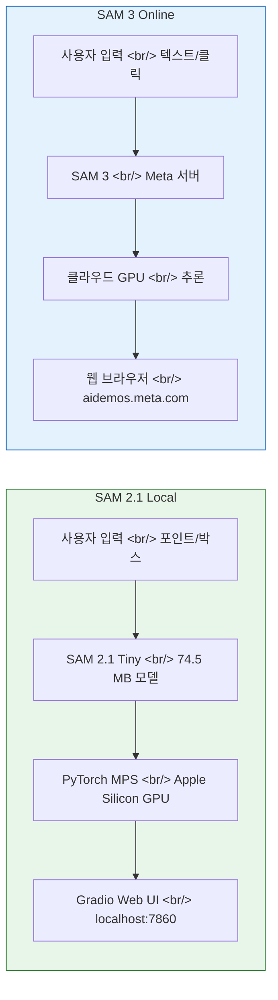

## Overview

Meta의 Segment Anything Model(SAM)은 이미지 세그멘테이션의 판도를 바꾼 모델이다. SAM 2.1은 로컬에서 직접 실행할 수 있고, 최신 SAM 3는 Meta의 온라인 플레이그라운드에서 체험할 수 있다. 이 글에서는 Apple Silicon Mac에서 SAM 2.1을 MPS GPU 가속으로 돌려보고, SAM 3 온라인 데모와 어떤 차이가 있는지 비교한다.

<!--more-->

## SAM 2.1 로컬 실행 vs SAM 3 온라인 — 아키텍처 비교



## SAM 2.1 on Apple Silicon Mac

[ice-ice-bear/sam2-mac-test](https://github.com/ice-ice-bear/sam2-mac-test) 레포지토리는 SAM 2.1을 Apple Silicon Mac에서 바로 실행할 수 있도록 구성되어 있다.

### 주요 특징

- **MPS GPU 가속**: PyTorch의 Metal Performance Shaders 백엔드를 사용해 M1/M2/M3/M4 칩의 GPU로 추론
- **Multi-point Segmentation**: 포함(include)/제외(exclude) 포인트를 찍어 세밀한 세그멘테이션 가능
- **Segment Everything 모드**: 이미지 내 모든 객체를 한 번에 세그멘테이션
- **Gradio Web UI**: 브라우저에서 바로 사용할 수 있는 인터페이스
- **SAM 2.1 Tiny 모델**: 74.5 MB의 경량 모델이 자동 다운로드됨

### 빠른 시작

```bash
git clone https://github.com/ice-ice-bear/sam2-mac-test.git
cd sam2-mac-test
uv sync
uv run python app.py
```

브라우저에서 `http://127.0.0.1:7860`으로 접속하면 Gradio UI가 열린다.

### 성능

M1 MacBook 기준 측정 결과:

| 작업 | 소요 시간 |
|------|-----------|
| 단일 포인트 세그멘테이션 | ~1.6초 |
| 멀티 포인트 업데이트 | ~1.5초/회 |

Tiny 모델을 사용하므로 메모리 부담이 적고, MPS 가속 덕분에 CPU 대비 상당한 속도 향상을 얻을 수 있다.

### 기술 스택

- **SAM 2.1**: Ultralytics 라이브러리를 통해 사용
- **PyTorch MPS**: Apple Silicon GPU 백엔드
- **Gradio**: 웹 UI 프레임워크
- **uv**: 패키지 매니저

## Meta SAM 3 온라인 플레이그라운드

Meta는 최신 SAM 3를 [aidemos.meta.com/segment-anything](https://aidemos.meta.com/segment-anything)에서 온라인 데모로 제공하고 있다.

### SAM 3의 차별화 기능

- **텍스트 프롬프트 세그멘테이션**: "find animal", "find person" 같은 자연어로 객체를 찾을 수 있음
- **원클릭 이펙트**: 블러, 복제, 채도 제거 등을 클릭 한 번으로 적용
- **모션 트레일**: 세그멘테이션된 객체에 모션 효과 추가
- **컨투어 라인 / 바운딩 박스**: 다양한 시각화 옵션
- **비디오 세그멘테이션**: 영상에서 객체를 추적하는 Track Anything 기능
- **커뮤니티 템플릿**: 다른 사용자가 만든 이펙트를 바로 사용 가능

## SAM 2.1 Local vs SAM 3 Online 비교

| 항목 | SAM 2.1 Local | SAM 3 Online |
|------|--------------|--------------|
| 실행 환경 | 로컬 Mac (Apple Silicon) | Meta 클라우드 서버 |
| GPU | MPS (M1/M2/M3/M4) | 클라우드 GPU |
| 모델 크기 | Tiny 74.5 MB | 풀사이즈 (비공개) |
| 입력 방식 | 포인트 클릭, 박스 | 텍스트, 클릭, 박스 |
| 텍스트 프롬프트 | 미지원 | 지원 |
| 이펙트 후처리 | 없음 | 블러, 복제, 채도 등 |
| 비디오 지원 | 미지원 | 지원 |
| 프라이버시 | 데이터가 로컬에 유지 | Meta 서버로 업로드 |
| 인터넷 필요 | 모델 다운로드 시에만 | 항상 필요 |
| 커스터마이징 | 코드 수정 자유 | 제한적 |

## 어떤 걸 선택할까

**SAM 2.1 로컬 실행**이 적합한 경우:
- 민감한 이미지를 외부 서버에 올리고 싶지 않을 때
- 자동화 파이프라인에 세그멘테이션을 통합하고 싶을 때
- 모델을 직접 수정하거나 확장하고 싶을 때
- 오프라인 환경에서 작업해야 할 때

**SAM 3 온라인 데모**가 적합한 경우:
- 텍스트 프롬프트로 빠르게 객체를 찾고 싶을 때
- 블러, 복제 같은 이펙트를 바로 적용하고 싶을 때
- 비디오 세그멘테이션이 필요할 때
- 설치 없이 바로 체험하고 싶을 때

## 마무리

SAM 2.1의 로컬 실행은 Apple Silicon Mac 사용자에게 접근성이 높은 선택지다. 74.5 MB Tiny 모델로도 실용적인 세그멘테이션이 가능하고, MPS 가속으로 GPU를 활용할 수 있다. SAM 3 온라인 데모는 텍스트 프롬프트와 다양한 이펙트로 한 단계 더 진화한 경험을 제공한다. 용도에 따라 로컬과 클라우드를 적절히 조합해서 쓰면 된다.

### 참고 링크

- [ice-ice-bear/sam2-mac-test (GitHub)](https://github.com/ice-ice-bear/sam2-mac-test)
- [Meta AI Demos — Segment Anything](https://aidemos.meta.com/segment-anything)
- [Ultralytics SAM 2 Documentation](https://docs.ultralytics.com/models/sam-2/)
- [PyTorch MPS Backend](https://pytorch.org/docs/stable/notes/mps.html)
