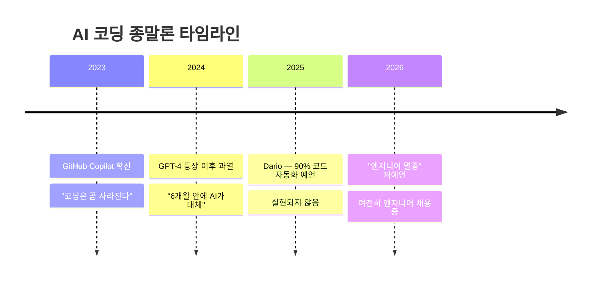
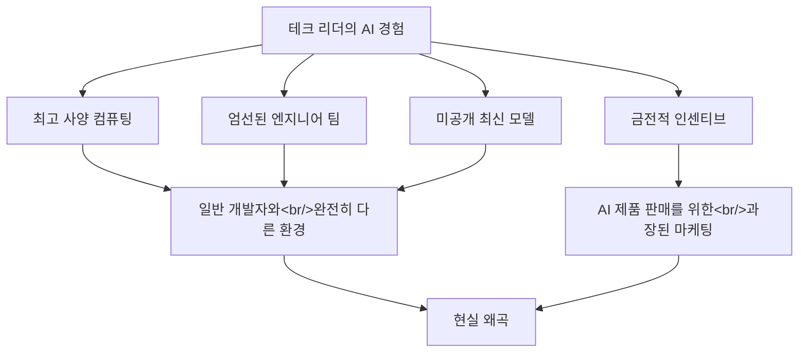
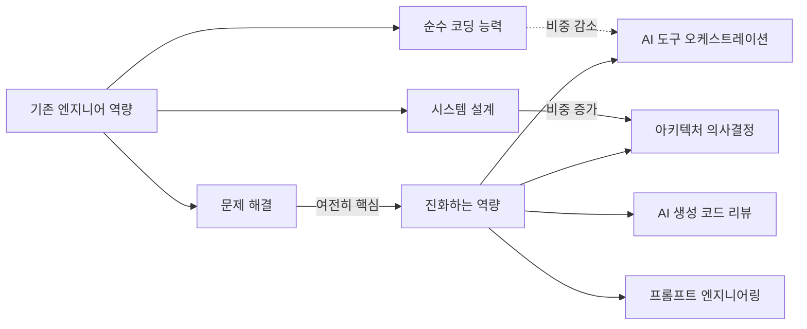

## 개요

6개월마다 반복되는 예언이 있다. "AI가 코딩을 대체할 것이다." Dario Amodei, Jensen Huang, Sam Altman 등 테크 리더들이 앞다투어 소프트웨어 엔지니어링의 종말을 선언한다. Cole Medin은 최근 영상에서 이 주장들을 데이터와 논리로 해부했다. AI 코딩 도구를 매일 실무에서 사용하는 입장에서, 그의 분석에 현장 경험을 더해 정리해본다.

<!--more-->

## 6개월 주기의 예언 패턴

Cole이 지적한 가장 핵심적인 패턴은 이것이다 — 코딩의 죽음은 항상 "6개월 후"다.

2025년 3월, Dario Amodei는 AI가 6개월 안에 코드의 90%를 작성할 것이라 했다. 그 6개월이 지났지만 실현되지 않았다. 이제는 2026년에 엔지니어가 멸종할 수 있다고 말한다. Amazon CEO, Microsoft AI CEO도 비슷한 톤이다.

이 패턴은 "핵융합 발전은 항상 30년 후"라는 농담과 닮아 있다. 다만 AI 코딩 도구가 실제로 유용하다는 점에서 완전한 허풍은 아니다. 문제는 **"대체"와 "보조"의 차이**를 무시하는 데 있다.

## 테크 리더들은 왜 과장하는가

Cole의 분석 중 가장 날카로운 부분이다. 테크 리더들이 편향될 수밖에 없는 구조적 이유가 있다.

매일 Claude Code를 사용하면서 느끼는 것은, 도구의 성능이 **환경에 극도로 의존적**이라는 점이다. 잘 구조화된 프로젝트에서는 놀라운 결과를 보여주지만, 레거시 코드베이스나 복잡한 비즈니스 로직 앞에서는 여전히 사람의 판단이 필수다. 테크 리더들은 전자의 경험만으로 후자를 일반화한다.

## AI 코딩의 실제 능력과 한계

실무에서 AI 코딩 도구를 사용하면 능력의 경계가 명확하게 보인다.

### AI가 잘하는 것

- **보일러플레이트 코드** — 반복적인 CRUD, 설정 파일, 타입 정의
- **스캐폴딩** — 프로젝트 초기 구조 잡기
- **테스트 생성** — 기존 코드에 대한 유닛 테스트 작성
- **문서화** — 코드 주석, README, API 문서
- **단순 기능 구현** — 명확한 스펙이 있는 독립적인 기능

### AI가 어려워하는 것

- **복잡한 아키텍처 결정** — 시스템 전체를 보는 설계 판단
- **난해한 버그 디버깅** — 여러 레이어에 걸친 문제 추적
- **비즈니스 컨텍스트 이해** — 도메인 지식이 필요한 판단
- **대규모 코드베이스 유지보수** — 수십만 줄의 코드 간 의존성 파악

AI 코딩 도구를 매일 쓰면서 체감하는 비율은, 내 작업의 약 40~50%를 AI가 가속화해준다는 것이다. 90%가 아니다. 그리고 그 40~50%도 내가 올바른 방향을 제시하고, 결과를 검증하고, 컨텍스트를 제공해야 가능하다.

## 채택 격차 — 가능성과 현실 사이

Cole이 강조한 또 하나의 핵심은 **채택 격차(adoption gap)**다.

AI 코딩 도구의 기술적 가능성과 실제 기업 현장의 도입 수준 사이에는 거대한 간극이 존재한다. 대부분의 기업은 아직 기본적인 통합조차 시도 단계에 있다.

- **보안 우려** — 코드가 외부 API로 전송되는 것에 대한 기업의 불안
- **컴플라이언스** — 금융, 의료, 공공 분야의 규제 장벽
- **레거시 시스템** — 20년 된 COBOL이나 독자 프레임워크에는 AI 도구가 무력
- **조직 관성** — 도구 도입에 필요한 교육, 워크플로우 변경, 문화 전환

스타트업과 개인 개발자는 빠르게 AI 도구를 도입하지만, 소프트웨어 산업의 대부분을 차지하는 엔터프라이즈 영역은 느리다. 이 격차를 무시하고 "곧 대체된다"고 말하는 것은 현실을 모르는 것이다.

## 변화의 실체 — 대체가 아닌 진화

소프트웨어 엔지니어링은 죽지 않는다. 진화하고 있을 뿐이다. Cole의 이 결론에 전적으로 동의한다.

실무에서 느끼는 변화는 이렇다. 예전에는 코드를 한 줄 한 줄 타이핑하는 데 시간의 60%를 썼다면, 지금은 **무엇을 만들지 설계하고, AI가 만든 것을 검증하는 데** 더 많은 시간을 쓴다. 코딩 능력이 불필요해진 게 아니라, 코딩 능력 위에 새로운 레이어가 추가된 것이다.

## 실용적 조언

Cole의 조언에 실무 경험을 더하면:

1. **당황하지 말 것** — 6개월마다 반복되는 종말론에 흔들리지 않기
2. **AI 도구를 익힐 것** — Claude Code, GitHub Copilot 등을 실제 프로젝트에 적용해보기
3. **시스템 설계에 투자할 것** — AI가 대체하기 가장 어려운 영역
4. **비즈니스 도메인 지식을 쌓을 것** — 코드보다 맥락이 중요해지는 시대
5. **AI 결과물을 비판적으로 평가하는 눈을 기를 것** — AI가 생성한 코드를 맹신하면 위험하다

AI 코딩 도구는 분명히 게임 체인저다. 하지만 게임을 끝내는 것이 아니라 규칙을 바꾸는 것이다. 적응하는 엔지니어는 이전보다 더 생산적이 될 것이고, 적응하지 못하는 엔지니어는 뒤처질 것이다. 하지만 "멸종"? 아직은 아니다.

---

**참고 영상**: [Cole Medin — Is Software Engineering Finally Dead?](https://www.youtube.com/watch?v=kM3V3MUFmA8)
