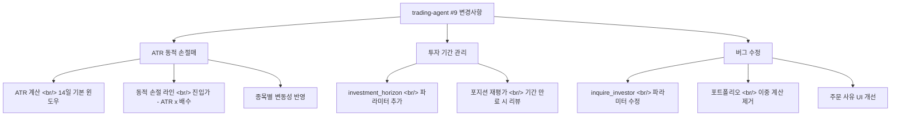
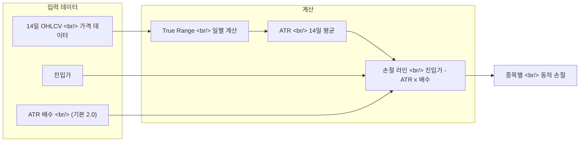

## 개요

[이전 글: trading-agent 개발기 #8](/ko/posts/2026-04-02-trading-agent-dev8/)

#8에서 5개 팩터 합성 스코어 시스템을 구축했다면, 이번 #9는 리스크 관리의 핵심인 **손절매(stop-loss)** 전략을 고도화하는 회차다. 고정 퍼센트 손절매를 **ATR(Average True Range) 기반 동적 손절매**로 교체하여 종목의 변동성에 맞게 손절 라인이 자동 조정된다. 동시에 **투자 기간(investment horizon)** 파라미터를 도입하고, 보유 포지션의 **재평가 로직**을 추가했다. 버그 수정으로는 투자자 조회 파라미터 오류와 포트폴리오 이중 계산 문제를 해결했다.

<!--more-->

---



---

## ATR 동적 손절매

### 배경: 고정 손절매의 한계

기존에는 진입가 대비 고정 퍼센트(예: -5%)로 손절 라인을 설정했다. 이 방식의 문제는 변동성이 다른 종목에 동일한 기준을 적용한다는 점이다. 일일 변동폭이 2%인 대형주에 -5% 손절은 합리적이지만, 일일 변동폭이 7%인 중소형주에 같은 기준을 적용하면 정상 등락에도 손절이 발동한다.

### ATR이란

**Average True Range(ATR)**는 일정 기간의 "진정한 변동폭(True Range)"을 평균한 기술적 지표다. True Range는 다음 세 값 중 최대값이다:

- 당일 고가 - 당일 저가
- |당일 고가 - 전일 종가|
- |당일 저가 - 전일 종가|

갭 상승이나 갭 하락도 반영하므로, 단순 고저 차이보다 실제 변동성을 더 정확히 포착한다.

### 구현

ATR 기반 손절 라인은 다음과 같이 계산된다:

```
손절 라인 = 진입가 - (ATR × 배수)
```

기본 ATR 윈도우는 14일, 기본 배수는 2.0이다. 일일 변동폭이 1,000원인 종목이면 손절 라인은 진입가에서 2,000원 아래에 설정된다. 변동폭이 3,000원인 종목이면 6,000원 아래로 자동 확장된다.



이 방식의 장점은 시장 상황 변화에도 적응한다는 점이다. 변동성이 높아지면 ATR이 올라가고 손절 라인이 넓어지며, 변동성이 낮아지면 손절 라인이 좁아진다.

---

## 투자 기간과 포지션 재평가

### 투자 기간 파라미터

에이전트 설정에 **investment_horizon** 파라미터를 추가했다. 이 값은 포지션을 보유할 예상 기간(일 단위)을 지정한다. 전문가 패널이 분석할 때 이 기간을 참조하여 단기 트레이딩인지 중기 투자인지에 맞는 의견을 제시한다.

### 포지션 재평가 로직

보유 중인 포지션이 투자 기간을 초과하거나 시장 상황이 변화했을 때, 해당 포지션을 자동으로 재평가 대상에 포함하는 로직을 추가했다. 재평가 시 현재 시점의 기술적 지표와 펀더멘털 데이터를 기반으로 HOLD/SELL 판단을 갱신한다.

이전에는 한번 BUY 시그널로 진입하면 명시적 SELL 시그널이 나올 때까지 포지션을 방치했다. 재평가 로직으로 "시그널이 없지만 검토가 필요한" 포지션을 능동적으로 관리할 수 있게 됐다.

---

## 버그 수정

### 투자자 조회 파라미터 오류

`inquire_investor` 함수의 파라미터가 API 스펙과 불일치하는 문제가 있었다. 잘못된 파라미터명으로 호출하면 응답이 빈 값으로 반환되어, 수급 데이터가 누락되는 사일런트 에러를 유발했다. 파라미터를 API 스펙에 맞게 수정했다.

### 포트폴리오 이중 계산

포트폴리오 합산 시 특정 조건에서 동일 종목이 두 번 집계되는 버그가 있었다. 보유 종목 목록을 구성할 때 데이터 소스가 중복으로 참조되는 것이 원인이었다. 중복 제거 로직을 추가하여 포트폴리오 가치가 정확하게 표시되도록 수정했다.

### 주문 사유 UI 개선

주문 실행 시 표시되는 사유(reason) 텍스트의 UI를 개선했다. 기존에는 사유가 단순 문자열로 표시됐는데, 전문가별 의견과 합성 스코어 구성 요소를 구조적으로 보여주도록 변경했다.

---

## 커밋 로그

| 메시지 | 카테고리 |
|--------|----------|
| fix: inquire_investor params, portfolio double-counting, order reason UI | 버그 수정 |
| feat: ATR dynamic stop-loss, investment horizon, position re-evaluation | 기능 추가 |

---

## 인사이트

고정 퍼센트 손절매는 구현이 간단하지만, 모든 종목을 동일한 잣대로 평가한다는 근본적 한계가 있다. ATR 기반 동적 손절매는 이 문제를 해결하지만, 배수 설정이 새로운 하이퍼파라미터가 된다. 배수가 너무 크면 손절이 느슨해져 손실이 커지고, 너무 작으면 정상 변동에 자주 걸린다. 기본값 2.0은 일반적 컨센서스이지만, 종목 특성에 따라 사용자가 조정할 수 있어야 한다.

포지션 재평가는 "시그널 부재"를 "아무것도 하지 않는다"로 해석하던 기존 로직의 맹점을 보완한다. 시장은 계속 변하는데, 초기 진입 시점의 분석이 영구히 유효할 수는 없다. 투자 기간이라는 명시적 기준을 도입함으로써, 기간 초과 포지션을 기계적으로 재검토하는 구조가 만들어졌다.

포트폴리오 이중 계산은 사일런트 에러의 전형이다. 총 자산이 실제보다 높게 표시되면, 리스크 매니저가 여유 자금이 충분하다고 판단하여 추가 매수를 허용할 수 있다. 데이터 정합성 문제가 의사결정 체인 전체에 파급되는 사례다.
