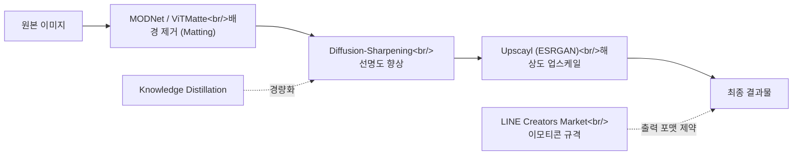

AI 기반 이미지 처리 오픈소스 도구의 생태계를 탐색했다. 배경 제거(matting)부터 샤프닝, 업스케일링까지 각 단계별 도구를 비교하고, 이들을 조합한 파이프라인과 LINE 이모티콘 출력 규격까지 정리한다.

<!--more-->

## 배경 제거: MODNet과 ViTMatte

이미지에서 전경(주로 인물)을 배경으로부터 분리하는 **image matting**은 전통적으로 trimap이라는 사전 마스크를 수동으로 지정해야 했다. [MODNet](https://github.com/ZHKKKe/MODNet) (4,292 stars)은 이 제약을 제거한 **trimap-free** 실시간 초상화 매팅 모델이다. AAAI 2022에서 발표되었으며, 단일 입력 이미지만으로 알파 매트를 생성한다.

MODNet의 핵심 아이디어는 매팅 문제를 세 가지 하위 목표로 분해하는 것이다:

```python
# MODNet의 3단계 분해 (개념적 구조)
# S: Semantic Estimation — 전경/배경 의미 파악
# D: Detail Prediction — 경계 디테일 예측  
# F: Final Fusion — 최종 알파 매트 합성

# 추론 시에는 단일 forward pass로 동작
from MODNet.models.modnet import MODNet
modnet = MODNet(backbone_pretrained=False)
modnet.load_state_dict(torch.load('modnet_photographic_portrait_matting.ckpt'))
# 입력: RGB 이미지 → 출력: alpha matte
```

[ViTMatte](https://github.com/hustvl/ViTMatte) (522 stars)는 다른 접근법을 택한다. Information Fusion 2024 논문에서, 사전학습된 **Vision Transformer(ViT)**를 매팅 태스크에 적용했다. ViT의 글로벌 어텐션이 넓은 범위의 컨텍스트를 활용할 수 있어, 머리카락이나 반투명 물체 같은 복잡한 경계에서 품질이 향상된다. MODNet이 실시간 처리에 강점이 있다면, ViTMatte는 품질 우선 시나리오에 적합하다.

## 이미지 샤프닝과 향상

이미지 선명도 향상에도 다양한 접근이 공존한다. [Diffusion-Sharpening](https://github.com/Gen-Verse/Diffusion-Sharpening) (72 stars)은 확산 모델(diffusion model)에 **RLHF 스타일 정렬**을 적용해 미세조정하는 프로젝트다. SFT(Supervised Fine-Tuning) 단계를 거친 후 RLHF로 인간 선호도에 맞게 정렬하는 파이프라인이 훈련 스크립트로 제공된다. LLM 분야의 정렬 기법이 이미지 생성 모델로 확산되는 흥미로운 사례다.

[ImageSharpening-KD](https://github.com/beingdhruvv/ImageSharpening-KD-Restormer-UNet)는 **Knowledge Distillation** 접근법이다. 대형 Restormer 모델을 teacher로 두고, 경량 Mini-UNet을 student로 훈련시킨다. 모바일이나 엣지 디바이스에서의 추론을 목표로 한 실용적 연구다.

```
Teacher (Restormer)          Student (Mini-UNet)
━━━━━━━━━━━━━━━━━━━         ━━━━━━━━━━━━━━━━━━━
- Transformer 기반            - UNet 기반 (경량)
- 높은 품질, 느린 추론          - 빠른 추론, 작은 모델
- soft label 생성       →     - KD loss로 학습
```

## Upscayl: ESRGAN 기반 업스케일링의 대중화

[Upscayl](https://github.com/upscayl/upscayl)은 44,475 stars로 이 분야에서 압도적인 인기를 자랑하는 **#1 오픈소스 AI 이미지 업스케일러**다. ESRGAN(Enhanced Super-Resolution GAN) 기반으로 동작하며, Electron 앱으로 패키징되어 비개발자도 GUI로 쉽게 사용할 수 있다. 커맨드라인 없이 드래그 앤 드롭으로 이미지 해상도를 4배까지 올릴 수 있다는 점이 대중적 성공의 핵심이다.

## 이미지 처리 파이프라인

이 도구들을 조합하면 하나의 이미지 처리 파이프라인을 구성할 수 있다:



## LINE 이모티콘 규격

LINE Creators Market의 이모티콘/움티(애니메이션 이모지) 가이드라인도 확인했다. 실제 크리에이터 마켓에 등록하려면 정해진 해상도와 프레임 수 규격을 맞춰야 하므로, 위 파이프라인의 최종 출력 단계에서 이런 제약을 고려해야 한다.

## 인사이트

오늘 탐색한 이미지 처리 도구들의 공통점은 **"파이프라인 사고"**다. 매팅 → 샤프닝 → 업스케일링이라는 단계적 파이프라인에서 개별 도구의 성능도 중요하지만, 이들을 어떻게 조합하느냐가 최종 결과물의 품질을 결정한다.

Knowledge Distillation과 RLHF 같은 기법이 이미지 처리 영역으로 확산되는 것도 주목할 만하다. LLM에서 검증된 훈련 패러다임이 도메인을 넘어 적용되면서, AI 기술의 크로스오버 효과가 가속화되고 있다. Diffusion-Sharpening이 RLHF를 이미지 생성에 적용한 것처럼, 앞으로도 NLP 분야의 기법이 비전 영역으로 이전되는 사례가 늘어날 것이다.
