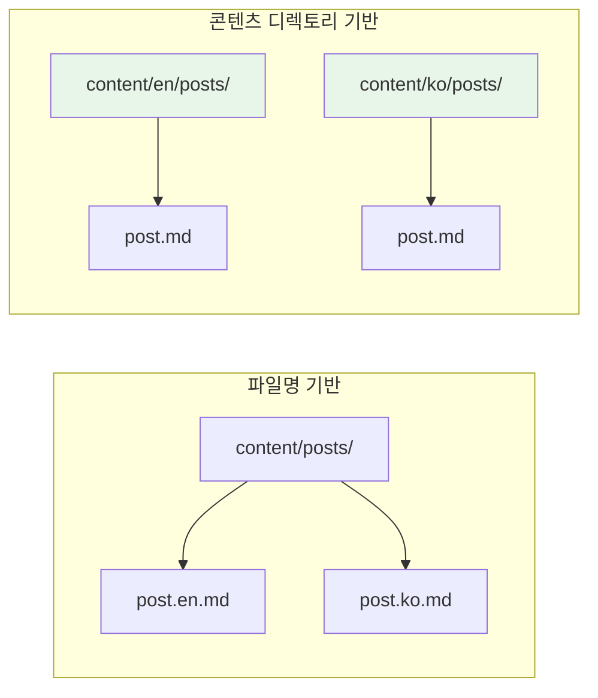
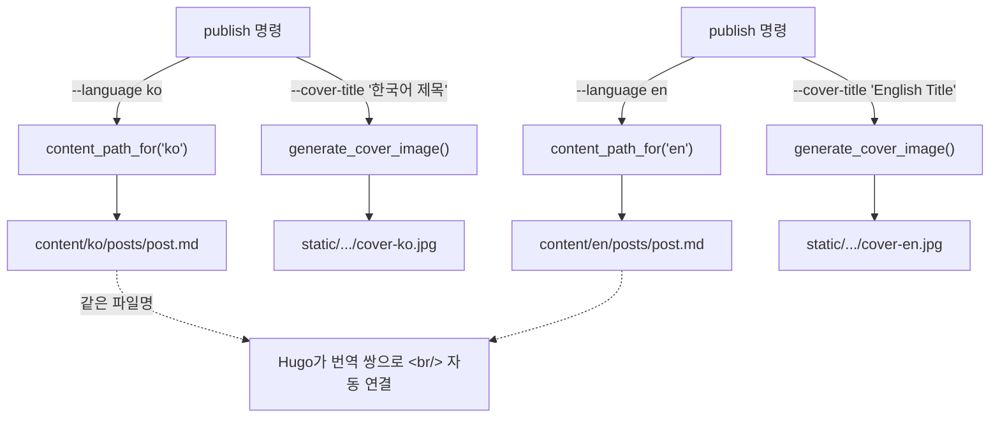

## 개요

하나의 언어로만 존재하는 블로그는 독자의 절반을 놓친다. 오늘 Hugo의 이중 언어 퍼블리싱 파이프라인을 구축했다. 포스트를 언어별 디렉토리로 라우팅하고, 현지화된 제목이 포함된 커버 이미지를 각 언어별로 생성하며, 번역 쌍을 자동으로 연결한다 — CLI의 `--language` 플래그 하나로.

<!--more-->

## Hugo의 두 가지 번역 방식

Hugo는 다국어 콘텐츠를 두 가지 방식으로 지원한다:

**파일명 기반**: 같은 디렉토리에 `about.en.md` / `about.ko.md`. 소규모 사이트에는 간단하지만, 파일이 많아지면 복잡해진다.

**콘텐츠 디렉토리 기반**: `content/en/posts/` / `content/ko/posts/`로 언어별 디렉토리 트리를 분리. CLI 자동화에 더 적합하다 — 언어가 파일명이 아닌 라우팅 결정이 된다.



log-blog는 콘텐츠 디렉토리 방식을 사용한다. config에서 언어 코드를 디렉토리에 매핑한다:

```yaml
blog:
  default_language: "en"
  language_content_dirs:
    ko: "content/ko/posts"
    en: "content/en/posts"
```

## 콘텐츠 라우팅: `content_path_for()`

라우팅 함수는 최소한의 코드다 — 딕셔너리 룩업과 폴백:

```python
@dataclass
class BlogConfig:
    content_dir: str = "content/posts"  # 폴백
    language_content_dirs: dict[str, str] = field(default_factory=dict)
    default_language: str = "en"

    def content_path_for(self, language: str | None = None) -> Path:
        lang = language or self.default_language
        if lang in self.language_content_dirs:
            return self.repo_path_resolved / self.language_content_dirs[lang]
        return self.content_path
```

`publish --language ko`를 호출하면 포스트가 `content/ko/posts/`에 저장된다. `--language` 없이 실행하면 `default_language` 설정을 따른다. `language_content_dirs`에 해당 언어가 없으면 범용 `content_dir`로 폴백한다.

이 설계 덕분에 세 번째 언어(예: 일본어) 추가는 config 한 줄이면 된다 — 코드 수정 불필요.

## 언어별 커버 이미지

각 언어는 해당 언어로 제목이 렌더링된 고유한 커버 이미지를 갖는다:

```
static/images/posts/2026-04-10-firecrawl/
├── cover-en.jpg   ← "Deep Docs Crawling with Firecrawl"
└── cover-ko.jpg   ← "Firecrawl로 딥 문서 크롤링하기"
```

`image_handler.py`의 이미지 생성기가 언어 접미사를 추가한다:

```python
cover_name = f"cover-{language}.jpg" if language else "cover.jpg"
rel_url = f"/images/posts/{post_slug}/{cover_name}"
```

CLI가 올바른 `image:` 프론트매터 경로를 자동 주입한다 — 사용자가 직접 작성할 필요 없다. `--cover-title "한국어 제목" --language ko`를 전달하면, 생성된 이미지에 한국어 텍스트와 태그 필이 표시되고, 프론트매터는 `cover-ko.jpg`를 가리킨다.



## Hugo 설정: `hasCJKLanguage`의 중요성

한국어 콘텐츠에 필수적인 Hugo 설정 하나:

```yaml
hasCJKLanguage: true
```

이 설정 없이는 Hugo가 `.Summary`와 `.WordCount`를 공백 기준 단어 분리로 계산한다 — 한국어, 중국어, 일본어에서는 의미 없는 결과가 나온다. 활성화하면 Hugo가 CJK 인식 분할을 사용한다.

Stack 테마는 한국어 언어 지원이 내장되어 있다. `languages.ko.menu` 아래 메뉴 항목이 자동 번역된다:

```yaml
languages:
  ko:
    languageName: 한국어
    weight: 1
    menu:
      main:
        - name: 포스트
          url: /posts
        - name: 카테고리
          url: /categories
        - name: 태그
          url: /tags
```

## 번역 워크플로우

이중 언어 포스트의 퍼블리싱 흐름:

1. **원본 작성** (보통 영어)
2. **한국어 독자를 위해 재작성** — 직역이 아니라 자연스러운 한국어 흐름으로 재구성. 기술 용어는 한국 기술 글쓰기에서 관례적인 경우 영어 유지
3. **같은 파일명으로 양쪽 모두 퍼블리시**:

```bash
# 영어 버전 → content/en/posts/
uv run log-blog publish post-en.md \
  --cover-title "English Title" \
  --tags "hugo,i18n" --language en

# 한국어 버전 → content/ko/posts/
uv run log-blog publish post-ko.md \
  --cover-title "한국어 제목" \
  --tags "hugo,i18n" --language ko
```

Hugo는 두 파일이 같은 파일명을 공유하는 것을 자동 감지하고 포스트 페이지에 언어 전환기를 표시한다. `.Translations` 템플릿 변수가 연결을 처리한다.

### 번역 가이드라인

한국어 재작성의 핵심 규칙:
- **번역**: title, description, 본문 텍스트, Mermaid 라벨, 섹션 헤더
- **유지**: tags, categories, 코드 블록, URL, CLI 명령어
- **`image:` 포함 금지** — CLI가 언어별 경로를 자동 주입
- Mermaid 안전 규칙(HTML 엔티티, 따옴표 처리된 슬래시)은 양쪽 언어에 동일하게 적용

## GitHub 멀티 계정 SSH 설정

한 가지 복잡한 점: 블로그 레포(`ice-ice-bear`)는 메인 개발 계정(`lazy-mango`)과 다른 GitHub 계정을 사용한다. SSH 키 기반 라우팅으로 해결한다:

```
# ~/.ssh/config
Host github-blog
    HostName github.com
    User git
    IdentityFile ~/.ssh/id_ed25519_blog
```

블로그 레포의 remote URL이 이 별칭을 사용: `git@github-blog:ice-ice-bear/ice-ice-bear.github.io.git`. GitHub은 SSH 키를 계정에 1:1 매핑하므로, 별칭이 올바른 키(그리고 계정)가 push에 선택되도록 보장한다.

## 인사이트

Hugo의 다국어 지원은 성숙했지만 문서가 방대하다 — "콘텐츠 디렉토리" vs "파일명" 결정이 전체 퍼블리싱 워크플로우에 연쇄적 영향을 미친다. CLI 기반 파이프라인에서는 콘텐츠 디렉토리가 확실히 유리하다: 언어가 모든 파일에 내장된 네이밍 컨벤션이 아닌 라우팅 파라미터가 된다.

언어별 커버 이미지 패턴이 예상보다 중요했다. SNS 미리보기(Open Graph, Twitter Cards)에 커버 이미지가 표시되는데, 포스트는 한국어인데 썸네일에 "Deep Docs Crawling"이 적혀 있으면 이질감이 크다. 현지화된 커버 이미지가 공유 링크를 각 언어 커뮤니티에서 자연스럽게 만든다.

`hasCJKLanguage` 플래그는 깨지기 전까지 보이지 않는 종류의 설정이다. 이것 없이 한국어 `.Summary`는 의미 없는 단어 수와 잘린 미리보기를 생성한다. 한 줄 수정이지만, 문제를 발견하려면 실제로 CJK 콘텐츠로 테스트해야 한다 — 영어만으로 개발하면 절대 드러나지 않는다.

가장 놀라웠던 건 이중 언어 지원에 필요한 코드가 얼마나 적었는지다. 핵심 라우팅은 딕셔너리 룩업. 커버 이미지는 파일명 접미사. 번역 연결은 파일명이 같을 때 Hugo의 내장 동작. 복잡성은 구현에 있지 않다 — 어떤 Hugo 기능을 조합하고 비라틴 스크립트에 어떤 설정이 중요한지 아는 데 있다.
