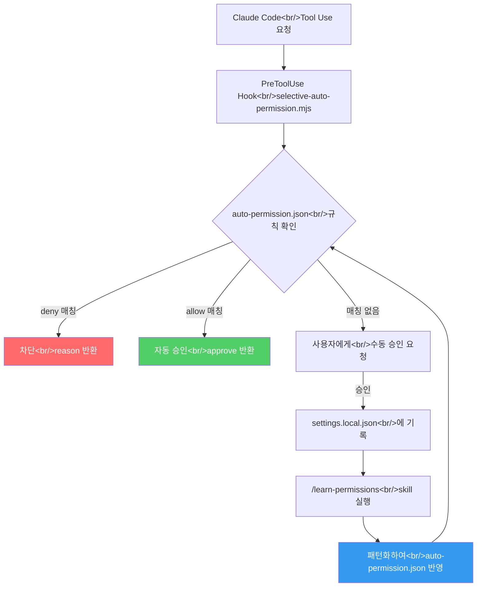

## 개요

Claude Code를 본격적으로 사용하다 보면, 한 세션에 수백 번씩 "Allow" 버튼을 누르게 됩니다. 파일 읽기, `git status`, 테스트 실행 같은 안전한 작업에도 매번 승인이 필요하죠. 내장된 `settings.local.json`은 개별 승인 이력이 쌓이면서 금세 관리 불가능한 상태가 됩니다. 이 문제를 해결하기 위해 hook 기반 자동 권한 승인 시스템인 **claude-auto-permission**을 만들었습니다.

<!--more-->

## 문제 인식 — 수백 번의 "Allow" 클릭

Claude Code는 보안을 위해 모든 tool use에 사용자 승인을 요구합니다. 원칙적으로는 옳은 설계지만, 실제 개발 세션에서는 불필요한 마찰이 됩니다.

- `Read` 도구로 파일 열기 — 매번 승인
- `Bash`로 `git status` 실행 — 매번 승인
- `Bash`로 `npm test` 실행 — 매번 승인
- `Grep`으로 코드 검색 — 매번 승인

한 시간 코딩 세션이면 100~200번의 클릭이 나옵니다. 그리고 이걸 수동으로 하나씩 승인하다 보면 `settings.local.json`에 이런 항목들이 쌓입니다:

```json
{
  "permissions": {
    "allow": [
      "Bash(git status)",
      "Bash(git diff)",
      "Bash(git log --oneline -20)",
      "Bash(git log --oneline -10)",
      "Bash(npm test)",
      "Bash(npm run test)",
      "Bash(npx jest)",
      ...
    ]
  }
}
```

정확히 일치하는 명령어만 기록되기 때문에, `git log --oneline -20`과 `git log --oneline -10`은 별개의 항목입니다. 패턴화가 안 되니까 끝없이 늘어납니다.

## 설계 — Hook 아키텍처

Claude Code의 hook 시스템은 `PreToolUse`, `PostToolUse` 같은 이벤트에 외부 스크립트를 연결할 수 있게 해줍니다. 이 구조를 활용하면, tool이 실행되기 전에 우리가 먼저 판단해서 자동 승인하거나 차단할 수 있습니다.

전체 아키텍처는 이렇게 생겼습니다:



핵심 구성 요소는 세 가지입니다:

1. **`selective-auto-permission.mjs`** — PreToolUse hook. 매 tool use마다 `auto-permission.json`의 allow/deny 목록을 확인하고 판단합니다.
2. **`permission-learner.mjs`** — 수동 승인 이력을 분석해서 패턴을 추출합니다.
3. **`/learn-permissions` skill** — 학습된 패턴을 `auto-permission.json`에 병합하는 대화형 워크플로우입니다.

## Preset 시스템

매번 규칙을 처음부터 작성하는 건 비현실적입니다. 그래서 개발 환경별로 5개의 preset을 제공합니다:

| Preset | 용도 | 자동 승인 범위 |
|--------|------|---------------|
| `safe-read` | 읽기 전용 | Read, Grep, Glob, git status/log/diff |
| `node-dev` | Node.js 개발 | + npm/npx, jest, eslint, tsc |
| `python-dev` | Python 개발 | + uv, pytest, ruff, mypy, pip |
| `fullstack-dev` | 풀스택 | node-dev + python-dev 통합 |
| `full-trust` | 전체 신뢰 | 거의 모든 tool (deny 목록 제외) |

모든 preset이 공통으로 **절대 자동 승인하지 않는** 명령어가 있습니다:

```javascript
const UNIVERSAL_DENY = [
  "rm -rf",
  "git push --force",
  "git reset --hard",
  "git clean -f"
];
```

`full-trust` preset을 선택하더라도, 이 네 가지는 반드시 수동 승인을 거칩니다. 실수로 `rm -rf /`가 자동 승인되는 일은 없어야 하니까요.

## auto-permission.json 구조

각 프로젝트 루트의 `.claude/auto-permission.json`에 규칙을 정의합니다:

```json
{
  "preset": "python-dev",
  "custom_allow": [
    {
      "tool": "Bash",
      "pattern": "docker compose *"
    },
    {
      "tool": "Bash",
      "pattern": "hugo server *"
    }
  ],
  "custom_deny": [
    {
      "tool": "Bash",
      "pattern": "docker system prune *"
    }
  ]
}
```

`preset`으로 기본 규칙을 가져오고, `custom_allow`와 `custom_deny`로 프로젝트 특화 규칙을 추가합니다. 패턴은 glob 스타일 매칭을 지원하기 때문에, `docker compose *`는 `docker compose up`, `docker compose down`, `docker compose logs -f` 등을 모두 포함합니다.

**규칙 우선순위**: deny가 항상 allow보다 우선합니다. 같은 명령어가 allow와 deny 양쪽에 매칭되면 차단됩니다. 안전 쪽으로 기울어지는 게 맞으니까요.

## Permission Learner — 승인 이력에서 패턴 추출

수동 승인을 반복하다 보면 `settings.local.json`에 비슷한 명령어들이 쌓입니다:

```
Bash(pytest tests/test_auth.py)
Bash(pytest tests/test_api.py)
Bash(pytest tests/test_models.py -v)
Bash(pytest --tb=short)
```

`permission-learner.mjs`는 이런 항목들을 분석해서:

1. 공통 접두사를 추출하고 (`pytest`)
2. 안전 분류를 수행하고 (read-only인지, 파일 시스템 변경이 있는지)
3. 패턴으로 일반화합니다 (`pytest *`)

`/learn-permissions` skill을 실행하면, 학습된 패턴을 보여주고 사용자 확인 후 `auto-permission.json`의 `custom_allow`에 추가합니다. 한 번 학습되면 같은 계열의 명령어는 더 이상 수동 승인이 필요 없습니다.

## 구현에서 고민한 부분

### Hook의 응답 속도

PreToolUse hook은 매 tool use마다 실행됩니다. Node.js 프로세스를 매번 새로 띄우면 cold start 오버헤드가 걱정되지만, 실제로 측정해보면 JSON 파일 하나 읽고 패턴 매칭하는 데 걸리는 시간은 수십 밀리초 수준입니다. 사용자가 체감할 수 있는 지연은 아닙니다.

### 보안과 편의의 균형

자동 권한 시스템에서 가장 중요한 건 "어디까지 자동으로 허용할 것인가"입니다. 너무 넓게 열면 위험하고, 너무 좁으면 쓸모가 없습니다.

이 프로젝트에서는 세 가지 원칙을 세웠습니다:

1. **Deny가 항상 우선** — allow 목록이 아무리 넓어도, deny에 매칭되면 차단
2. **Universal deny는 preset 독립** — 어떤 preset을 쓰든 파괴적 명령어는 항상 차단
3. **학습은 제안까지만** — permission learner가 패턴을 제안하지만, 실제 적용은 사용자가 확인

### Per-repo 설정

`auto-permission.json`은 프로젝트 루트의 `.claude/` 디렉토리에 위치합니다. 같은 개발자라도 프로젝트마다 필요한 권한이 다르기 때문입니다. 블로그 레포에서는 `hugo server *`가 필요하지만, API 서버 레포에서는 `docker compose *`가 필요하죠. 글로벌 설정이 아니라 프로젝트별 설정으로 가야 합니다.

## 현재 상태와 다음 단계

첫 번째 릴리스에서 구현한 것:
- 5개 preset과 custom rule 시스템
- PreToolUse hook 기반 자동 승인/차단
- Permission learner와 `/learn-permissions` skill
- Universal deny list

다음에 다룰 내용:
- 실제 프로젝트에 적용하면서 발견한 edge case들
- Preset 커스터마이징 가이드
- 다른 hook 이벤트(`PostToolUse`, `Notification`)와의 연계 가능성

GitHub 저장소: [ice-ice-bear/claude-auto-permission](https://github.com/ice-ice-bear/claude-auto-permission)
