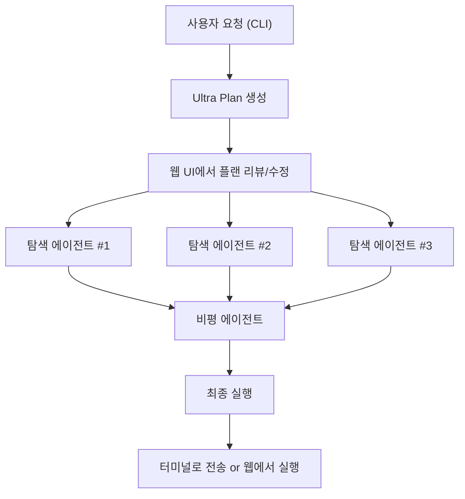

Claude Code Ultra Plan을 중심으로 AI 개발 워크플로우의 변화를 살펴봤다. 멀티에이전트 코딩, YC의 AI 네이티브 스타트업 전략, RunPod 서버리스 GPU 배포, 그리고 개발 도구 생태계의 최신 동향을 정리한다.

<!--more-->

## Ultra Plan: 멀티에이전트 코딩 워크플로우

오후다섯씨의 YouTube 영상에서 **Claude Code Ultra Plan** 워크플로우를 상세히 다뤘다. 핵심은 멀티에이전트 구조로, 탐색(exploration) 에이전트 3개가 독립적으로 코드베이스를 분석하고, 비평(critique) 에이전트 1개가 결과를 종합/검증한다.



주목할 점은 **15분 걸리던 작업이 5분으로 단축**된다는 경험 보고다. 단순 속도 향상이 아니라, 탐색 에이전트들이 병렬로 다른 접근법을 시도하면서 놓칠 수 있는 엣지 케이스를 커버하기 때문이다. 웹 UI와 데스크톱 연동으로, CLI에서 플랜을 생성하고 브라우저에서 리뷰한 뒤 다시 터미널로 전송하는 흐름이 가능하다.

## Y Combinator와 AI 네이티브 스타트업

Y Combinator의 "The New Way To Build A Startup" 영상은 더 충격적이었다. Anthropic 엔지니어들이 실제로 Claude Code를 사용해 코드를 작성한다는 점, 그리고 **한 엔지니어가 3~8개 Claude 인스턴스를 동시에 운영**한다는 사실이다. YC 회사들이 "극적으로 빠르게" 출시한다는 건 과장이 아니라 구조적 변화다.

이것은 개발자의 역할이 "코드 작성자"에서 "AI 에이전트 오케스트레이터"로 변화하고 있음을 보여준다. 코드를 한 줄씩 치는 대신, 여러 AI 인스턴스에 태스크를 분배하고 결과를 검증하는 것이 핵심 역량이 된다.

## RunPod: GPU 클라우드에서 LLM 서빙

[RunPod](https://runpod.io)은 GPU 클라우드 인프라 서비스로, OpenAI의 인프라 파트너이기도 하다. 한국어 블로그에서 다룬 **RunPod Serverless + vLLM** 조합으로 LLM 배포하는 가이드가 실용적이었다.

```python
# RunPod Serverless에서 vLLM으로 LLM 서빙 (개념적 구조)
# gemma-2-9b-it 예제

# 1. Docker 이미지에 vLLM + 모델 패키징
# 2. RunPod Serverless 엔드포인트 생성
# 3. OpenAI 호환 API로 요청

import openai

client = openai.OpenAI(
    api_key="your-runpod-api-key",
    base_url="https://api.runpod.ai/v2/{endpoint_id}/openai/v1"
)

response = client.chat.completions.create(
    model="google/gemma-2-9b-it",
    messages=[{"role": "user", "content": "Hello!"}]
)
```

서버리스 GPU 포드 방식이라 유휴 시간에는 비용이 발생하지 않고, OpenAI 호환 API를 제공하므로 기존 코드의 `base_url`만 바꾸면 된다. 자체 호스팅 LLM의 진입장벽이 크게 낮아진 셈이다.

## 개발 도구 소식

[OpenScreen](https://github.com/siddharthvaddem/openscreen) (27,132 stars)은 유료 Screen Studio의 오픈소스 대안으로, 워터마크 없는 무료 화면 녹화 도구다. 개발자 튜토리얼이나 데모 영상 제작에 유용하다.

**self.md ui-design plugin**은 Claude Code용 종합 UI/UX 디자인 플러그인으로, 9개 스킬을 제공한다. Claude Code의 플러그인 생태계가 점점 확장되고 있는데, 이 플러그인은 디자인 시스템 구축부터 컴포넌트 설계까지를 커버한다.

**HarnessKit** 관련으로는 같은 이름의 서로 다른 AI 에이전트 하네스(harness) 프로젝트를 비교했다. 동명 프로젝트의 접근법 차이를 살펴보는 것도 흥미로운 탐색이었다.

## 인사이트

오늘 탐색의 핵심 키워드는 **"오케스트레이션"**이다. Claude Code Ultra Plan의 멀티에이전트 구조는 탐색 → 비평 → 실행이라는 파이프라인으로 코딩 작업을 분해하고, YC 스타트업들은 여러 AI 인스턴스를 동시에 운영하며, RunPod는 서버리스 GPU로 LLM 서빙을 간소화한다. 개별 AI 모델의 성능보다 이들을 어떻게 조합하고 관리하느냐가 경쟁력을 결정하는 시대가 오고 있다.

개발자의 역할 변화도 주목할 만하다. 코드를 직접 작성하는 시간보다, AI 에이전트에 태스크를 분배하고 결과를 검증하는 시간이 더 중요해지고 있다. OpenScreen이나 self.md 같은 도구들도 이런 변화에 발맞춰, 개발 워크플로우의 다른 부분(데모 녹화, UI 설계)을 자동화하고 있다.
