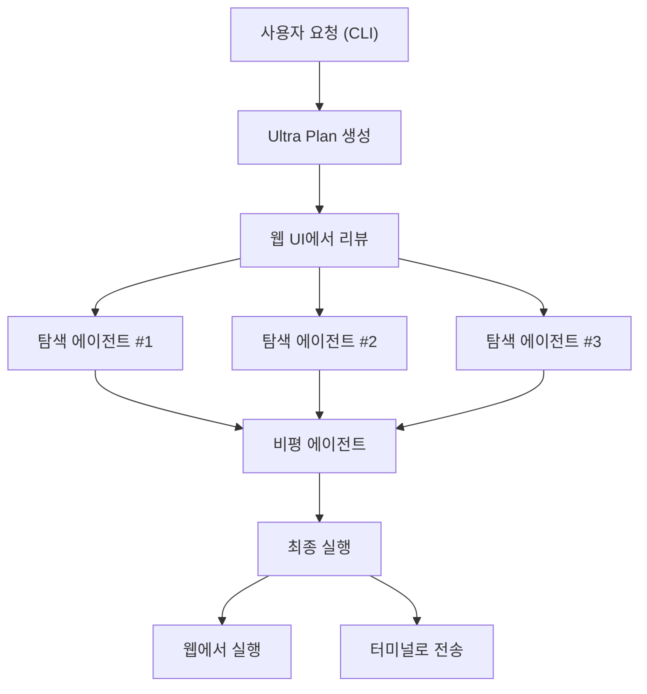
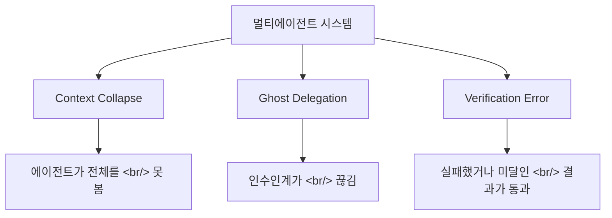

## 개요

Claude Code의 Ultra Plan은 멀티에이전트 플래닝을 클라우드로 가져왔다. 탐색 에이전트 3개가 병렬로 코드베이스를 분석하고, 비평 에이전트 1개가 검증한다. YC의 "엔지니어 한 명이 Claude 인스턴스 3~8개를 동시 운영"한다는 보고, 그리고 API 토큰 $5,000을 태우며 멀티에이전트 오케스트레이션의 한계를 실증한 분석까지 — AI 개발의 핵심 역량이 "오케스트레이션"으로 수렴하고 있다.

<!--more-->

## Ultra Plan: 클라우드 기반 멀티에이전트 플래닝

Ultra Plan은 연구 프리뷰 기능(v2.1.91+)으로, 플랜 생성을 로컬 CLI에서 Anthropic 클라우드 인프라로 오프로드한다. 핵심 아키텍처 변화: 단일 에이전트가 터미널에서 계획하는 대신, 4개 에이전트가 협업한다.

탐색 에이전트 3개가 독립적으로 코드베이스를 분석하면서 서로 다른 접근법을 시도한다. 비평 에이전트가 이들의 결과를 종합하고 플랜을 검증한다. 보고된 결과: **15분 걸리던 작업이 5분으로 단축** — 단순 병렬화가 아니라, 탐색 에이전트들이 단일 에이전트가 놓칠 수 있는 엣지 케이스를 커버하기 때문이다.

### 세 가지 실행 방법

1. **명령어**: `/ultraplan` 다음에 프롬프트
2. **키워드**: 일반 프롬프트에 "ultraplan" 포함
3. **로컬 플랜에서**: 로컬 플랜 완료 후 "Ultraplan으로 리파인" 선택

### 터미널-웹 브릿지

워크플로우가 로컬과 클라우드를 매끄럽게 연결한다. CLI에서 시작하고, 플랜은 클라우드에서 생성되는 동안 터미널은 다른 작업에 사용할 수 있다. 웹 브라우저에서 리치 UI로 리뷰 — 섹션별 코멘트, 타겟 피드백, 링크를 통한 팀 공유.

오후다섯씨의 YouTube 분석에서 핵심 포인트: 기존 플랜 모드에서는 계획을 세우는 동안 아무것도 할 수 없었다. 세션을 새로 만들면 기존 세션의 데이터를 알 수 없다. Ultra Plan은 이 문제를 클라우드로 오프로드하면서 해결한다.

승인 후에는 선택: 웹에서 실행(PR 직접 생성 가능) 또는 터미널로 전송해서 로컬 파일 시스템 접근과 함께 실행.

### 요구 사항과 제한

Ultra Plan은 Claude Code 웹 계정과 GitHub 레포지토리가 필요하다. Anthropic 클라우드에서 실행되므로 Amazon Bedrock, Google Cloud Vertex AI, Microsoft Foundry 백엔드에서는 사용 불가.

## YC의 AI 네이티브 스타트업 속도

Y Combinator의 "The New Way To Build A Startup" 영상은 Anthropic 엔지니어들이 실제로 Claude Code로 코드를 작성하고, **한 엔지니어가 Claude 인스턴스 3~8개를 동시에 운영**한다고 밝혔다. YC 회사들이 "극적으로 빠르게" 출시한다는 건 마케팅이 아니라 이 워크플로우의 구조적 결과다.

시사점은 역할 변화다: "코드 작성자"에서 "AI 에이전트 오케스트레이터"로. 코드를 한 줄씩 치는 대신, 여러 AI 인스턴스에 태스크를 분배하고 결과를 검증하는 것이 핵심 역량이 된다.

이건 Ultra Plan의 아키텍처와 직접 연결된다. 탐색-비평 패턴은 Anthropic 내부 도구 철학만이 아니라, 인간 개발자가 AI 코딩 어시스턴트와 대규모로 상호작용하는 새로운 패턴이다.

## 멀티에이전트 오케스트레이션의 현실: $5,000의 교훈

shalomeir의 분석 "멀티 에이전트 오케스트레이션은 왜 잘 안 되는가?"는 가장 현실적인 평가였다. API 토큰 $5,000을 쓰면서 Gastown(Steve Yegge의 에이전트를 "도시"로 조직하는 시스템)과 Paperclip("제로 휴먼 컴퍼니" 컨셉)을 테스트한 후, 세 가지 구조적 병목을 확인했다.

### 3대 구조적 병목

**Context Collapse (맥락 붕괴)** — 각 에이전트가 제한된 컨텍스트 윈도우에서 작동한다. 시스템이 확장될수록 전체 프로젝트 상태를 보는 에이전트가 없어진다.

**Ghost Delegation (유령 위임)** — 에이전트 A가 B에게 작업을 넘길 때, 핸드오프에서 맥락이 조용히 사라진다. 받는 쪽 에이전트가 불완전한 정보로 진행해서, 올바르게 보이지만 핵심 제약 조건을 놓치는 결과를 낸다.

**Verification Error (검증 오류)** — 리뷰 에이전트가 에러를 잡지 못하거나 미달 구현을 수용한다. 원래 의도를 깊이 이해하지 못하면, 리뷰가 도장 찍기가 된다.

### 실제로 작동하는 것

결론: 에이전트 수가 핵심이 아니라 **오케스트레이터 설계**가 핵심이다.

- **도메인별로 깊게, 영역 간에는 느슨하게**: 에이전트가 자기 도메인 안에서 깊이 작업하되 도메인 사이는 느슨하게 연결
- **대화가 아니라 공유 환경**: 진짜 협업은 메시지 전달이 아닌 공유 파일 시스템과 상태를 통해 발생
- **이미 쓰고 있는 도구 안에 답이 있다**: Claude Code의 워크트리, git 브랜치, 파일 시스템이 이미 조정 프리미티브를 제공

### 다섯 가지 위임 판별 기준

에이전트에게 얼마나 맡길지 결정하는 기준:
1. **태스크 분해 가능성** — 독립 하위 태스크로 나눌 수 있는가?
2. **검증 명확성** — 결과를 객관적으로 확인할 수 있는가?
3. **맥락 지역성** — 에이전트가 독립 작업에 충분한 맥락을 갖는가?
4. **실패 회복 비용** — 에이전트가 실패하면 복구 비용이 얼마나 큰가?
5. **도메인 안정성** — 해당 도메인이 잘 이해되었는가, 빠르게 변화하는가?

## Claude Code 캐시 버그: 주의가 필요하다

ArkNill의 [claude-code-hidden-problem-analysis](https://github.com/ArkNill/claude-code-hidden-problem-analysis)는 **11개 클라이언트 측 버그**와 4개 예비 발견을 문서화했다. 캐시 버그(B1-B2)는 v2.1.91에서 수정됐지만, **v2.1.97 기준으로 9개 버그가 미수정** — 6개 릴리스에서 토큰 회계, 컨텍스트 변조, 로그 무결성 버그에 대한 수정이 하나도 없었다.

주목할 발견:
- **B10**: `TaskOutput` 디프리케이션이 21배 컨텍스트 주입을 유발, 치명적 에러로 이어짐
- **B11**: 적응형 사고(adaptive thinking) 제로 추론이 허위 생성으로 이어짐 (Anthropic이 HN에서 인정했으나 후속 조치 없음)
- **프록시 캡처된 속도 제한 헤더**가 이중 5시간/7일 윈도우 쿼터 시스템과 사고 토큰 사각지대를 밝혀냄

Ultra Plan 사용자에게 중요한 이유: 로컬에서 캐시 버그가 10~20배 토큰 인플레이션을 일으킨다면, 4개 에이전트가 동시에 실행되는 멀티에이전트 클라우드 환경에서 동일한 문제가 증폭될 수 있다.

## 인사이트

Ultra Plan 아키텍처는 특정 패턴을 검증한다: **여러 접근법을 병렬로 탐색하고, 비평하고 종합한다**. 이건 인간 소프트웨어 팀에서도 작동하는 패턴이다 — 세 개발자에게 같은 태스크를 주지는 않지만, 설계 리뷰 때 다양한 관점을 원한다. Ultra Plan은 이걸 플래닝 단계에서 자동화한다.

오늘 탐색에서 드러난 긴장은 멀티에이전트 시스템의 약속과 현실 사이에 있다. Ultra Plan은 문제를 제약하기 때문에 성공한다: 4개 에이전트, 하나의 태스크(플래닝), 구조화된 역할(탐색 vs 비평), 끝에 인간 리뷰. Gastown과 Paperclip은 많은 에이전트의 자율 위임으로 개방형 오케스트레이션을 시도하기 때문에 실패한다.

떠오르는 경험 법칙: 멀티에이전트는 에이전트가 **도메인 깊이가 깊고 조정이 가벼울 때** 작동한다. 에이전트들이 서로의 작업을 깊이 이해해야 하는 순간 — 단순히 출력을 소비하는 게 아니라 — 맥락 붕괴에 도달한다. Ultra Plan은 조정을 단순하게 유지함으로써 이 경계의 올바른 쪽에 머문다.

shalomeir의 다섯 가지 위임 판별 기준은 하나에서 여럿으로 에이전트를 확장하기 전에 모든 AI 증강 팀의 체크리스트가 되어야 한다. 질문은 "에이전트를 더 추가할 수 있는가?"가 아니라 "이 태스크가 에이전트들이 독립적으로 작업할 수 있을 만큼 깔끔하게 분해되는가?"다.
