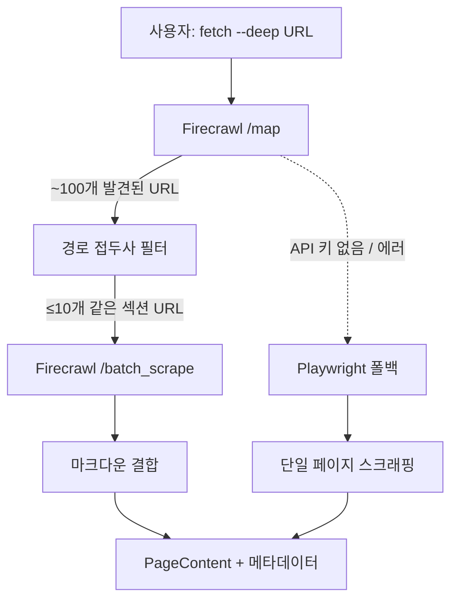

## 개요

페이지 하나만 스크래핑하면 맥락을 놓친다. 문서 사이트는 관련 페이지들이 연결된 지식 그래프다. 오늘 log-blog에 Firecrawl을 통합해서, `--deep` 플래그 하나로 문서 섹션 전체를 크롤링하고, API 키가 없으면 Playwright로 자동 폴백하는 파이프라인을 만들었다.

<!--more-->

## 문제: 한 페이지만으로는 부족하다

브라우징 히스토리를 블로그 포스트로 바꾸는 도구를 만들 때, 단순한 접근은 각 URL을 방문해서 텍스트를 추출하는 것이다. 하지만 문서는 그렇게 작동하지 않는다. `asyncio.gather()` 페이지는 `asyncio.create_task()`, 에러 핸들링, 이벤트 루프 아키텍처 페이지와 함께 봐야 제대로 이해된다.

Playwright로 멀티 페이지를 처리하려면:
1. 페이지의 모든 링크를 파싱
2. 같은 도메인, 같은 섹션의 URL만 필터링
3. 헤드리스 브라우저로 하나씩 순차 방문
4. 결과 결합

느리고, 리소스를 많이 쓰고, 불안정하다. Firecrawl은 이 문제를 세 단계 API 파이프라인으로 해결한다: **map → filter → batch scrape**.

## Firecrawl 아키텍처

Firecrawl은 "AI를 위한 웹 데이터 API"를 표방한다. 프록시 로테이션, 안티봇 처리, JavaScript 렌더링을 관리해주고, 깔끔한 마크다운을 출력한다. 주요 엔드포인트:

| 엔드포인트 | 용도 | 크레딧 |
|-----------|------|--------|
| `/scrape` | 단일 페이지 → 마크다운/JSON | 페이지당 1 |
| `/map` | 도메인의 모든 URL 탐색 | 호출당 1 |
| `/batch_scrape` | 여러 URL 비동기 스크래핑 | 페이지당 1 |
| `/crawl` | 링크 추적 전체 사이트 크롤 | 페이지당 1 |
| `/extract` | 구조화된 데이터 추출 | 가변 |

핵심은 `/map` 엔드포인트다. 사이트맵, SERP 결과, 크롤 캐시를 활용해 2~3초 만에 URL을 발견하고, 한 번 호출에 최대 30,000개 URL을 반환한다. `/batch_scrape`와 결합하면 브라우저 인스턴스 관리 없이 병렬 페칭이 가능하다.



## 구현 상세

통합은 `firecrawl_fetcher.py`에 두 핵심 함수로 구현했다.

### URL 필터링: `_filter_by_path_prefix()`

`/map`은 도메인의 모든 URL을 반환한다. 문서 크롤링에는 같은 섹션의 페이지만 필요하다. 입력 URL의 상위 디렉토리를 경로 접두사로 사용한다:

```python
def _filter_by_path_prefix(
    base_url: str,
    links: list[str],
    max_pages: int = 10,
) -> list[str]:
    parsed = urlparse(base_url)
    base_domain = parsed.netloc
    # 상위 디렉토리를 접두사로 사용
    # 예: /guides/intro → /guides/
    path_parts = parsed.path.rstrip("/").rsplit("/", 1)
    base_prefix = path_parts[0] + "/" if len(path_parts) > 1 else "/"

    filtered = []
    for link in links:
        p = urlparse(link)
        if p.netloc != base_domain:
            continue
        if p.path.startswith(base_prefix):
            filtered.append(link)
        if len(filtered) >= max_pages:
            break
    return filtered
```

`https://docs.example.com/guides/auth/oauth2`를 요청하면 `/guides/auth/*` 페이지만 수집하고 `/api-reference/*`나 `/blog/*`는 건너뛴다. `max_pages` 상한(config.yaml에서 설정 가능)으로 대규모 문서 사이트의 무한 크롤을 방지한다.

### 딥 페치 파이프라인: `fetch_docs_deep()`

세 단계 파이프라인을 오케스트레이션하는 메인 함수:

```python
def fetch_docs_deep(url: str, config: Config):
    client = Firecrawl(api_key=config.firecrawl.api_key)

    # 1단계: Map — 서브 링크 발견
    map_result = client.map(url=url, limit=100)
    all_links = [link.url for link in map_result.links]

    # 2단계: 같은 경로 접두사로 필터
    filtered = _filter_by_path_prefix(
        url, all_links, max_pages=config.firecrawl.max_pages
    )

    # 3단계: Batch scrape
    batch_result = client.batch_scrape(
        filtered, formats=["markdown"], poll_interval=2
    )

    # 4단계: 섹션 헤더와 함께 결합
    parts = []
    for page in batch_result.data:
        page_title = page.metadata.title or "Untitled"
        page_url = page.metadata.source_url or ""
        parts.append(f"--- {page_title} ({page_url}) ---")
        parts.append(page.markdown.strip())

    return PageContent(
        url=url, title=first_title,
        text_content="\n".join(parts),
        metadata={"source": "firecrawl", "pages_crawled": len(parts)}
    )
```

반환값은 표준 `PageContent` 데이터클래스 — Playwright가 반환하는 것과 동일한 타입이다. 호출자는 어떤 페처가 결과를 생성했는지 알 필요가 없다.

### 우아한 폴백

`content_fetcher.py`에서 Firecrawl을 선택적으로 사용한다:

```python
if deep_urls and url in deep_urls and url_type == UrlType.DOCS_PAGE:
    from .firecrawl_fetcher import fetch_docs_deep
    fc_result = fetch_docs_deep(url, config)
    if fc_result is not None:
        results[url] = fc_result
        continue
# Firecrawl이 None을 반환하면 Playwright로 폴스루
```

API 키 없음? 임포트 에러? API 타임아웃? 각 경우 `None`을 반환하고, 호출자는 투명하게 단일 페이지 Playwright 스크래핑으로 폴백한다.

## Firecrawl vs Playwright: 언제 무엇을 쓸까

| | Firecrawl | Playwright |
|---|---|---|
| **적합한 용도** | 문서 사이트, 공개 콘텐츠 | 인증 필요 페이지, AI 챗 스크래핑 |
| **멀티 페이지** | 네이티브 (map + batch) | 수동 링크 추적 |
| **안티봇** | 관리형 프록시, 스텔스 | DIY 또는 기본 수준 |
| **출력** | 깔끔한 마크다운 | Raw HTML → 커스텀 추출 |
| **비용** | 크레딧 기반 API | 무료 (컴퓨팅만) |
| **인증 흐름** | 제한적 | 풀 브라우저 제어 (CDP) |

log-blog에서는 둘 다 공존한다: Playwright는 일반 페이지와 CDP를 통한 인증 AI 챗 스크래핑을, Firecrawl은 딥 문서 크롤링을 담당한다. `log-blog fetch`의 `--deep` 플래그가 문서 URL에 대해 Firecrawl을 트리거한다.

## 인사이트

"관리형 API + 로컬 폴백" 패턴이 AI 인접 도구의 표준이 되어가고 있다. Firecrawl은 프록시 관리, JavaScript 렌더링, 깔끔한 마크다운 추출의 복잡성을 처리해준다. 하지만 Playwright를 폴백으로 유지하면 API 키 없이도, 오프라인에서도, 외부 API가 접근할 수 없는 인증 콘텐츠에 대해서도 도구가 동작한다.

`/map` 엔드포인트에서 가장 인상적인 건 효율성이다: 한 크레딧으로 문서 사이트 전체의 URL 구조를 발견한다. 경로 접두사 필터링과 결합하면, LLM이 필요로 하는 정확한 컨텍스트 윈도우를 얻을 수 있다 — 사이트 전체도 아니고, 페이지 하나도 아닌, 관련 섹션만.

더 넓은 패턴으로 보면, AI 도구가 "스크래핑 가능한 걸 긁어오기"에서 "구조를 이해하고 필요한 것을 가져오기"로 전환하고 있다. Firecrawl의 map-before-scrape 접근은 `git diff` 전에 `git log --stat`를 먼저 보는 것과 같다 — 먼저 조사하고, 그다음 깊이 파고든다.
