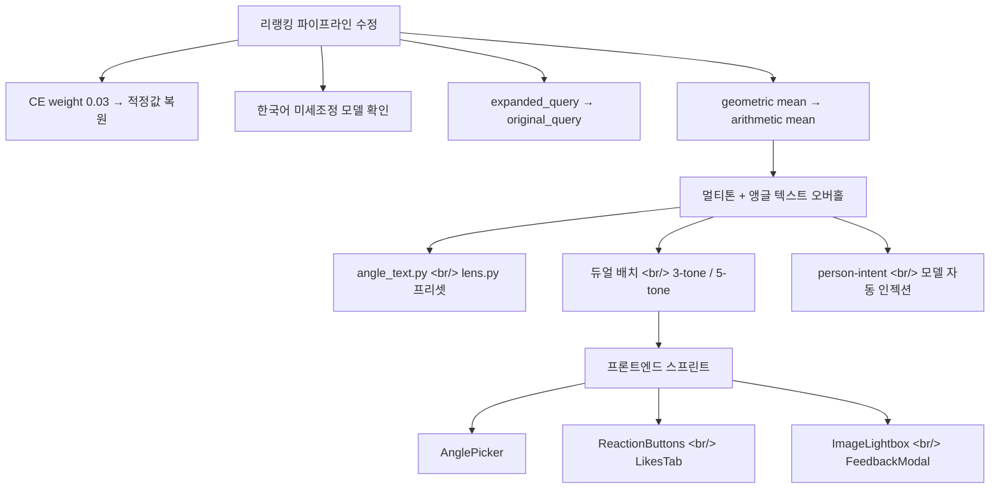
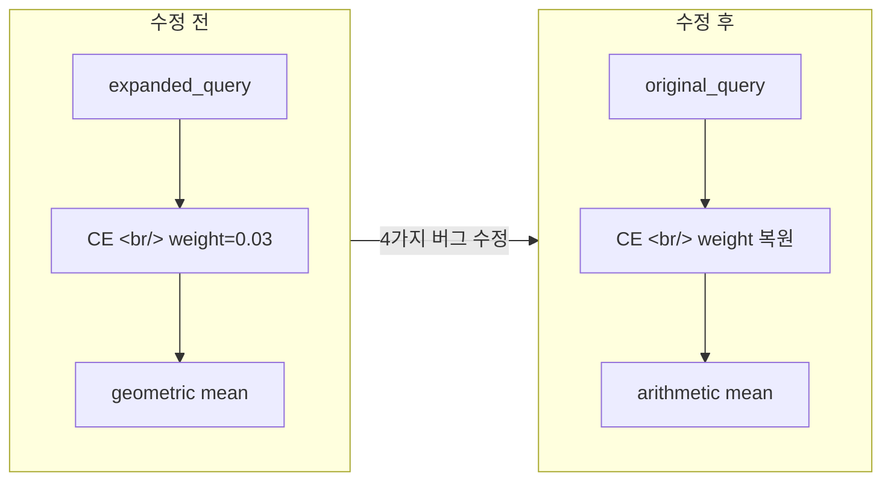

[이전 글: Hybrid Image Search 개발기 #11](/ko/posts/2026-04-08-hybrid-search-dev11/)

Hybrid Image Search #12에서는 크게 세 가지 축으로 작업이 진행됐다. 첫째, 리랭킹 파이프라인에 숨어있던 4가지 버그를 발견하고 수정했다. 둘째, 이미지 생성 파이프라인을 단일 톤+앵글 이미지 방식에서 듀얼 배치(3-tone/5-tone)+텍스트 기반 앵글 디렉티브로 전면 교체했다. 셋째, AnglePicker, ReactionButtons, LikesTab, ImageLightbox, FeedbackModal 등 프론트엔드 컴포넌트를 일괄 구현했다. 총 42개 파일, +2,749/-662 라인의 변경이다.

<!--more-->

## 전체 작업 흐름

## 1. 리랭킹 파이프라인 — 4가지 버그 동시 수정

검색 결과의 재정렬(reranking)이 사실상 작동하지 않고 있었다. 원인을 추적해보니 버그가 하나가 아니라 네 개였다.

### 문제 분석

| 버그 | 증상 | 영향 |
|------|------|------|
| CE weight 0.03 | Cross-Encoder 점수가 최종 스코어에 3%만 반영 | 리랭킹이 사실상 무효 |
| 한국어 미세조정 없는 모델 | 한국어 쿼리에 대한 relevance 판단 부정확 | 검색 품질 저하 |
| expanded_query를 CE에 전달 | 확장된 쿼리가 원래 의도와 다른 방향으로 CE 스코어 왜곡 | 관련 없는 결과 상위 노출 |
| geometric mean 사용 | 부분 매칭 시 하나의 낮은 점수가 전체를 치명적으로 끌어내림 | 좋은 부분 매칭 결과 사라짐 |

### 해결

네 가지를 한꺼번에 수정했다. CE weight를 적정값으로 복원하고, `expanded_query` 대신 `original_query`를 Cross-Encoder에 전달하도록 변경했으며, geometric mean을 arithmetic mean으로 교체했다.

모델 업그레이드도 시도했다. `bge-reranker-v2-m3`(568M 파라미터)은 한국어 성능이 확실히 좋았지만, EC2 CPU 환경에서 컴포넌트당 16초가 걸려 실사용이 불가능했다. 결국 기존 `mmarco-mMiniLMv2`(136M)로 롤백하되, 나머지 세 가지 수정은 그대로 유지했다.

## 2. 멀티톤 + 앵글 텍스트 오버홀

기존에는 단일 톤과 앵글 이미지 한 장을 주입하는 방식이었다. 이번에 이를 완전히 뒤집었다.

### 앵글: 이미지 → 텍스트 디렉티브

앵글 참조 이미지를 제거하고, 텍스트 기반 프리셋으로 전환했다. `angle_text.py`에 "45도 하향 앵글", "오버헤드", "아이레벨" 등의 프리셋을 정의하고, `lens.py`에는 카테고리별 렌즈 초점거리 프리셋(예: 인물 85mm, 풍경 24mm)을 추가했다.

텍스트 디렉티브의 장점은 명확하다. 앵글 이미지를 찾고 관리하는 비용이 사라지고, 프롬프트 레벨에서 세밀한 조정이 가능해진다.

### 톤: 단일 → 듀얼 배치 (3-tone / 5-tone)

한 번의 생성 요청에서 3-tone 배치와 5-tone 배치를 동시에 돌린다. 사용자는 프론트엔드에서 tone3/tone5 토글로 결과를 비교할 수 있다. DB 스키마에도 multi-tone 컬럼을 추가하고, `log_generation` 함수를 업데이트했다.

### person-intent 모델 자동 인젝션

Gemini 분류 프롬프트에 `intent_person` 필드를 추가했다. 사용자가 올린 참조 이미지에 인물이 없으면, `refs/model_image_ref/` 디렉토리에서 모델 이미지를 자동으로 주입한다. 인물 의도가 있는 쿼리인데 참조에 사람이 없는 경우를 커버하기 위한 장치다.

## 3. 프론트엔드 기능 스프린트

백엔드 변경에 맞춰 프론트엔드 컴포넌트를 집중적으로 구현했다.

### 새로 추가된 컴포넌트

- **AnglePicker** — 앵글 프리셋을 검색·선택하는 컴포넌트. `/api/angle-presets` 엔드포인트에서 목록을 가져온다. 생성 후에도 앵글을 재선택할 수 있도록 detail 페이지에 통합했다.
- **ReactionButtons** — 생성된 이미지에 대한 빠른 리액션(이모지) 버튼
- **LikesTab** — 좋아요를 누른 이미지를 모아보는 갤러리 탭
- **ImageLightbox** — 썸네일 클릭 시 확대 보기
- **FeedbackModal** — 텍스트 기반 상세 피드백 입력 모달

### 듀얼 배치 UI

프론트엔드에서 `MAX_REFS`를 7로 올리고, 듀얼 배치 생성을 지원한다. detail 페이지에서는 multi-tone 정보 표시와 tone3/tone5 토글을 추가했다.

### API 엔드포인트

`GET /api/angle-presets`, reaction 및 feedback 엔드포인트를 추가하고, API 인터페이스 타입 정의를 업데이트했다.

## 4. 프로드 서버 디버깅 & 인프라

### Grafana 데이터 누락

`DEPLOYMENT_ENV` 환경변수가 설정되지 않았고, `.env` 파일의 줄바꿈 누락으로 S3 경로가 잘못 조합되고 있었다. 두 가지를 모두 수정해서 모니터링 데이터가 정상 수집되도록 했다.

### DB 마이그레이션 누락

`injected_model_filename` 컬럼이 프로드 DB에 없어서 모델 자동 인젝션 기능이 실패했다. migration 스크립트를 추가해서 해결했다.

### 인프라 개선

- prod SSH 키를 ed25519로 전환하고 lifecycle guard 추가
- 열린 포트를 닫고 nginx reverse proxy 구성
- 시작 시 인증 체크에서 발생하던 중복 401 에러 제거
- 모바일 반응형 레이아웃 수정
- Security Group description을 AWS 검증 규격에 맞게 수정
- `APP_ENVIRONMENT`를 ecosystem.config.js에서 제거

## 마무리

이번 스프린트에서 가장 의미 있었던 작업은 리랭킹 파이프라인 수정이다. 네 가지 버그가 동시에 존재하면서 서로의 영향을 가려주고 있었기 때문에, 하나씩 고치면 오히려 결과가 나빠지는 상황이었다. 한꺼번에 수정하고 나서야 리랭킹이 제대로 작동하는 것을 확인할 수 있었다.

듀얼 배치 생성과 텍스트 기반 앵글은 아직 사용자 피드백을 충분히 모으지 못했다. 다음 단계에서는 reaction과 feedback 데이터를 기반으로 3-tone과 5-tone 중 어느 쪽이 선호되는지, 앵글 텍스트 프리셋이 실제로 앵글 이미지보다 나은지를 검증할 계획이다.
