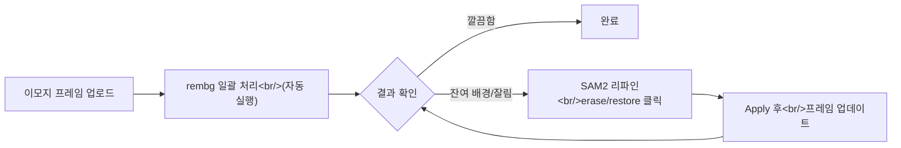

> [이전 글: PopCon 개발기 #4](/ko/posts/2026-04-08-popcon-dev4/)

## 개요

PopCon 개발기 #4에서 SAM 2.1 인터랙티브 세그멘테이션과 비용 최적화를 다뤘다. 이번 글에서는 그 위에 **리파인 페이지를 전면 구축**하고, rembg 일괄 처리 후 SAM2로 터치업하는 **하이브리드 파이프라인**을 완성한 과정을 정리한다. 영상 생성 쪽에서는 wan2.6-i2v-flash 720P로 모델을 업그레이드하고, 모션 프롬프트를 물리적 바디 메커닉스 기반으로 전면 리라이트했다.

<!--more-->

## 1. 하이브리드 배경 제거 파이프라인

### 문제: rembg만으로는 부족하다

rembg는 빠르고 일괄 처리에 좋지만, 이모지 프레임처럼 경계가 복잡한 이미지에서는 잔여 배경이 남거나 캐릭터 일부가 잘려나가는 경우가 잦았다. 반대로 SAM2는 정밀하지만 모든 프레임을 하나씩 클릭하기엔 시간이 너무 걸린다.

### 해결: rembg 일괄 → SAM2 터치업

두 도구의 장점을 합치는 하이브리드 접근을 택했다.



핵심은 `/refine` 페이지 진입 시 **rembg를 자동 실행**하고, 사용자는 결과만 확인한 뒤 문제가 있는 프레임만 SAM2로 터치업하는 흐름이다. 로딩 화면을 표시하면서 auto-rembg를 돌리고, 완료되면 바로 리파인 캔버스로 넘어가도록 했다.

```typescript
// refine/page.tsx — 페이지 로드 시 자동 rembg 실행
useEffect(() => {
  if (frames.length > 0 && !rembgComplete) {
    runRembgOnAllFrames(frames).then(() => {
      setRembgComplete(true);
    });
  }
}, [frames]);
```

### SAM2 erase/restore 리파인

rembg 결과 위에서 SAM2를 사용하는 방식은 두 가지 모드로 나뉜다.

- **Erase**: 남아 있는 배경 잔여물을 클릭하면 해당 영역이 마스킹되어 제거
- **Restore**: rembg가 잘라낸 캐릭터 부분을 클릭하면 원본에서 복원

`RembgRefineCanvas.tsx`에서 캔버스 클릭 좌표를 수집하고, 백엔드 SAM2 엔드포인트에 포인트 리스트를 전송한다. 한 가지 까다로운 점은 **multi-point 입력을 단일 오브젝트로 래핑**해야 한다는 것이었다. SAM2 API가 포인트 배열을 개별 오브젝트로 해석하면 각 포인트마다 별도 마스크가 생성되어 의도와 달라진다.

```python
# backend/main.py — multi-point를 단일 오브젝트로 래핑
input_points = [[p["x"], p["y"]] for p in points]
input_labels = [p["label"] for p in points]  # 1=foreground, 0=background

# 단일 오브젝트로 전달해야 하나의 통합 마스크 생성
masks, scores, _ = predictor.predict(
    point_coords=np.array([input_points]),
    point_labels=np.array([input_labels]),
    multimask_output=False,
)
```

## 2. 캐릭터 이미지 전용 리파인 캔버스

이모지 프레임뿐 아니라 **캐릭터 원본 이미지**에도 SAM2 리파인이 필요했다. 캐릭터 업로드 단계에서 배경이 깔끔하지 않으면 이후 모든 파이프라인에 영향을 미치기 때문이다.

`CharacterRefineCanvas.tsx`를 별도로 만들어 `CharacterUpload.tsx`에서 호출하는 구조로 분리했다. erase/restore 로직은 이모지 쪽과 동일하지만, 프레임 네비게이션 없이 단일 이미지에 집중하는 UI다.

## 3. 리파인 UX 다듬기

파이프라인은 완성됐지만 실제로 써보니 UX 문제가 산적했다. 24개 커밋 중 상당수가 이 UX 개선에 할애됐다.

### Side-by-side 원본 참조

리파인 작업 중 "이 부분이 원래 배경인지 캐릭터인지" 판단하려면 원본을 봐야 한다. 원본과 리파인 캔버스를 나란히 배치하고, **crosshair를 동기화**해서 마우스 위치가 양쪽에 동시에 표시되도록 했다.

### 프레임 네비게이션

이모지는 보통 수십 프레임이다. 화살표 키로 프레임 간 이동을 지원하고, 하단에 클릭 가능한 썸네일 스트립을 배치했다. per-frame SAM2 세그멘테이션도 프레임 전환 시 자동으로 초기화된다.

### 툴바 정리

초기 버전은 버튼이 여기저기 흩어져 있었다. undo/reset/apply 버튼을 캔버스 위에 모으고, 전체 툴바를 단일 컴팩트 행으로 통합했다. Tabbed UI로 rembg 결과 보기와 SAM2 리파인 모드를 전환할 수 있게 했다.

### 소소한 버그 수정들

- Apply 후 캔버스에 남아있던 **클릭 도트 지우기** — apply 이벤트 핸들러에서 dots 배열 초기화
- Canvas `Image` 객체에 `crossOrigin` 속성을 설정하면 **same-origin 이미지도 CORS 프리플라이트**를 타는 문제 — 불필요한 `crossOrigin` 제거

## 4. 영상 생성 업그레이드

### wan2.6-i2v-flash 720P

기존 영상 생성 모델을 **wan2.6-i2v-flash**로 업그레이드하고 해상도를 720P로 올렸다. 모델 파라미터 변경 과정에서 API 필드명이 달라진 부분이 있었다.

```python
# prompt_extend → extend_prompt 필드명 수정, negative_prompt 추가
response = client.video.generate(
    model="wan2.6-i2v-flash",
    image=image_url,
    prompt=motion_prompt,
    extend_prompt=True,        # 기존: prompt_extend
    negative_prompt="blurry, low quality, distorted",
    resolution="720P",
)
```

### 모션 프롬프트 리라이트

기존 모션 프리셋은 "wave hand", "nod head" 같은 단순한 지시였다. 이를 **물리적 바디 메커닉스**를 기술하는 상세 프롬프트로 리라이트했다. 예를 들어:

- 기존: `"wave hand"`
- 변경: `"character raises right arm from resting position, forearm rotates at elbow joint, hand pivots at wrist with fingers spread, smooth pendulum motion"`

### 배경 관련 프롬프트 보정

영상 생성에서 이펙트(파티클, 빛 등)가 캐릭터에 달라붙는 문제가 있었다. 이펙트를 캐릭터와 분리하라는 지시를 추가하고, **solid white background**를 강제하는 프롬프트를 넣었다.

## 5. Matting 모델 벤치마크

### 왜 별도 벤치마크가 필요했나

rembg가 "대부분" 잘 동작한다고는 했지만, 얼마나 잘 동작하는지 정량적으로 비교할 근거가 없었다. LINE 애니메이션 이모지 프레임이라는 특수한 도메인에서 어떤 matting 모델이 최적인지 체계적으로 비교하기 위해 **popcon-matting-bench** 별도 레포지토리를 만들었다.

### 테스트 조건

6가지 모델/설정을 비교했다:

| 모델 | 설명 |
|------|------|
| rembg | 기본 U2-Net 기반 (베이스라인) |
| rembg_enhanced | rembg 후처리 강화 |
| MODNet ONNX | 경량 25MB 포트레이트 matting |
| ViTMatte_5 | trimap 폭 5px |
| ViTMatte_10 | trimap 폭 10px |
| ViTMatte_20 | trimap 폭 20px |
| RVM | Robust Video Matting (실사 영상용) |

### 평가 지표

두 가지 지표로 측정했다:

- **Halo Score**: 알파 경계에서 검정 배경 합성 시 흰색 프린지(halo) 강도. 낮을수록 좋다.
- **Coverage Ratio**: rembg 베이스라인 대비 전경 면적 비율. 1.0이 베이스라인과 동일.

```python
# Halo Score 계산 — 알파 경계의 흰색 프린지 측정
def compute_halo_score(alpha: np.ndarray, rgb: np.ndarray) -> float:
    """검정 배경 합성 후 알파 경계에서 밝기 누출을 측정."""
    # 알파 경계 추출 (0 < alpha < 255인 픽셀)
    edge_mask = (alpha > 10) & (alpha < 245)
    if edge_mask.sum() == 0:
        return 0.0
    # 검정 배경 합성
    composite = (rgb * (alpha[..., None] / 255.0)).astype(np.uint8)
    # 경계 영역의 평균 밝기
    edge_brightness = composite[edge_mask].mean() / 255.0
    return float(edge_brightness)
```

### 결과: 만화 곰 캐릭터 (24 프레임)

| 모델 | Clean 비율 | Halo Score | Coverage Ratio | 비고 |
|------|-----------|------------|----------------|------|
| **rembg** | **100%** | **0.000** | **1.000** | 고대비 만화에 최적 |
| rembg_enhanced | 100% | 0.000 | 1.000 | rembg와 동일 |
| ViTMatte_20 | 100% | 0.031 | 1.016 | 디테일 보존 최고 (모션 라인, 이펙트) |
| ViTMatte_10 | 100% | 0.024 | 1.008 | 안정적 |
| ViTMatte_5 | 100% | 0.018 | 1.002 | 보수적 |
| MODNet | 96% | 0.045 | 0.860 | 전경 14% 손실 (포트레이트 특화) |
| RVM | 42% | 0.089 | 0.630 | 만화 콘텐츠 파괴 (실사 영상 특화) |

### 결론

- **rembg**: 두꺼운 외곽선의 고대비 만화 캐릭터에는 halo 0, coverage 100%로 최적. 추가 모델이 필요 없다.
- **ViTMatte_20**: 얇은 선, 파스텔 톤, 모션 블러가 있는 프레임에서는 rembg보다 디테일을 1.6% 더 보존한다. 복잡한 이모지에 적합.
- **MODNet / RVM**: 포트레이트나 실사 영상에 최적화되어 있어 만화 이모지에는 부적합. MODNet은 전경의 14%를, RVM은 37%를 잃는다.

이 벤치마크 결과가 하이브리드 파이프라인의 설계 근거가 됐다 — 단순한 캐릭터는 rembg 자동 처리로 충분하고, 복잡한 프레임만 SAM2로 터치업하면 된다.

## 6. 기타 개선

### 커스텀 프롬프트 에디터

사용자가 직접 프롬프트를 수정할 수 있는 에디터를 추가했다. 에디터 상태는 페이지 이동 후에도 유지되도록 persistence를 구현했다.

### 다운로드 버튼

리파인된 프레임과 생성된 영상을 개별 다운로드할 수 있는 버튼을 추가했다.

## 정리

이번 스프린트의 핵심은 **"자동화 + 수동 터치업"의 균형**이다.

| 영역 | 변경 내용 |
|------|-----------|
| 배경 제거 | rembg 자동 → SAM2 수동 터치업 하이브리드 |
| Matting 벤치마크 | 6개 모델 비교 — rembg가 고대비 만화에 최적, ViTMatte_20이 디테일 보존 최고 |
| 리파인 UX | side-by-side 참조, 키보드 네비게이션, tabbed UI |
| 캐릭터 리파인 | 전용 SAM2 캔버스 분리 |
| 영상 생성 | wan2.6-i2v-flash 720P, 바디 메커닉스 프롬프트 |
| 편의 기능 | 커스텀 프롬프트, 다운로드, 상태 persistence |

rembg가 90%를 처리하고 SAM2가 나머지 10%를 잡아주는 구조 덕분에, 수십 프레임의 이모지 배경 제거 작업 시간이 체감상 절반 이하로 줄었다. 다음 글에서는 이렇게 만든 에셋을 실제 스티커/이모지 플랫폼에 배포하는 과정을 다룰 예정이다.
