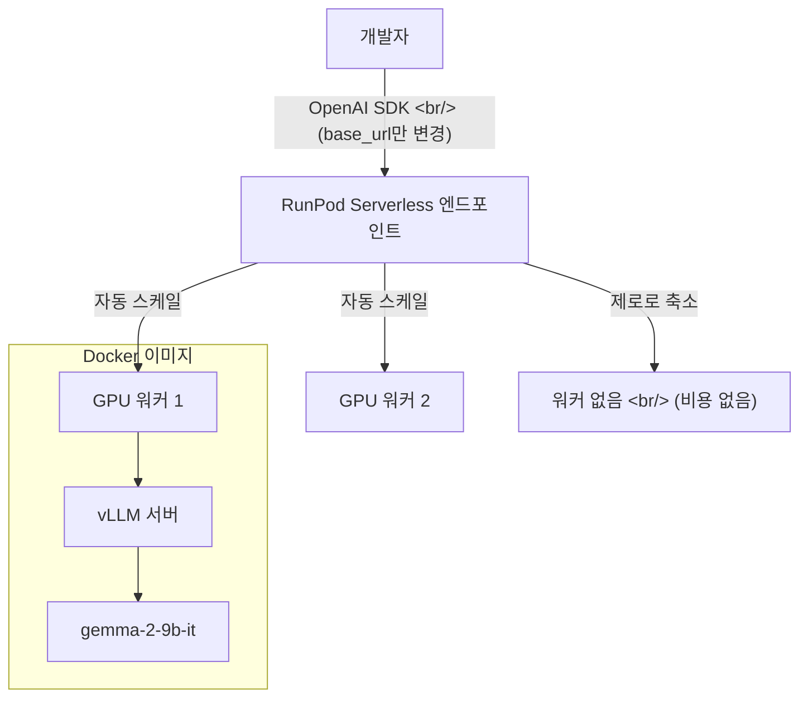
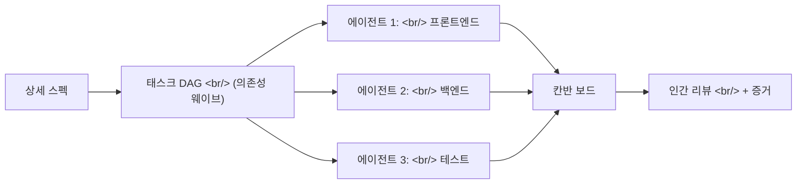

## 개요

자체 호스팅 LLM이 극적으로 쉬워지고 있다. RunPod Serverless와 vLLM 조합은 유휴 비용 없는 OpenAI 호환 API 엔드포인트를 제공한다. 한편 오픈소스 개발 도구 생태계가 빈틈을 채우고 있다 — OpenScreen은 유료 화면 녹화를 대체하고, HarnessKit은 AI 에이전트 오케스트레이션의 엔지니어링 패턴을 제안한다.

<!--more-->

## RunPod Serverless: 유휴 비용 없는 GPU 클라우드

[RunPod](https://runpod.io)은 GPU 클라우드 인프라 서비스로, OpenAI의 인프라 파트너이기도 하다. 핵심 제안: 사용하지 않을 때 제로로 스케일되는 서버리스 GPU 포드와 OpenAI 호환 API 레이어.



### vLLM 통합

배포 패턴은 RunPod 서버리스 플랫폼의 Docker 컨테이너 안에서 vLLM을 추론 엔진으로 사용한다:

```python
# OpenAI에서 자체 호스팅으로의 전체 마이그레이션:
# base_url과 api_key만 바꾸면 된다

import openai

client = openai.OpenAI(
    api_key="your-runpod-api-key",
    base_url="https://api.runpod.ai/v2/{endpoint_id}/openai/v1"
)

response = client.chat.completions.create(
    model="google/gemma-2-9b-it",
    messages=[{"role": "user", "content": "Hello!"}]
)
```

자체 호스팅 LLM의 진입장벽이 여기까지 낮아졌다: 모델을 vLLM과 함께 Docker 이미지로 패키징하고, RunPod Serverless에 배포하고, `base_url`을 교체. OpenAI SDK를 사용하는 기존 코드가 변경 없이 동작한다. 지원 모델: Llama 3, Mistral, Qwen3, Gemma, DeepSeek-R1, Phi-4.

### FlashBoot: 콜드 스타트 해결

서버리스 GPU의 최대 고통점은 콜드 스타트 지연이다 — 대형 모델로 새 워커를 기동하면 60초 이상 걸릴 수 있다. RunPod의 FlashBoot 최적화가 이를 약 10초로 줄인다(추가 비용 약 10%). 스핀다운 후에도 모델 상태를 유지해서 다음 요청 시 더 빠르게 워밍업한다. 버스트 트래픽 패턴(개발자 도구의 전형적 패턴)에서 "사용 가능"과 "고장난 느낌" 사이의 차이를 만든다.

### 왜 중요한가

서버리스 모델이 GPU 클라우드의 최대 고통점을 제거한다: 유휴 시간에 대한 지불. 전통적인 GPU 인스턴스는 추론을 실행하든 안 하든 시간 단위로 과금된다. RunPod의 서버리스 포드는 요청 시 기동하고 제로로 스케일 다운해서, 간헐적 워크로드에서 자체 호스팅 LLM이 실용적이 된다 — 대부분의 개발자 도구가 따르는 정확한 패턴이다.

AI 기능을 구축하는 팀에게 실용적인 중간 지점이 생긴다:
- **OpenAI/Anthropic API** — 간단하지만 대규모에서 비쌈, 모델 커스터마이징 불가
- **전용 GPU 서버** — 완전한 제어 가능하지만 높은 고정 비용
- **RunPod Serverless** — 사용량 기반 과금의 자체 호스팅 모델

## OpenScreen: 개발자를 위한 무료 화면 녹화

[OpenScreen](https://github.com/siddharthvaddem/openscreen) (27,321 stars)은 Screen Studio의 오픈소스 대안이다 — 개발자들이 프로덕트 데모와 튜토리얼 제작에 사용하는 월 $29 화면 녹화 도구.

Electron과 TypeScript로 구축, 렌더링에 PixiJS를 사용하며, 기본 이상의 기능을 제공한다:
- 클릭 시 자동/수동 줌과 조절 가능한 줌 깊이
- 자동 팬과 모션 블러로 부드러운 애니메이션
- 웹캠 오버레이가 포함된 화면 캡처와 크기 조절 가능한 웹캠
- 커스텀 배경(단색, 그라디언트, 월페이퍼)과 크롭 기능
- 마이크 + 시스템 오디오 녹음, 실행 취소/다시 실행
- MP4 내보내기 (최근 Wayland/Linux 수정 포함)
- 워터마크 없음, 상업적 사용 무료

프로젝트는 폭발적으로 성장했다 — 피크 시 하루 만에 2,573개의 스타가 증가. 380개 이상의 풀 리퀘스트와 활발한 국제화 기여(터키어, 프랑스어)로 Screen Studio와의 격차를 빠르게 좁히고 있다. 아직 부족한 건 Screen Studio의 세련된 커서 효과와 자동 프레이밍 정도인데, 개발자 데모 용도로는 이미 충분하다.

### 개발자에게 왜 필요한가

개발자 애드보커시와 문서화에 점점 더 영상이 필요하다. GIF가 포함된 README, 화면 녹화가 포함된 PR 설명, 런칭용 데모 영상. Screen Studio의 품질은 훌륭하지만, 터미널 세션이나 UI 인터랙션의 깔끔한 녹화만 필요할 때 월 $29는 부담이 된다.

## HarnessKit: AI 에이전트 오케스트레이션 패턴

[HarnessKit](https://github.com/deepklarity/harness-kit) (32 stars, deepklarity)은 AI 에이전트 도구에 다른 각도로 접근한다. 또 하나의 오케스트레이션 프레임워크가 아니라, 에이전트 기반 개발 주변의 **엔지니어링 패턴**에 집중한다:

- **TDD 우선 실행** — 에이전트가 구현 전에 테스트를 먼저 작성
- **구조화된 디버깅** — 에이전트 실패에 대한 체계적 접근
- **지식 축적** — 각 실행이 다음 실행을 개선
- **비용 인식 위임** — 에이전트별 토큰 지출 추적 및 최적화

아키텍처는 칸반 보드 UI, DAG 기반 태스크 분해, 에이전트별 비용 추적을 제공한다. 철학이 인상적이다: "시스템은 당신이 제공하는 스펙만큼만 좋다. 코드가 아니라 스펙에 시간을 투자하라."



### 같은 이름, 다른 접근

흥미롭게도 HarnessKit이라는 이름의 또 다른 프로젝트(Superpowers 플러그인)가 있는데, Claude Code 통합에 집중한다 — 하네스 설정, 툴킷 관리, `.harnesskit/` 디렉토리를 통한 기능 추적. 둘을 비교하면 같은 문제에 대한 접근법의 폭이 드러난다: 소프트웨어 개발을 위한 인간-AI 협업을 어떻게 구조화할 것인가.

deepklarity 버전은 시각적 프로젝트 관리(칸반, DAG 뷰)에 기대고, Superpowers 버전은 CLI 네이티브 개발자 경험(스킬, 훅, 워크트리)에 집중한다. 둘 다 공유하는 통찰: 개별 에이전트의 능력보다 오케스트레이션 레이어가 더 중요하다.

## 인사이트

RunPod, OpenScreen, HarnessKit을 연결하는 맥락은 **도구를 통한 민주화**다. RunPod는 DevOps 전문 지식 없이 GPU 추론을 접근 가능하게 만든다. OpenScreen은 품질 희생 없이 화면 녹화를 무료로 만든다. HarnessKit은 멀티에이전트 오케스트레이션을 임기응변이 아닌 체계적으로 만들려 한다.

RunPod의 서버리스 모델이 특히 의미 있는 이유는 자체 호스팅 LLM에 대한 마지막 주요 반대 — 비용 예측 불가능성 — 을 제거하기 때문이다. 스케일 투 제로와 OpenAI 호환 API로, 팀이 전용 인프라에 대한 헌신 없이 오픈 웨이트 모델(Gemma, Llama, Mistral)을 실험할 수 있다.

오픈소스 개발 도구의 물결은 더 넓은 패턴을 반영한다: AI가 소프트웨어 구축의 진입장벽을 낮추면서, 개발 프로세스를 둘러싼 도구들 — 녹화, 오케스트레이션, 배포 — 도 보조를 맞춰야 한다. 승리하는 도구는 해당 도메인의 전문 지식을 요구하지 않으면서 마찰을 줄이는 도구다. RunPod는 GPU 관리를, OpenScreen은 영상 프로덕션을, HarnessKit은 에이전트 조정을 숨긴다. 문제는 이 추상화가 현실 세계의 복잡성에서 버텨내느냐다.
