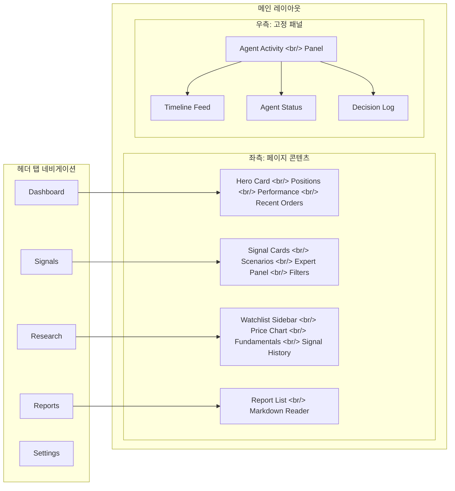

기존 Trading Agent UI의 구조적 문제를 분석하고, Tailwind CSS v4 + shadcn/ui 기반으로 5개 페이지와 Agent Activity 패널을 새로 설계/구현한 과정을 정리한다.

<!--more-->

> [이전 글: Trading Agent 개발기 #9](/ko/posts/2026-04-08-trading-agent-dev9/) — ATR 동적 손절매와 투자 기간 관리

## 문제: 핵심이 뒷전에 있는 UI

Trading Agent의 핵심 사용 사례는 **에이전트 활동 모니터링**이다. 실시간으로 어떤 에이전트가 무엇을 판단하고, 어떤 시그널을 생성했으며, 최종 결정이 어떻게 내려졌는지를 추적하는 것이 이 도구의 존재 이유다.

그런데 기존 UI 구조에서는 이 핵심 기능이 **2차 탭에 묻혀 있었다**. 반면 채팅 인터페이스가 화면의 상당 부분을 상시 차지하고 있었다. 체감상 사용 시간의 80%를 차지하는 기능이 한 번 클릭을 더 해야 보이는 구조 — 이건 단순 개선이 아니라 전면 재설계가 필요한 문제였다.

## 설계: 디자인 퍼스트 세션

코드를 바로 작성하는 대신, 별도 세션(세션 3)을 디자인 전용으로 할당했다. HTML 목업으로 레이아웃을 잡고, 스펙 문서를 작성한 뒤, 12개 태스크로 구현 계획을 세웠다.

새 레이아웃의 핵심 원칙:

1. **Agent Activity는 항상 보인다** — 우측 고정 패널로 어떤 페이지에서든 실시간 상태 확인 가능
2. **헤더 탭으로 페이지 전환** — Dashboard / Signals / Research / Reports / Settings
3. **채팅은 필요할 때만** — 상시 노출에서 온디맨드로 전환

## 구현: 바닥부터 다시 쌓기

### 1단계: 기반 구축 — Tailwind CSS v4 + shadcn/ui

기존 스타일링을 완전히 걷어내고, **Tailwind CSS v4**와 **shadcn/ui**를 도입했다.

shadcn/ui를 선택한 이유는 명확하다:
- 복사해서 쓰는 구조라 커스터마이징이 자유롭다
- Radix UI 기반이라 접근성이 보장된다
- Tailwind와 궁합이 완벽하다

이 단계에서 Button, Badge, Card, Command, Dialog, Table 등 **17개 UI 컴포넌트**를 한꺼번에 세팅했다. 약 4,900줄이 추가됐지만, 대부분 shadcn/ui 컴포넌트 코드다.

### 2단계: 레이아웃 셸

`app.tsx`를 완전히 다시 작성했다. 기존 190줄을 걷어내고 새 구조로 277줄을 작성.

핵심 컴포넌트:
- **`header.tsx`** — 5개 탭 네비게이션
- **`main-layout.tsx`** — 좌측 콘텐츠 + 우측 Agent Activity 패널의 분할 레이아웃

### 3단계: Agent Activity 패널

가장 중요한 컴포넌트. 3개 서브 뷰로 구성:

| 서브 뷰 | 역할 | 핵심 컴포넌트 |
|---|---|---|
| **Timeline** | 실시간 이벤트 흐름 | `timeline-feed.tsx`, `flow-event.tsx` |
| **Agent Status** | 각 에이전트의 현재 상태 | `activity-panel.tsx` |
| **Decision Log** | 결정 체인 추적 | `decision-chain.tsx` |

이 패널은 모든 페이지에서 우측에 고정되므로, 어떤 작업을 하든 에이전트 상태를 바로 확인할 수 있다.

### 4단계: 5개 메인 페이지

**Dashboard** — 가장 무거운 페이지(631줄 추가). Hero Card로 포트폴리오 요약, Positions Table로 현재 보유 종목, Performance Chart로 수익률 추이, Recent Orders로 최근 주문 내역을 한눈에 보여준다.

**Signals** — 시그널 카드, 시나리오 행, 전문가 패널, 필터로 구성. 각 시그널이 어떤 시나리오에서 발생했고, 전문가 에이전트들이 어떤 입장인지를 시각적으로 보여준다.

**Research** — 좌측에 Watchlist Sidebar, 메인 영역에 Price Chart와 Fundamentals Card, 하단에 Signal History. 종목 하나를 깊이 파볼 때 쓰는 페이지.

**Reports** — 좌측에 리포트 목록, 우측에 Markdown Reader. 에이전트가 생성한 분석 리포트를 읽는 뷰.

**Settings** — 아직 플레이스홀더 상태.

## 커밋 히스토리

| 순서 | 내용 | 변경량 |
|---|---|---|
| 1 | Tailwind CSS v4 + shadcn/ui 기반 초기화 | +793/-73 |
| 2 | shadcn/ui 컴포넌트 17개 추가 | +4,896/-50 |
| 3 | 레이아웃 셸 (헤더 탭, 분할 패널) | +277/-190 |
| 4 | Agent Activity 패널 | +358/-3 |
| 5 | Dashboard 페이지 | +631/-1 |
| 6 | Signals 페이지 | +194/-1 |
| 7 | Research 페이지 | +289/-1 |
| 8 | Reports 페이지 | +115/-1 |

총 56개 파일, **+7,747 / -514줄**.

## 회고

### 잘한 것

- **디자인 퍼스트**: 코드부터 작성하지 않고 HTML 목업 + 스펙 문서 + 12-태스크 계획을 먼저 세운 것. 구현 단계에서 방향을 잃지 않았다.
- **바닥부터 다시 쌓기**: 기존 코드에 패치를 덧대는 대신 완전히 새로 작성한 것. 구조적 문제는 구조적으로 해결해야 한다.
- **핵심 기능의 항상-노출**: Agent Activity 패널을 고정 사이드바로 배치한 것. 이제 탭 전환 없이 에이전트 상태를 항상 볼 수 있다.

### 다음 할 것

- Settings 페이지 구현
- 실시간 WebSocket 연동 (현재는 목업 데이터)
- 반응형 레이아웃 (모바일에서 Agent Activity 패널 처리)
- 다크 모드 지원

---

*Trading Agent 시리즈의 다음 글에서 계속.*
