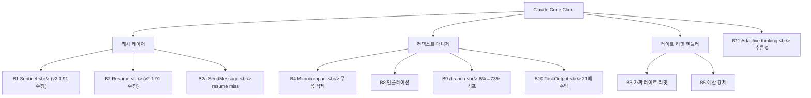
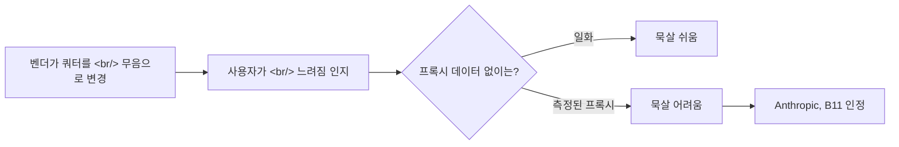

## 개요

[ArkNill/claude-code-hidden-problem-analysis](https://github.com/ArkNill/claude-code-hidden-problem-analysis)는 어떤 개발자 도구에 대해서도 본 적 있는 가장 철저한 커뮤니티 리버스 엔지니어링 중 하나다. **11개의 확인된 클라이언트 사이드 버그**를 카탈로그하고, 그중 **9개가 v2.1.92부터 v2.1.97까지 6번의 릴리스 동안 미수정 상태**라는 것을 추적하며, 가로챈 HTTP 헤더에서 서버 사이드 쿼터 시스템을 재구성한다. 이 글은 그 안에 실제로 무엇이 있는지 정리한다.

<!--more-->

## 버그의 위치

레포의 버그 분류는 세 레이어를 친다 — **캐시**(B1, B2, B2a), **컨텍스트**(B4, B8, B9, B10), **레이트 리밋**(B3, B5, B11). Anthropic은 v2.1.91에서 B1과 B2 수정을 출시했고, 이후 6번의 릴리스 동안 다른 어떤 것도 움직이지 않았다. 메인테이너는 이 사례를 만들기 위해 변경 로그를 명시적으로 교차 참조한다.

## 프록시 데이터셋

이 분석을 평범한 "Claude Code가 느려진 것 같다" 불평과 구분하는 것은 데이터다. 메인테이너는 Claude Code 클라이언트와 Anthropic API 사이의 모든 요청을 캡처하는 투명 HTTP 프록시(**cc-relay**)를 운영한다. 4월 8일 데이터셋은 다음을 포함한다:

- **17,610 요청**, **129 세션** (4월 1-8일)
- **532개 JSONL 파일** (158.3 MB)의 원본 세션 로그
- 데이터셋 전체에서 **자동화된 버그 감지**

눈에 띄는 숫자들:
- **B5 예산 강제 이벤트:** 261건(4/3 단일일 측정)에서 **72,839건(전체 주 4/1-8)**으로 — 데이터셋이 커지면서 감지량 279배 증가, 거의 모든 긴 세션에서 발생함을 시사
- **B4 microcompact 이벤트:** 3,782 이벤트가 세션 중간에 **15,998 아이템**을 무음 삭제
- **B8 컨텍스트 인플레이션:** 10 세션 평균 2.37배, 최대 4.42배 — 보편적, 고립 사례 아님
- **합성 레이트 리밋(B3):** 532 파일 중 183개(34.4%)에 `<synthetic>` 모델 항목 — 만연

캐시 효율은 v2.1.91의 모든 세션 길이에서 98-99%를 유지했고, 캐시 회귀가 진짜 수정되었음을 확인한다. 요청당 비용은 세션 길이에 따라 스케일한다 — 0-30분 세션 `$0.20/요청` vs 5시간 이상 세션 `$0.33/요청`. 메인테이너는 이를 버전 특정 버그가 아닌 구조적 컨텍스트 성장에 귀속한다.

## 리버스 엔지니어링된 쿼터 아키텍처

가장 흥미로운 단일 발견은 **3,702 요청**(4월 4-6일)에서 `anthropic-ratelimit-unified-*` 헤더로 재구성한 쿼터 시스템이다. 헤드라인:

**듀얼 슬라이딩 윈도우 시스템:** 두 개의 독립 카운터가 병렬로 — **5시간** 윈도우(`5h-utilization`)와 **7일** 윈도우(`7d-utilization`). 관측된 모든 요청에서 `representative-claim` 필드가 `five_hour`였다 — 즉 5시간 윈도우가 *항상* 병목이고, 7일 윈도우는 그렇지 않다.

Max 20x ($200/월)에서 1% 이용률당 측정값:

| 메트릭 | 1%당 범위 |
|--------|-----------|
| Output 토큰 | 9K-16K |
| Cache Read 토큰 | 1.5M-2.1M |
| Total Visible | 1.5M-2.1M |
| 7일 누적 비율 | 0.12-0.17 |

### Thinking 토큰 사각지대

여기가 불편한 부분이다. Extended thinking 토큰이 API가 반환하는 `output_tokens` 필드에 **포함되지 않는다.** 1%당 9K-16K visible output이라면, 5시간 윈도우 100% 전체가 0.9M-1.6M visible output 토큰밖에 안 된다 — 몇 시간의 Opus 작업으로는 비현실적으로 낮다. 이 패턴은 thinking 토큰이 클라이언트 보고 없이 서버 사이드에서 쿼터에 카운트되고 있다는 가설과 일치한다. 메인테이너는 이를 클라이언트에서 미확인이라고 명시적으로 표시하고, thinking 비활성화 격리 테스트를 제안한다.

이게 중요한 이유는 **Max 플랜 사용자가 언제 한계에 부딪힐지 예측할 방법이 없다는 것**을 의미하기 때문이다 — visible 토큰 카운터는 모델이 얼마나 많이 thinking 하는지에 따라 달라지는 인자만큼 실제 소비를 과소평가하고, 사용자는 그것을 관찰할 수 없다.

## 커뮤니티 교차 검증

두 명의 독립 기여자가 자체 데이터로 분석을 뒷받침한다:
- **@fgrosswig**: 듀얼 머신 18일 JSONL 포렌식이 3월 26일(32억 토큰, 무제한)과 4월 5일(8800만 토큰에 90%) 사이 **64배 예산 감소**를 보여줌
- **@Commandershadow9**: 별도 캐시 수정 포렌식이 캐시 버그와 무관한 **34-143배 용량 감소**를 보여주며, thinking 토큰 가설을 뒷받침

Anthropic은 Hacker News에서 B11(adaptive thinking zero-reasoning → 사실 조작)을 인정했지만 후속 조치는 없었다.

## 이 분석이 중요한 이유

이 레포는 본질적으로 **벤더 API의 투명한 옵저버빌리티가 왜 중요한가**의 워크드 예제다. `cc-relay`가 실제 헤더와 JSONL 포렌식을 캡처하지 않았다면, 분석의 모든 주장은 "사용자 오류" 또는 "당신 프롬프트가 이전과 다르다"로 묵살될 수 있다. 17K 요청이 기록되면, 대화는 "서버가 실제로 무엇을 다르게 하고 있는가"로 옮겨간다.

자매 레포 [ArkNill/claude-code-cache-analysis](https://github.com/ArkNill/claude-code-cache-analysis)는 캐시 특화 딥다이브를 갖고 있고, 분석을 건너뛰고 우회책만 적용하려는 사용자를 위한 [퀵스타트 가이드](https://github.com/ArkNill/claude-code-hidden-problem-analysis/blob/main/09_QUICKSTART.md)도 있다.

## 인사이트

이게 벤더가 불투명할 때 좋은 개발자 도구 QA가 어떻게 생겼는지를 보여준다. 패턴 — 투명 프록시 운영, 모든 헤더 로깅, 수백 세션에 걸쳐 자동화된 버그 감지, 변경 로그 교차 참조 — 은 모든 불투명 API 서비스에 이식 가능하다. Thinking 토큰 사각지대는 특히 **벤더의 클라이언트 사이드 텔레메트리만으로는 충분하지 않다**는 케이스 스터디다 — 서버 사이드 헤더가 필요하거나, 그러지 않으면 병목을 볼 수 없다. Max 플랜의 Claude Code 사용자에게 실용적 함의는 구체적이다 — 세션을 로깅하고, `output_tokens`가 진짜 비용을 반영한다고 가정하지 말고, 벽에 부딪히고 있다면 `5h-utilization` 헤더를 보라. LLM API 위에 빌드하는 모두에게 교훈은 **옵저버빌리티 인프라는 벤더가 알리지 않고 쿼터 동작을 바꾸는 첫 번째 순간 자기 비용을 회수한다**는 것이다.

## 빠른 링크

- [ArkNill/claude-code-hidden-problem-analysis](https://github.com/ArkNill/claude-code-hidden-problem-analysis) — 메인 레포
- [ArkNill/claude-code-cache-analysis](https://github.com/ArkNill/claude-code-cache-analysis) — 캐시 특화 딥다이브
- [한국어 버전 (ko/README.md)](https://github.com/ArkNill/claude-code-hidden-problem-analysis/blob/main/ko/README.md)
- [13_PROXY-DATA.md](https://github.com/ArkNill/claude-code-hidden-problem-analysis/blob/main/13_PROXY-DATA.md) — 프록시 데이터셋 상세
