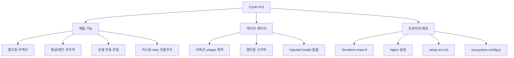

## 개요

[이전 글: #12](/posts/2026-04-10-hybrid-search-dev12/)에 이은 13회차. 백엔드, 프런트엔드, 인프라에 걸쳐 39개 커밋 — 지금까지 단일 사이클 중 최대. 세 갈래가 엮여 있다 — **제품**(멀티톤 리액션, 앵글/렌즈 프리셋, 커스텀 retry 프롬프트), **데이터 레이어**(새 리액션 형태를 위한 alembic 마이그레이션), **프로덕션 컷오버**(EC2 + Nginx + Terraform).

<!--more-->

## 한 사이클의 세 갈래

---

## 멀티톤 리액션

리액션 시스템이 톤 인지를 얻었다 — 이미지당 단일 👍/👎 대신, 사용자가 여러 톤+앵글 조합으로 반응할 수 있다. 세 alembic 마이그레이션이 안착시킨다:
- `add_multi_tone_angle_text_reactions_*.py` — 새 리액션 형태 스키마
- `add_unique_constraint_to_image_reactions.py` — (user, image, tone)당 중복 리액션 방지
- `add_injected_model_filename_to_*.py` — 어떤 모델이 리액션 받은 변형을 만들었는지 추적

프런트엔드 변경(`ReactionButtons.tsx`, `LikesTab.tsx`, `FeedbackModal.tsx`)이 톤 피커를 노출.

---

## 앵글과 렌즈 프리셋

이름이 붙은 사진 프리셋의 라이브러리 — 앵글("eye-level", "low-angle", "dutch tilt")과 렌즈("35mm", "85mm portrait", "fisheye") — 가 생성 프롬프트에 주입된다. `backend/tests/test_angle_presets.py`와 `test_lens_presets.py` 백엔드 테스트가 프롬프트 구성을 검증. 프런트엔드 `AnglePicker.tsx`가 시각적 선택기를 제공.

---

## Person-Intent 프롬프트의 모델 자동 주입

사용자 프롬프트가 사람 중심으로 감지되면, 생성 파이프라인이 사람 튜닝 모델 체크포인트를 자동 주입한다. 주입 로직은 `backend/src/generation/injection.py`에 살고 `prompt.py`와 `service.py`를 통해 연결된다. `add_injected_model_filename_to_*.py` 마이그레이션이 각 생성에 어떤 모델이 주입되었는지 기록해서 UI가 출처를 보여줄 수 있게 한다.

---

## 프로덕션 컷오버

가장 큰 인프라 델타. 이전 사이클들은 개발자 EC2에서 수동 배포로 돌았다. 이번 사이클:
- `terraform/main.tf` — 프로덕션 VPC, EC2 인스턴스, 보안 그룹 정의
- `terraform/keys/prod.pub` — 프로덕션 SSH 키
- `infra/nginx/diffs-image-agent.conf` — Nginx 리버스 프록시 설정(TLS termination, 프런트엔드/백엔드 라우트 분기)
- `scripts/setup-ec2.sh` — 프로비저닝 스크립트(uv, node, postgres client, pm2)
- `ecosystem.config.js` — pm2 프로세스 정의, `APP_ENVIRONMENT` 제거 fix(.env 로더와 충돌)

이번 사이클 후 앱은 실제 도메인에서 Nginx 뒤에 살고 pm2로 자동 재시작.

---

## 커밋 로그 (하이라이트 — 총 39개)

| 메시지 | 영역 |
|--------|------|
| feat: add model auto-injection for person-intent prompts | generation/injection.py |
| feat: multi-tone reactions with unique constraint | reactions.py + alembic |
| feat: angle and lens preset libraries | generation/{angle,lens}_presets.py |
| infra: terraform main.tf + nginx config + EC2 setup script | terraform/, infra/, scripts/ |
| fix: remove APP_ENVIRONMENT from ecosystem.config.js | ecosystem.config.js |
| feat: feedback modal + reaction buttons | frontend/components/* |

---

## 인사이트

39 커밋 사이클에서 세 가지가 두드러진다. 첫째, **alembic 마이그레이션 수는 제품 속도를 추적한다** — 한 사이클에 마이그레이션 세 개는 데이터 모델이 진짜로 진화하고 있다는 뜻이지, 단지 패치되고 있는 게 아니다. 둘째, **새 기능과 같은 사이클에 프로덕션 배포를 안착시키는 것은 위험하지만 빠르다** — 역사적으로 이건 사이클을 나눠서 했지만, 묶으면 새 기능이 즉시 현실 조건에서 테스트된다. 셋째, 앵글/렌즈 프리셋 패턴(이름 붙은 프리셋이 프롬프트에 주입)은 모델 자동 주입과 같은 패턴이다 — 둘 다 *사용자 시그널 기반 프롬프트 강화*의 형태다. 다음 사이클에 형식화할 올바른 추상화 — 프리셋, 모델 선택, 페르소나 주입이 모두 같은 훅을 통과하는 통합 프롬프트 강화 파이프라인.
