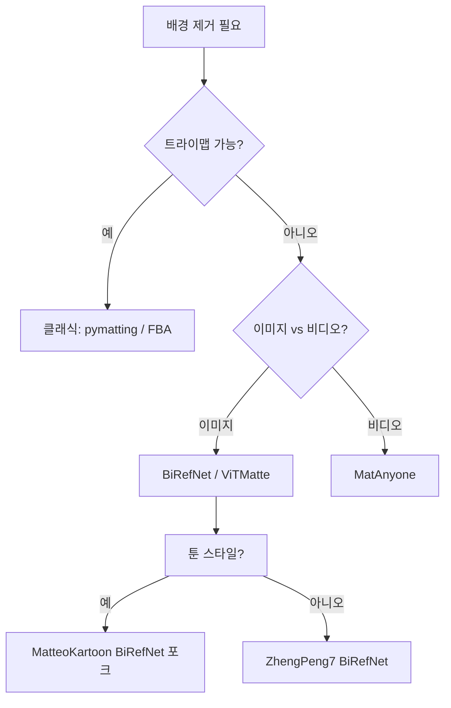
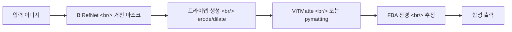

## 개요

[popcon-matting-bench](https://github.com/ice-ice-bear/popcon-matting-bench)를 만들면서 신뢰할 만한 모든 오픈소스 매팅 라이브러리를 훑어볼 수밖에 없었다. 공간은 세 시대로 나뉜다 — 클래식 알고리즘(pymatting, FBA), 트라이맵 없는 딥 모델(BiRefNet, ViTMatte), 그리고 안정적인 비디오 매팅의 신세대(MatAnyone). 이 글은 지형을 정리하고 어떤 작업에 어떤 모델이 이기는지 정리한다.

<!--more-->

## 오늘의 탐색 맵

## BiRefNet — 고해상도 이분 세그멘테이션

[ZhengPeng7/BiRefNet](https://github.com/ZhengPeng7/BiRefNet) (CAAI AIR 2024)은 [birefnet.top](https://www.birefnet.top/)을 포함해 최근 거의 모든 배경 제거 데모가 기반으로 삼는 모델이다. *이분 이미지 세그멘테이션* — 고해상도 이진 전경/배경 마스크 — 을 타깃으로 하며, bilateral reference 설계로 두 스트림(소스 이미지, 레퍼런스)이 U-Net 디코더에서 cross-attend 한다.

BiRefNet이 두드러지는 두 가지 이유:
1. **해상도.** 대부분의 세그멘테이션 모델이 1024×1024에서 멈추는 반면 BiRefNet은 2048×2048 가중치를 제공하고, 임의 종횡비도 잘 처리한다. 이커머스나 에셋 추출에서는 결정적이다.
2. **일반화.** 기본 `general` 체크포인트가 사람, 제품, 동물, 추상 형상까지 다 다룬다. 특정 도메인에서 정확도가 필요하면 Hugging Face에 특화 변형(`portrait`, `matting`, `dis5k_general`)이 있다.

[MatteoKartoon/BiRefNet](https://github.com/MatteoKartoon/BiRefNet)는 **ToonOut**이라는 포크로, BiRefNet을 툰/스티커 데이터셋으로 파인튜닝한다 — 애니메이티드 이모지나 만화 에셋을 만드는 제품에 직접 관련된다. 포크는 주로 학습 데이터와 평가 하네스를 바꿨고, 코어 모델은 변경하지 않았다.

## ViTMatte — ViT 백본 + 트라이맵 입력

[hustvl/ViTMatte](https://github.com/hustvl/ViTMatte) (Information Fusion vol.103, 2024년 3월)는 다른 베팅을 한다 — 명시적 트라이맵 입력을 받는 Vision Transformer 백본. 트라이맵(전경 / 배경 / 미확정 영역)이 강제이기 때문에 BiRefNet보다 plug-and-play 성격은 떨어지지만, 트라이맵을 줄 수 있는 경우 **머리카락, 털, 반투명 가장자리에서 훨씬 정확하다.** 파이프라인 패턴은 BiRefNet으로 초기 마스크 → erode/dilate로 트라이맵 생성 → ViTMatte가 sub-pixel 품질로 알파를 정제하는 흐름이다.

## MatAnyone — 안정적 비디오 매팅 (CVPR 2025)

[pq-yang/MatAnyone](https://github.com/pq-yang/MatAnyone)은 매팅에서 가장 어려운 문제 — **시간적 안정성** — 을 노린다. 비디오에서 프레임 단위 매팅을 하면 플리커가 생긴다 — 알파 마스크가 프레임 사이에서 1-2픽셀씩 떨리고, 사람 눈은 즉시 알아챈다. MatAnyone은 메모리 증강 영역 전파를 도입한다 — 모델이 과거 프레임의 high-confidence 영역을 메모리 뱅크에 들고 있다가 현재 프레임 마스크를 제약하는 데 쓴다. 결과는 떨리지 않는 비디오 매팅이다.

popcon의 애니메이티드 이모지 파이프라인에는 이게 결정적이다 — 30프레임에 걸쳐 깨끗한 알파를 뽑으려면 MatAnyone을 쓰거나, BiRefNet 위에 직접 만든 시간 스무딩을 얹어야 한다.

## pymatting과 FBA — 클래식 베이스라인

[pymatting/pymatting](https://github.com/pymatting/pymatting) (1.9k 스타, MIT)은 알 만한 가치가 있는 모든 클래식 알파 매팅 방법 — Closed-Form, KNN, Large Kernel, Random Walk, Shared Sampling — 과 Fast Multi-Level Foreground Estimation을 구현한다. 트라이맵이 필요하지만 전부 CPU에서 돌고(전경 추정에는 선택적으로 CuPy/PyOpenCL 가속), 가장 널리 배포된 오픈소스 배경 제거 도구인 [Rembg](https://github.com/danielgatis/rembg)의 기반이기도 하다.

[MarcoForte/FBA_Matting](https://github.com/MarcoForte/FBA_Matting)은 공식 "F, B, Alpha" 매팅 논문 레포다 — 전경 색상, 배경 색상, 알파를 동시에 예측해서 전경과 배경 색상이 미세하게 다를 때 훨씬 깨끗한 합성을 만든다.

클래식 방법은 폐기되지 않았다. 트라이맵을 쓸 수 있는 고처리량 배치(예: 크로마키 푸티지, 스캔 문서)에서는 비슷한 품질로 딥 모델보다 **10-100배 빠른 경우**가 흔하다.

## popcon-matting-bench의 아키텍처 패턴

벤치마크 레포의 일은 표준 데이터셋(DIS-5K, AIM-500, RealWorldPortrait636)에서 각 모델을 점수화하고 비교 하네스를 만드는 것이다. 핵심 메트릭 — 알파 품질은 SAD, MSE, Grad, Conn; 이진 세그멘테이션은 mIoU; A100 한 대 기준 1024×1024 이미지 한 장당 지연시간.

## 인사이트

매팅 공간은 깔끔하게 분기되었다 — **BiRefNet은 고해상도 세그멘테이션을, ViTMatte는 트라이맵 정제 알파를, MatAnyone은 비디오를, pymatting/FBA는 클래식 CPU 경로를 가져갔다.** 모든 곳에서 이기는 단일 모델은 없다 — 프로덕션 파이프라인은 거의 항상 두세 개를 캐스케이드한다. 흥미로운 비즈니스 질문은 더 이상 *어떤 모델*이 아니라 *어떤 트라이맵 워크플로우를 원하는가*다 — 제로샷(BiRefNet 단독)은 품질을 인체공학과 바꾸고, 2단계(BiRefNet → ViTMatte)는 지연시간을 머리카락 수준 정확도와 바꾼다. ToonOut은 버티컬 매팅의 길을 보여준다 — 베이스 모델이 충분히 좋아서 틈새 데이터셋 파인튜닝이 저위험 베팅이 되었다.

## 빠른 링크

- [ZhengPeng7/BiRefNet](https://github.com/ZhengPeng7/BiRefNet) — 베이스 모델, CAAI AIR'24
- [MatteoKartoon/BiRefNet (ToonOut)](https://github.com/MatteoKartoon/BiRefNet) — 툰 파인튜닝 포크
- [hustvl/ViTMatte](https://github.com/hustvl/ViTMatte) — 트라이맵 기반 ViT 매팅
- [pq-yang/MatAnyone](https://github.com/pq-yang/MatAnyone) — 안정적 비디오 매팅 (CVPR'25)
- [pymatting/pymatting](https://github.com/pymatting/pymatting) — 클래식 알고리즘
- [MarcoForte/FBA_Matting](https://github.com/MarcoForte/FBA_Matting) — F, B, Alpha 동시 추정
- [birefnet.top 데모](https://www.birefnet.top/) — 온라인 추론
- [ice-ice-bear/popcon-matting-bench](https://github.com/ice-ice-bear/popcon-matting-bench) — 벤치마크
