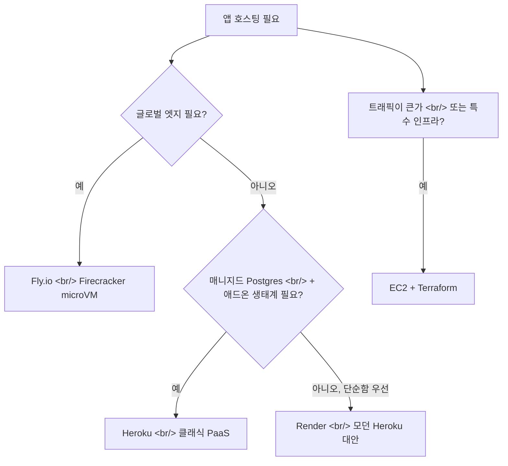
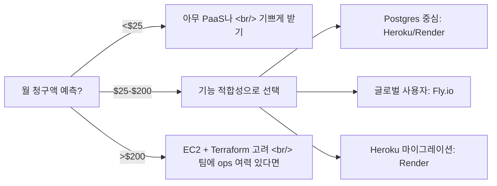

## 개요

앱의 작은 CPU 사이드 — API 서버, 워커 큐, Postgres — 에서는 마이크로 PaaS가 EC2를 직접 굴리는 것보다 여전히 싼가? 2026년의 답은 "거의 항상, 월 $200을 넘기 전까지는"이다. 이 글은 Fly.io, Heroku, Render를 비교하고, 언제 PaaS를 완전히 떠나야 하는지에 대한 의사결정 프레임워크를 정리한다.

<!--more-->

## 세 플랫폼 한눈에



## Fly.io

Fly는 Docker 이미지를 **35개 이상의 글로벌 리전**에 걸쳐 Firecracker microVM에서 돌린다. 가격은 shared-cpu-1x VM 기준 대략 `$0.0000022/초` (256MB 상시 운영 시 약 `$1.94/월`), 일부 플랜에서는 zero scale도 지원한다. 핵심 강점은 `fly.toml` + `flyctl deploy` 조합 — CI/CD 파이프라인 없이 git push 스타일 배포가 된다.

```toml
# fly.toml
app = "my-api"
primary_region = "nrt"

[http_service]
  internal_port = 8080
  force_https = true
  auto_stop_machines = true
  auto_start_machines = true
  min_machines_running = 0
```

Postgres는 Fly가 직접 매니지드로 제공하지 않고(이미지를 직접 돌리는 방식), 매니지드 대안으로는 Supabase나 Neon을 안내한다.

**적합:** 지리적으로 분산된 앱, Firecracker 격리가 필요한 경우, HTTP만이 아닌 TCP/UDP가 중요한 프로젝트.

## Heroku

PaaS의 원조, 지금은 Salesforce 산하. 2026년 플랫폼은 두 기반을 운영한다:
- **Cedar** — 클래식 dyno (LXC 기반, 폭넓은 애드온 호환성)
- **Fir** — Kubernetes 기반, 더 풍부한 옵저버빌리티와 세밀한 제어

| 티어 | 가격 | 용도 |
|------|------|------|
| Eco dyno | `$5/월` | 취미 / 스테이징 |
| Basic | `$7/월` | 작은 프로덕션 앱 |
| Standard-1X | `$25/월` | 진짜 프로덕션 |
| Heroku Postgres essentials | `$5/월` | 10K rows |

애드온은 Elements Marketplace를 통하고 엔터프라이즈는 1 크레딧 = `$1`로 환산된다.

새로운 베팅은 **Heroku Managed Inference and Agents** — 큐레이션된 LLM(text-to-text, embedding, image generation) 세트와 종량제 dyno 위의 MCP 서버 호스팅. Heroku가 "쉬운 AI 앱 배포" 플랫폼이 되려는 시도다. Vercel AI SDK + Modal 스타일 스택과 경쟁할 수 있을지는 두고 봐야 하지만, Heroku는 그것을 신뢰성 있게 만들 배포 인체공학을 가지고 있다.

**적합:** 진짜 매니지드 Postgres가 필요한 앱, 운영 예산이 적은 팀, `git push heroku main`을 무설정으로 원하는 경우.

## Render

2022년 Heroku 무료 플랜 종료 때 모두가 이주한 대안. Render는 Heroku 마이그레이션 크레딧을 최대 `$10K`까지 제공한다. 가격도 경쟁력 있다:

| 서비스 | 가격 |
|--------|------|
| 정적 사이트 | 무료 티어 |
| 웹 서비스 | `$7/월`부터 |
| 매니지드 Postgres | `$7/월`부터 |
| 백그라운드 워커 | `$7/월`부터 |
| 크론 잡 | 무료 |

크론 잡, 백그라운드 워커, 프리뷰 환경이 네이티브 지원된다. Render Workflows는 멀티 서비스 배포를 위한 더 새로운 오케스트레이션 레이어.

**적합:** Heroku에서 이주한 사용자, 프리뷰 환경이 기본으로 필요한 팀, Fly.io의 글로벌 분산 복잡도 없이 Docker 지원이 필요한 프로젝트.

## 사이드 바이 사이드

| 능력 | Fly.io | Heroku | Render |
|------|--------|--------|--------|
| 글로벌 엣지 | ✅ 35+ 리전 | ❌ US/EU만 | ❌ US/EU만 |
| 매니지드 Postgres | ❌ (Supabase/Neon) | ✅ 1차 | ✅ 1차 |
| Scale-to-zero | ✅ | ❌ (Eco는 sleep) | ❌ |
| Docker 네이티브 | ✅ | ✅ (Fir) | ✅ |
| 프리뷰 환경 | ⚠️ flyctl로 | ✅ Pipelines | ✅ Workflows |
| 크론 / 워커 | ⚠️ 별도 머신 | ✅ | ✅ |
| AI/LLM 호스팅 | ❌ | ✅ Managed Inference | ❌ |
| 가장 싼 상시 티어 | `~$2/월` | `$5/월` | `$7/월` |

## 의사결정 프레임워크



유용한 휴리스틱: **앱이 `$25/월`에 들어간다면 매니지드 PaaS를 기쁘게 받아들여라.** Terraform과 Nginx 설정에 안 쓴 한 시간이 플랫폼 마진보다 가치 있다. PaaS 청구가 `$200/월`을 넘어가기 시작하면 EC2 + 얇은 Terraform 모듈이 더 싸지지만 — 팀에 ops를 즐기는 사람이 있을 때만 그렇다.

## Vercel과 Railway는?

인접 옵션으로 짚어둘 만하다:
- **Vercel**은 Next.js / 프런트엔드 배포 틈새를 지배한다. SSR React 앱이라면 디폴트. Python API나 Go 서비스라면 다른 곳이 낫다.
- **Railway**는 무리 중 가장 매끈한 DX지만, 피벗 후 가격이 위로 이동했다 — 더 이상 2023년의 "명백히 싼" 옵션은 아니다.

## 인사이트

2024-2025년의 클라우드 비용 내러티브("다들 베어메탈로 돌아간다!")는 작은 팀에게는 대부분 노이즈다. **작은 규모에서는 매니지드 플랫폼 마진이 그것을 대체하는 엔지니어링 비용보다 낮다.** Fly.io는 여전히 개발자 경험의 벤치마크, Heroku는 Fir + Managed Inference로 진심으로 부활했고, Render는 대부분의 CRUD 앱에 가장 지루하면서도 옳은 선택이다. 올바른 프레이밍은 "PaaS vs EC2"가 아니라 "청구액이나 규모가 마이그레이션을 강요할 때까지 PaaS"다. 대부분의 작은 앱에 그날은 오지 않는다.

## 빠른 링크

- [Fly.io Pricing](https://fly.io/docs/about/pricing/)
- [Heroku Pricing](https://www.heroku.com/pricing)
- [Render Pricing](https://render.com/pricing)
