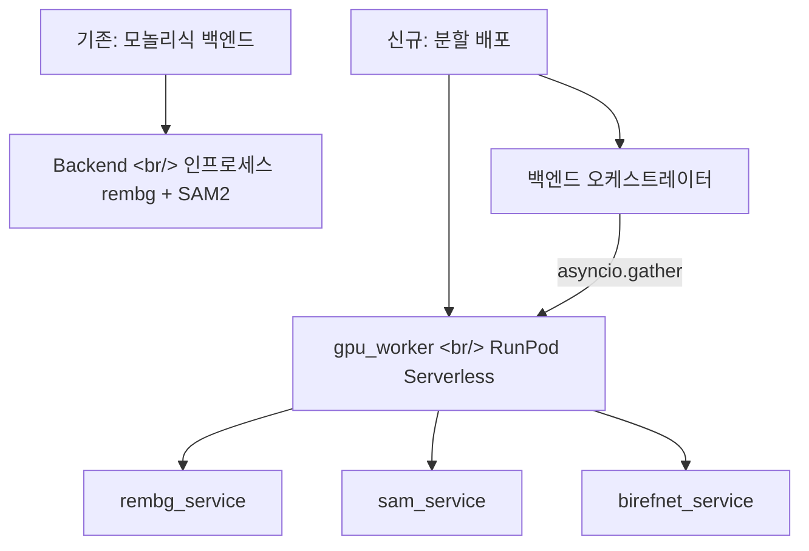

## 개요

[이전 글: #5](/posts/2026-04-10-popcon-dev5/)에 이은 6회차. 큰 움직임 — GPU 추론(rembg + SAM2)이 백엔드를 떠나 전용 RunPod Serverless 워커에 산다. 백엔드는 얇은 오케스트레이터가 된다. 제품 측면에서는 커스텀 모션 프롬프트와 프레임 후보 스왑으로 사용자가 전체 파이프라인을 다시 돌리지 않고 개별 프레임을 반복할 수 있게 된다.

<!--more-->

## 아키텍처 전환



---

## RunPod Serverless GPU 워커

### 배경

백엔드가 rembg와 SAM2 모델 가중치를 인프로세스로 들고 있었다. 그래서 백엔드 인스턴스 하나가 4GB 이상 메모리를 먹었고, 단순 API 트래픽을 서빙하기 위해 백엔드를 GPU 머신에 올려야 했다. 해결 — 추론을 Serverless 워커로 분리해서 백엔드는 싼 CPU 인스턴스에서 돌도록.

### 구현

새 `gpu_worker/` 디렉토리:
- `Dockerfile` — 네트워크 볼륨 콜드 스타트 페널티를 피하려고 모델 가중치를 이미지에 굽는다
- `handler.py` — RunPod 핸들러 시그니처, 세 서비스 중 하나로 디스패치
- `services/rembg_service.py`, `sam_service.py`, `birefnet_service.py` — 순수 추론 함수
- `requirements.txt` — pinned torch/torchvision/onnxruntime 버전

핸들러는 `{ "task": "rembg" | "sam" | "birefnet", "image": "<base64>", "params": {...} }`를 받아 알파 마스크 base64를 반환한다.

### 백엔드 리팩터

`backend/gpu_client.py`가 RunPod 엔드포인트로의 새 HTTP 클라이언트. `processor.py`와 `sam_segmenter.py`의 기존 인프로세스 추론 경로는 `await gpu_client.infer(...)` 호출로 교체된다.

---

## 비동기 병렬화

프레임 단위 추론이 순차였다 — 30프레임 애니메이션이 30 × 프레임당 지연시간이 걸렸다. `asyncio.gather`로 N개의 RunPod 요청을 병렬 발사하도록 리팩터:

```python
results = await asyncio.gather(*[
    gpu_client.infer({"task": "rembg", "image": frame})
    for frame in frames
])
```

병목이 컴퓨트에서 RunPod 오토스케일러로 옮겨갔다 — 30개 요청이 동시에 도착하면 추가 Flex 워커의 콜드 스타트가 wall-clock 지연시간을 *가장 느린 콜드 스타트* 정도로 묶는다, 30배의 warm 지연시간이 아니라.

---

## 커스텀 모션 프롬프트 + 프레임 스왑

인프라가 아니라 제품 기능. 이제 사용자는 커스텀 모션 설명("미묘한 바운스", "느린 줌")을 입력할 수 있고, 그것이 애니메이션 프롬프트 템플릿에 주입된다. 또 refine UI에서 개별 프레임 후보를 스왑할 수 있다. 구체적으로:
- 백엔드가 generation 단계의 프레임당 후보를 저장
- 프런트엔드 `EmojiPreview.tsx`와 `RembgRefineCanvas.tsx`가 프레임당 어떤 후보를 유지할지 사용자가 고르게 함
- retry 엔드포인트가 사용자의 수정된 프롬프트로 단일 프레임을 재생성

---

## 커밋 로그

| 메시지 | 파일 |
|--------|------|
| feat: add gpu_worker for RunPod Serverless (rembg + SAM2) | gpu_worker/* |
| refactor: delegate rembg + SAM2 inference to GPU worker | backend/pipeline/processor.py, sam_segmenter.py |
| perf: parallelize per-frame GPU calls with asyncio.gather | backend/main.py |
| test: add GPU worker smoke test script | backend/scripts/gpu_smoke.py |
| feat: wire up custom retry prompts, frame candidate swap, preset list | backend/main.py, frontend/* |
| feat: add custom motion prompts, white bg handling, and rembg frame viewer | backend/pipeline/animator.py, frontend/* |
| chore: add Makefile for native dev workflow | Makefile |
| chore: add gstack skill routing rules to CLAUDE.md | CLAUDE.md |
| chore: ignore .playwright-mcp/ artifacts | .gitignore |
| merge: integrate main branch changes into SAM2 worktree | (merge) |

---

## 인사이트

Serverless 추출은 프레임당 지연시간이 중요해지는 순간 본전을 뽑는다. 추론이 백엔드 인라인이면 백엔드 프로세스를 여러 개 띄우지 않고는 병렬화할 수 없었다 — 그리고 그 프로세스 하나하나가 4GB 모델을 로드했다. Serverless 워커가 있으면 병렬성은 그냥 `asyncio.gather`이고 워커 풀은 RunPod이 처리한다. 패턴 — 오케스트레이터를 작고 stateless 하게 싼 CPU에 두고, GPU 작업을 큐 기반 핸들러로 밀어내는 — 은 추론이 버스티한 모든 AI 제품에 맞는 모양이다. 커스텀 모션 프롬프트 기능은 더 작은 변경이지만, 코드 한 줄당 사용자 가치는 인프라 리팩터 전체보다 크다. 둘이 같은 사이클에 출시되었고, 그게 목표다.
