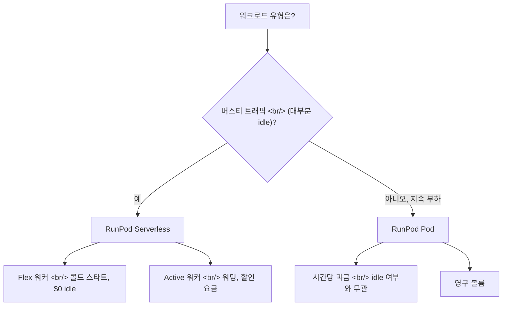

## 개요

[popcon](https://github.com/ice-ice-bear/popcon-matting-bench) GPU 워커를 붙이면서 진짜 선택을 강요받았다 — 추론 파이프라인을 RunPod Serverless로 돌릴까, 상시 Pod로 돌릴까? 둘 다 초 단위 과금에 동일한 GPU SKU를 쓰지만 비용 곡선은 특정 이용률 지점에서만 교차한다. 이 글은 아키텍처 차이와 손익분기 계산을 정리한다.

<!--more-->

## 두 모델



## Pods — 상시 컨테이너

**Pod**는 볼륨 디스크가 붙은 영구 컨테이너다. 요청을 처리하든 idle이든 **연속적으로** 시간당 GPU 요금을 낸다. 스토리지는 실행 중일 때 `$0.10/GB/월`(초 단위), **중단 시에는 `$0.20/GB/월`로 두 배가 된다** — RunPod는 "쓰거나 지우거나" 하라고 강하게 유도한다. 잔액이 0이 되면 볼륨이 통째로 삭제된다.

배포 시 **최소 1시간치 크레딧**이 계좌에 있어야 하고, 기본 `$80/시간` 지출 한도가 폭주를 막아준다.

Pods가 맞는 경우:
- 노트북 환경, SSH 접근, 영구 상태가 필요할 때
- GPU가 실제 작업에 40% 이상 쓰일 때
- 콜드 스타트 지연이 UX를 망칠 때(인터랙티브 비디오 모델 등)

## Serverless — 초 단위 핸들러

**Serverless 워커**는 트래픽이 오면 뜨고, 큐 요청을 처리한 뒤 사라지는 stateless 컨테이너 핸들러다. 두 가지 워커 클래스:
- **Flex** — 트래픽 도착 시 콜드 스타트, **idle 비용 0**
- **Active** — 할인된 요금으로 워밍 유지, 콜드 스타트 없음

`handler(event)` 함수를 짜고 Docker 이미지로 배포한다. 네트워크 볼륨(`$0.07/GB/월` 1TB 미만, `$0.05/GB/월` 1TB 초과)은 워커 간 공유 모델 가중치 캐싱에 쓴다.

### 콜드 스타트 함정

콜드 스타트 시간도 과금된다. 30초짜리 이미지 매팅 요청에 10초 콜드 스타트면 40초가 청구된다. 모델이 5GB 이상이고 네트워크 볼륨에 있으면 콜드 스타트가 폭증할 수 있다. [popcon](https://github.com/ice-ice-bear/popcon-matting-bench)의 `gpu_worker/Dockerfile` 패턴은 정확히 이 문제를 피하려고 **모델 가중치를 이미지에 굽는다**:

```dockerfile
FROM runpod/pytorch:2.1-cuda12.1
COPY weights/birefnet.pth /app/weights/
COPY handler.py /app/
CMD ["python", "/app/handler.py"]
```

6GB 이미지는 풀이 오래 걸리지만 워커에 캐시되면 몇 초 안에 로드된다.

## 손익분기 계산

A100 기준 대략적인 숫자:

| 모델 | 요금 | 24시간 비용 |
|------|------|-------------|
| Pod | `$1.89/시간` | `$45.36` |
| Serverless Flex (활성 컴퓨트) | `$0.00076/초` ≈ `$2.74/시간` | `$2.74 × 사용 시간` |

**분기점은 대략 17시간/일 이용률.** 그 아래면 Serverless 승, 위면 Pods 승. 사용자 트래픽이 들쭉날쭉한 스타트업이면 거의 항상 Serverless가 정답이다. 계속 파인튜닝하는 연구소라면 Pods가 정답.

## 동시성 패턴

Serverless가 정말 빛나는 곳은 병렬 추론이다. `asyncio.gather`로 N개 요청을 동시 발사:

```python
results = await asyncio.gather(*[
    gpu_client.infer({"task": "rembg", "image": frame})
    for frame in frames
])
```

병목이 컴퓨트에서 RunPod 오토스케일러로 옮겨간다 — 30개 요청이 동시에 도착하면 추가 Flex 워커의 콜드 스타트가 wall-clock 지연시간을 *가장 느린 콜드 스타트* 정도로 묶는다, 30배의 warm 지연시간이 아니라. 단일 Pod로 같은 일을 하려면 요청을 배치하거나(추가 코드, 추론 어려움) 여러 Pod를 띄워야 한다(전부 연속 과금).

## Serverless를 쓰지 *말아야* 할 때

- **장시간 학습 작업** — RunPod Serverless는 요청당 최대 실행 시간이 있다. 멀티시간 파인튜닝은 Pod로.
- **비자명한 상태가 있는 모델** — 추론이 핫 in-memory KV 캐시를 읽는다면, Serverless의 stateless 워커는 콜드 스타트마다 그 캐시를 다시 만든다.
- **지연 시간이 결정적인 인터랙티브 UX** — 사용자가 UI에서 2초 미만 응답을 기다리는 경우, Active 워커가 도움이 되지만 워밍된 Pod에는 못 미친다.

## 인사이트

Serverless 모델은 지금 GPU 컴퓨트에서 가장 흥미로운 흐름이다 — "모델을 API로 배포한다"가 Lambda 배포처럼 느껴지게 만든다. 스타트업 규모의 추론 워크로드 90%에서는 Serverless가 올바른 디폴트다 — 손익분기는 거의 24시간 운용에 가까워질 때까지 Pods를 선호하지 않는다. 주의할 함정은 콜드 스타트 비용 분할 — 가중치를 네트워크 볼륨이 아니라 이미지에 굽고, 그러면 실효 Serverless 비용이 warm 요금에 가깝게 머문다. RunPod의 가격 모델은 본질적으로 "대부분의 GPU 작업은 버스티하다고 우리는 믿는다"고 말하고 있고, 제품 워크로드에서는 아마 옳다.

## 빠른 링크

- [RunPod Pods Pricing](https://docs.runpod.io/pods/pricing)
- [RunPod Serverless Pricing](https://docs.runpod.io/serverless/pricing)
- [RunPod Billing Overview](https://docs.runpod.io/accounts-billing/billing)
