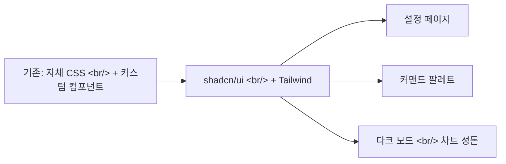

## 개요

[이전 글: #10](/posts/2026-04-10-trading-agent-dev10/)에 이은 11회차. 이번 사이클은 전부 UI 작업이다 — 설정 페이지가 안착하고, 커맨드 팔레트가 출시되고, 레거시 CSS 더미가 마침내 삭제된다. 5개 커밋 모두 프런트엔드.

<!--more-->

## 아키텍처 전환

shadcn/ui + Tailwind로의 마이그레이션이 이번 사이클의 나머지를 잠금 해제한다. 베이스 컴포넌트가 일관되면, 설정 페이지와 커맨드 팔레트는 처음부터 빌드가 아니라 조합 연습이 된다.

---

## 설정 페이지

### 배경

거래 설정, 리스크 임계값, 팩터 가중치, 스케줄러가 흩어진 모달 다이얼로그나 하드코딩된 YAML에 살고 있었다. 운영자에게 모든 것을 튜닝할 한 곳이 필요했다.

### 구현

4탭 설정 뷰:
- **Trading config** — 주문 라우팅, 기본 limit/market 동작, 포지션 사이징 규칙
- **Risk config** — 최대 포지션 크기, 일일 손실 캡, 드로다운 정지 임계값
- **Factor weights** — 펀더멘털/기술/심리 복합 점수의 슬라이더
- **Scheduler** — 각 에이전트의 cron 스타일 스케줄 테이블

각 탭은 독립 컴포넌트(`settings/trading-config.tsx`, `settings/risk-config.tsx` 등)이며 동일한 백엔드 설정 엔드포인트와 연결된다.

---

## 커맨드 팔레트

Linear/VS Code 커맨드 팔레트 패턴에서 영감. `Cmd-K`가 네비게이션 라우트와 에이전트 빠른 액션("Run discovery scan", "Pause all positions", "Open risk dashboard")에 대한 fuzzy search 오버레이를 연다. 파워 유저의 클릭을 줄인다 — 무엇을 원하는지 아는 운영자가 메뉴 세 개를 클릭할 필요가 없어야 한다.

---

## 레거시 CSS 정리

shadcn 마이그레이션이 수십 개의 고아 CSS 파일과 컴포넌트 셸을 남겼다. 이 커밋이 그것들을 삭제한다. 순수 삭제 — 동작 변경 없음, 그러나 어떤 컴포넌트 구현이 정본인지에 대한 혼란을 제거. 이 커밋 이후 dashboard, signals, stockinfo 뷰는 모두 shadcn/ui로만 돈다.

---

## 다크 모드 + 레이아웃 정돈

마이그레이션의 가시적 회귀를 정리하는 마지막 두 커밋:
- 다크 테마용 차트 색상과 툴팁 스타일 재튜닝(Recharts 기본은 다크에서 바랜 듯 보임)
- Hero card stat 텍스트 정렬, KPI 레이블 위계, 대시보드 레이아웃 간격 — 페이지를 의도적으로 보이게 만드는 작은 것들

---

## 커밋 로그

| 메시지 | 영역 |
|--------|------|
| feat(ui): settings page with trading config, risk config, factor weights, scheduler | settings/* |
| feat(ui): command palette with navigation and agent quick actions | layout/command-palette.tsx |
| chore(ui): remove old CSS and component files replaced by shadcn/ui + Tailwind | (삭제) |
| fix(ui): dark mode polish — chart colors, tooltip styles, contrast adjustments | dashboard/* |
| fix(ui): dashboard text display fixes — hero card stats, KPIs, layout spacing | dashboard/hero-card.tsx, KPIs |

---

## 인사이트

이번 사이클은 교과서적인 "디자인 시스템 마이그레이션이 기능을 잠금 해제한다" 서사다. 이전 10 사이클이 새 UI 표면을 추가하는 것을 고통스럽게 만들고 있었다 — 새 표면이 매번 새 컴포넌트 발명을 의미했기 때문. shadcn/ui로 commit한 뒤, 다음 두 기능(설정 페이지, 커맨드 팔레트)이 압도적으로 빨리 출시되었다. 발명이 아니라 조합 작업이었기 때문이다. 교훈 — UI 코드베이스가 당신을 늦추고 있다면, 병목은 거의 항상 누락된 프리미티브이지 누락된 기능이 아니다.
