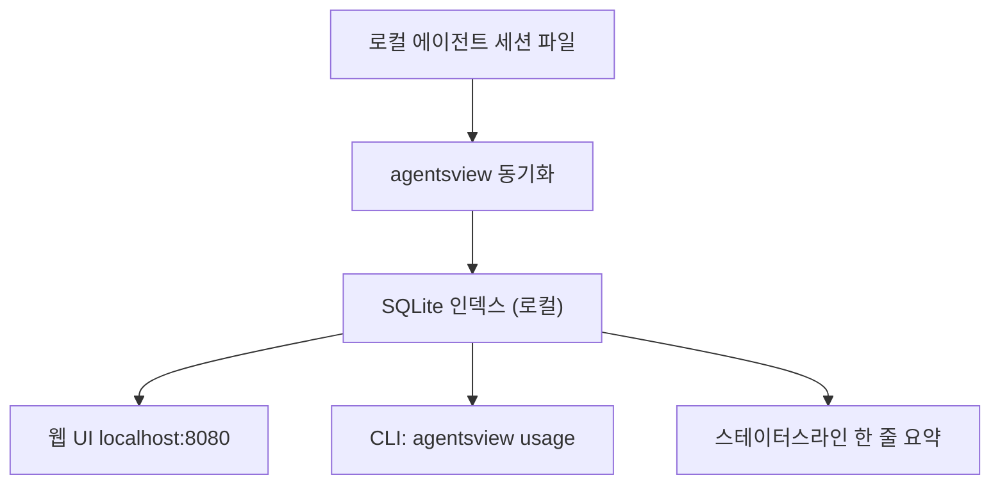

## 개요

Wes McKinney가 [agentsview](https://github.com/wesm/agentsview)를 공개했다. Claude Code, Codex, OpenCode 등 내 머신에 있는 모든 코딩 에이전트의 세션을 SQLite로 빨아들여서 웹 UI와 CLI로 보여주는 로컬 우선 단일 바이너리다. 덤으로 `ccusage`를 100배 빠르게 대체한다. GitHub 스타 758개, Go 본체에 Svelte/TypeScript UI.

<!--more-->



## 실제로 뭘 하는가

첫째, 디스커버리. 처음 실행하면 머신을 훑어서 지원되는 모든 에이전트의 세션을 찾아 인제스트한다. 계정도, 업로드도, 사전 데몬 설치도 없다. `curl install.sh | bash` 한 줄이면 끝. 웹 UI가 `127.0.0.1:8080`에서 열리고 시간대별 비용, 프로젝트별 비용 분배, 전체 transcript 검색 가능한 세션 브라우저를 제공한다.

둘째, SQLite 트릭. `ccusage`는 실행할 때마다 raw JSONL 세션 파일을 다시 파싱한다. Max 플랜을 헤비하게 쓰는 사람이라면 이게 수 분씩 걸린다. agentsview는 한 번만 인덱싱하고 이후 `agentsview usage daily`는 SQL aggregate 쿼리다. README는 100배 이상 빨라진다고 주장하고, 수개월 히스토리에서도 체감상 즉각적이다.

셋째, 가격 계산. LiteLLM 요율을 기반으로 오프라인 폴백 테이블이 있고, 캐시 인식(프롬프트 캐시 생성 vs 읽기 토큰이 다른 가격), 에이전트·모델·날짜·시간대 필터링 지원. 최근 커밋 `3758c37` (Opus 4.6 폴백 가격 $5/$25 수정)을 보면 Anthropic 공식가격을 빠르게 쫓아가고 있다.

## CLI 표면

```bash
agentsview                  # 서버 실행, 웹 UI 오픈
agentsview usage daily      # 일별 비용 요약 (기본 30일)
agentsview usage daily --breakdown --agent claude --since 2026-04-01
agentsview usage statusline # 셸 프롬프트용 한 줄
agentsview usage daily --all --json
```

`statusline` 출력은 내가 즉시 원한 기능이다. 셸 프롬프트나 tmux status bar에 파이프로 꽂아두면 작업하면서 오늘 소진량을 볼 수 있다. JSON 출력은 스크립트에 쉽게 붙일 수 있어서 일일 지출이 임계치를 넘으면 크론으로 경고를 보내는 식의 자동화가 가능하다.

## Cobra 마이그레이션

최근 PR #324가 CLI 디스패치를 손수 짠 `os.Args` switch에서 [spf13/cobra](https://github.com/spf13/cobra)로 옮겼다. 주말 해킹으로 시작한 도구가 의미있는 변곡점을 맞은 것이다. 서브커맨드 구조 안정화를 의미하고 `usage weekly`, `usage monthly`, `export` 같은 확장이 쉬워진다. Go 코드베이스가 2.7MB로 이미 작지 않은 규모인데 Cobra가 help와 completion 자동 생성을 해주니 유지보수 부담이 크게 줄어든다.

## 왜 지금 중요한가

시장에는 세 가지가 있다. (1) ccusage — Claude 전용, 느리지만 이 카테고리를 만든 주역. (2) 에이전트별로 각각 포맷을 추적하는 도구들. (3) 에이전트 벤더의 공식 대시보드 — 중앙화되어 있고 지연이 있다. agentsview는 1과 2를 한 바이너리로 합치고, 로컬 유지로 3을 우회한다. 같은 바이너리가 에이전트 플릿을 감사하는 데이터 사이언티스트와 Claude Max에서 월 $200을 넘을까 말까 고민하는 솔로 개발자 모두를 만족시킨다.

"로컬 우선 + SQLite + 단일 바이너리 + Go" 조합은 2026년 개발자 도구에서 계속 반복되는 패턴이다 ([sqlite-utils](https://github.com/simonw/sqlite-utils), [dust](https://github.com/bootandy/dust), [fd](https://github.com/sharkdp/fd) 참고). 데이터가 이미 디스크에 있고 SQLite에 들어가면, 서버 기반 SaaS는 과한 구조라는 명제. agentsview는 그 명제를 AI 에이전트 관측성에 깔끔하게 적용한 사례다.

## 인사이트

세 가지가 눈에 띈다. 첫째, 100배 속도 향상은 미시 최적화가 아니다. "주 1회 돌리는 도구"와 "항상 스테이터스라인에 떠 있는 지표"의 차이이며, 데이터가 실제로 행동을 바꾸느냐를 결정짓는 지점이다. 둘째, Claude·Codex·OpenCode를 통합해서 보는 비용 뷰가 중요하다. 헤비 유저는 작업마다 다른 에이전트를 쓰는데 벤더별 대시보드는 이 그림을 조각낸다. 셋째, 리포지토리 자체의 사용량 관측 로직(LiteLLM 가격, 프롬프트 캐시 인식 산식, cache-creation vs cache-read 구분)은 Anthropic SDK 앱을 직접 만드는 사람에게 의외로 좋은 체크리스트다. 수백 줄 Go 코드로 정리된 프로덕션 가격 모델이다.
