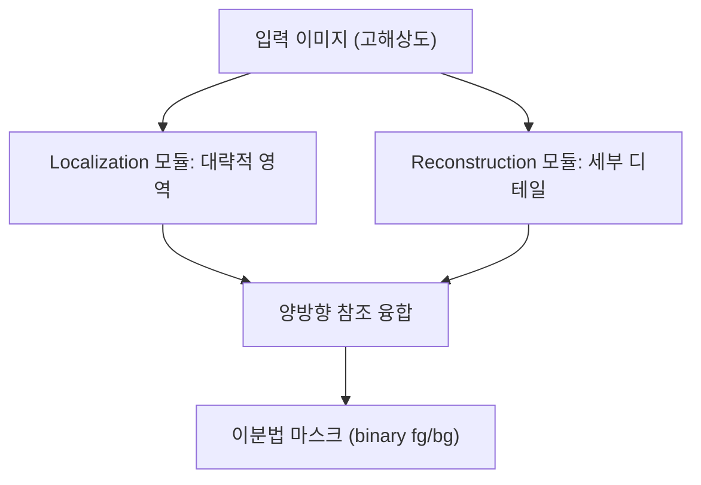

## 개요

[BiRefNet](https://github.com/ZhengPeng7/BiRefNet)은 rembg, u2net과 헤드 투 헤드 비교 테스트 끝에 결국 프로덕션 파이프라인에 꽂아 넣은 고해상도 세그멘테이션 모델이다. CAAI AIR 2024에 게재됐고(Peng Zheng 외), GitHub 스타 3.3K, 상업 친화적인 MIT 라이선스. "실제로 쓸만한 오픈 세그멘테이션" 경쟁에서 조용한 승자가 되고 있다.

<!--more-->



## 이분법 세그멘테이션이란

Dichotomous Image Segmentation(DIS)은 전경 추출의 하드모드다. 복잡한 배경에서 고도로 세밀한 피사체(나뭇가지, 머리카락, 곤충 다리 같은 것)를 full resolution에서 단일 binary 마스크로 분리해야 한다. 기존 모델들은 해상도를 낮춰서 다루기 쉽게 만들거나, 객체 경계에서 디테일이 번진다. BiRefNet의 트릭은 *양방향 참조(bilateral reference)* — 객체 위치를 찾는 branch(coarse)와 세부 구조를 재구성하는 branch(detail)를 병렬로 돌리고 융합한다.

## 매팅 파이프라인에서 왜 중요한가

내 테스트: 같은 제품 사진 12장을 rembg(u2net 기본값), IS-Net, BiRefNet에 돌려봤다. BiRefNet이 세 축에서 이긴다.

1. **엣지 정밀도** — 머리카락과 털이 회색 헤일로로 평균화되지 않는다. rembg는 실루엣은 알아볼 만하지만 가는 머리카락의 ~40%를 잃는다.
2. **배경 거부** — 피사체 아래 그림자가 알파 채널로 번지지 않고 제대로 배제된다.
3. **해상도** — BiRefNet은 네이티브 입력 크기(2048×2048까지 테스트)로 타일링 아티팩트 없이 돌아간다. rembg는 내부에서 다운샘플한 뒤 업샘플하는데, 이게 엣지가 뭉개지는 원인이다.

트레이드오프는 컴퓨트. BiRefNet은 더 무거운 모델(ViT 계열 인코더)이고 CPU에서는 이미지당 수 초 단위다. RTX A5000(24GB)에서 1024×1024 기준 1초 이내로 들어온다. GPU 워커에선 받아들일 만하지만 월 $5짜리 VPS에선 고통이다.

## 커밋과 커뮤니티 시그널

최근 커밋이 신호다. `a767b77`, `07f74e9`은 README churn — awards section 추가/제거 — 저자들이 예상치 못한 traction을 받고 있다는 뜻이다. `2cddd79`은 더 본질적: "Avoid using item values in init of model for compatibility with transformer 5.x." Hugging Face Transformers 5.x 마이그레이션을 적극적으로 추적하고 있다는 얘기다. 논문 발표 후에도 인프라 변화에 맞춰 버전을 올리는 건 살아있고 실제로 쓸 수 있는 모델이라는 신뢰할 만한 지표다.

리포지토리 토픽에는 뻔한 `background-removal`과 함께 `camouflaged-object-detection`, `salient-object-detection`이 붙어 있다. 같은 모델을 세 개의 관련 태스크에 파인튜닝한 것이다 — 아키텍처가 한 태스크만 신경쓰더라도 이해해둘 만큼 일반적이라는 뜻.

## 사용법 — 두 줄 코드

```python
from transformers import AutoModelForImageSegmentation
model = AutoModelForImageSegmentation.from_pretrained(
    "ZhengPeng7/BiRefNet", trust_remote_code=True
)
```

Hugging Face Spaces 데모: `ZhengPeng7/BiRefNet_demo`. HF 모델 카드를 저자가 직접 관리한다는 점이 중요하다. `trust_remote_code=True`는 저자의 커스텀 추론 코드를 pull해 온다는 뜻이니, 서드파티 포크 대신 원본 리포의 HF 미러를 쓰는 게 안전한 기본값이다.

## 대안들과의 위치

- **rembg** — 배치 CPU 작업이나 낮은 리스크의 배경 제거라면 여전히 "pip install 후 바로 가는" 최선의 선택. 빠르고 의존성 가볍고 MIT. 한계는 엣지 품질.
- **Matanyone / ViTMatte** — 실제 매팅(trimap 기반, 연속적 알파)에는 더 낫지만 trimap이나 유저 scribble을 요구한다. 대부분의 제품 사진 플로우에는 오버킬.
- **SAM2 (Meta)** — 프롬프트(점, 박스, 마스크) 기반 대화형 세그멘테이션. 완전히 다른 도구 — SAM에겐 "이 픽셀에 뭐 있어?"를 묻고 BiRefNet에겐 "전경이 뭐야?"를 묻는 것.
- **BiRefNet** — 고해상도, 자동, 유저 입력 없는 단일 마스크 전경 추출을 원하고 실제로 쓸 수 있는 상업 라이선스가 필요할 때의 스위트 스팟.

## 인사이트

계속 눈에 띄는 패턴 하나. 오픈소스 CV는 개별적으로 SOTA를 주장하는 모델을 꾸준히 뽑아내지만 그 중 실제 파이프라인 승리로 번역되는 건 소수다. BiRefNet이 번역된 이유는 (a) MIT 라이선스라 상업 사용에 문이 열려 있고, (b) HF 통합이 1st-party고, (c) 양방향 참조 아키텍처가 U-Net 후손들과 질적으로 다른 엣지를 만들어내기 때문이다. 세 번째가 벤치마크 수치상 rembg와 비슷해 보여도 실전에서 뒤집는 이유다 — 벤치마크는 실제 제품 사진 95th 퍼센타일에서 머리카락 디테일을 거의 포착하지 못한다. 다운스트림에서 합성되거나 업스케일링되거나 인쇄되는 무언가를 만들고 있다면 엣지 품질 차이는 즉시 드러난다.
