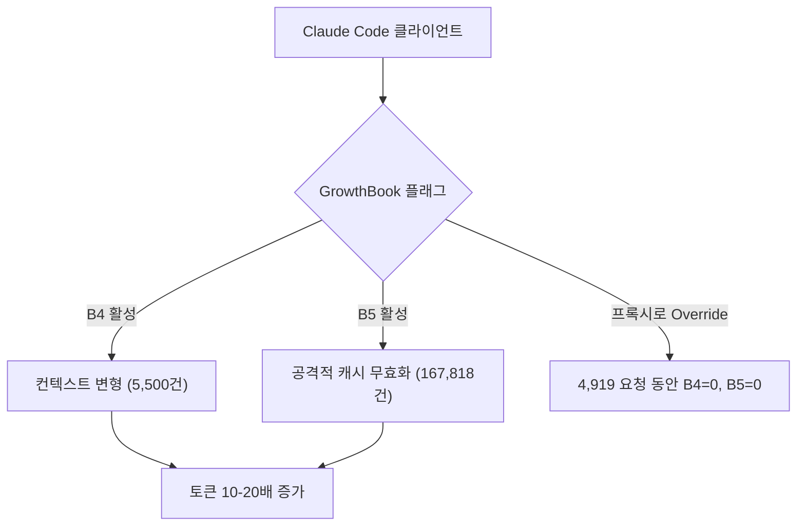

## 개요

[ArkNill/claude-code-hidden-problem-analysis](https://github.com/ArkNill/claude-code-hidden-problem-analysis)는 Max 플랜에서 토큰 사용량을 10-20배 부풀리는 Claude Code의 클라이언트 사이드 버그 11개를 체계적으로 측정·문서화한 조사 리포트다. GitHub 스타 93, HN과 Reddit 쓰레드에서 주로 인용된다. 4월 14일 업데이트가 가장 중요한 데이터 드롭이다 — 14일간 30,477건의 프록시 요청 데이터와, 두 개 버그를 이벤트 0으로 만든 GrowthBook 플래그 override.

<!--more-->

## 측정된 명제

리포지토리 TL;DR: 확정 버그 11개(B1–B5, B8, B8a, B9, B10, B11, B2a)와 예비 발견 3개. 캐시 버그 B1, B2는 v2.1.91에서 수정. **9개는 v2.1.101 현재도 미수정** — 8번의 릴리스가 지나도록. 증거는 Claude Code와 Anthropic API 사이에 앉아서 모든 요청/응답 헤더를 로깅하는 프록시다. 클라이언트 사이드 토큰 산수를 Anthropic 청구서와 분리해서 보는 유일한 방법이다.

이 보고서를 흔한 "Claude Code 비싸요" 스레드와 다르게 만드는 건 인과관계 작업이다. 모든 버그 주장은 불필요한 컨텍스트 churn을 보여주는 요청 diff나 어느 quota 창이 binding인지를 보여주는 응답 헤더(`anthropic-ratelimit-*`)로 뒷받침된다.

## GrowthBook Override — 새로운 증거

Anthropic은 [GrowthBook](https://www.growthbook.io/)을 통해 Claude Code에 feature flag를 내려준다. 리포지토리는 프록시 기반 override를 문서화한다(anthropics/claude-code#42542의 접근법): GrowthBook config 응답을 가로채서 B4, B5 플래그를 강제로 off로 flip하고 나머지는 그대로 통과시킨다.

같은 머신, 같은 계정, 같은 사용 패턴으로 이어진 4,919 요청 4일 동안의 결과:

- **B5 이벤트: 167,818 → 0**
- **B4 이벤트: 5,500 → 0**

벤더가 돌리는 A/B 테스트 바깥에서 얻을 수 있는 가장 깨끗한 인과 증거다. 이 GrowthBook 플래그들이 클라이언트 컨텍스트 변형과 캐시 무효화 동작을 직접 제어한다는 걸 사실상 증명한다.

## 7일 quota — 이전에는 보이지 않던 것

더 조용한 발견 하나. `anthropic-ratelimit-representative-claim` 헤더(어느 rate-limit 창이 binding인지 알려줌)는 기존 보고에서 100% `five_hour`였다. 30K 데이터셋에서는 **요청의 22.6% (5,279 / 23,374)가 `seven_day`를 binding constraint로** 보고했다 — 7일 사용률이 0.85–0.97에 달한 4월 9-10일에 집중. 주간 리셋 후에는 `five_hour`가 복귀.

운영 함의: "월요일 아침에 갑자기 throttle당한 것 같다"고 느끼는 Max 유저는 7일 창에 걸린 거지 5시간 창이 아니다. 관측할 수 없는 한계는 계획할 수 없는데, 7일 창은 Claude Code UI나 Anthropic 문서에서 눈에 띄게 드러나지 않는다.

## 방법론 중 훔쳐올 만한 것들

*어떤* 클로즈드 소스 클라이언트든 조사할 때 복제할 만한 것들:

1. **프록시로 보되 수정하지 마라** — 클라이언트와 API 사이에 mitm 프록시를 두면 클라이언트 동작을 보존하면서 모든 요청을 들여다볼 수 있다. 클라이언트 자체를 수정하면(디컴파일, 패치) 측정 자체가 무효화된다.
2. **모든 버그에 안정적 ID를 붙여라** — B1~B11에 B2a, B8a. 안정적 ID는 파일 간·릴리스 간 cross-reference를 충돌 없이 가능하게 한다.
3. **"확정"과 "예비"를 분리하라** — 리포지토리는 측정된 버그와 의심되는 버그(P1-P3)를 명시적으로 구분한다. 이 규율이 신뢰도를 쌓고 문서를 적대적 scrutiny에서도 살아남게 만든다.
4. **환경 변화를 인정하라** — 4월 14일 업데이트는 4월 11일 이후 데이터가 override된 환경에서 왔고 baseline과 섞을 수 없음을 플래그한다. 작은 디테일, 거대한 integrity.

## 미수정 항목

9개 버그가 미패치 상태로 남아 있고, B11("adaptive thinking zero-reasoning")도 포함된다. Anthropic이 HN에서 B11을 인지했다고 말했지만 수정은 따라오지 않았다. 리포지토리가 별도로 추적하는 `fallback-percentage` 헤더는 override에 영향받지 않는데, 여전히 non-zero rate을 보인다 — 일부 요청이 유저가 요청한 것보다 작은 모델로 조용히 라우팅되고 있다는 뜻이며 그 자체로 별개 카테고리의 버그다.

## 인사이트

세 가지 테이크어웨이. 첫째, 프록시 기반 관측이 클로즈드 소스 AI 클라이언트를 감사하는 유일한 방법이 되어가고 있다. 벤더의 청구 텔레메트리는 집계되고 한 방향이며, 클라이언트가 실제로 뭘 하는지 보려면 raw 요청 흐름이 필요하다. 둘째, GrowthBook 플래그 주입은 그럴듯한 공격 표면이자 그럴듯한 완화 표면이다 — 버그를 만드는 같은 메커니즘으로 버그를 잠재울 수 있다. 셋째, Max 플랜 비용을 내면서 월요일에 7일 quota가 다 타버리고 있다면 이 리포지토리가 그 사용량이 어디로 갔는지에 대한 가장 완전한 설명이며, 근본 문제가 8 릴리스가 지나도록 미수정이라는 사실이 버그 자체보다 더 흥미로운 이야기다.
