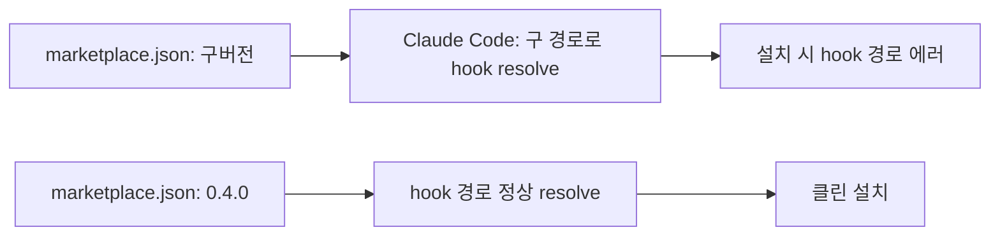

## 개요

짧은 인터벌, 결정적 픽스. HarnessKit의 플러그인 `marketplace.json`이 배포된 패키지 버전과 맞지 않아서 Claude Code가 플러그인 hook 경로를 구버전 기준으로 resolve하다가 설치 시점에 hook 경로 에러가 났다. 버전 필드를 `0.4.0`으로 올리는 한 줄 픽스.

이전 글: [HarnessKit 개발 로그 #5](/posts/2026-04-08-harnesskit-dev5/)

<!--more-->



---

## 버그

Claude Code가 마켓플레이스에서 플러그인을 설치할 때 `marketplace.json`을 읽어 플러그인 버전을 파악하고, 그 버전 기준으로 플러그인 캐시 디렉토리 내부의 hook 경로(와 skill 경로)를 resolve한다. `marketplace.json`의 버전이 실제 배포 버전과 다르면 resolve된 경로가 존재하지 않는 디렉토리를 가리키고, 설치가 hook 경로 에러로 실패한다.

실패 모드가 은근히 조용하다 — 에러 메시지는 hook 관련이지만 근본 원인은 버전 불일치. 처음 마주치면 20분 날리고 두 번째부터는 30초에 고치는 종류의 버그다.

## 픽스

`a8ce0b1 fix: sync marketplace.json version to 0.4.0 to resolve hook path errors` — `.claude-plugin/marketplace.json`의 `version` 필드를 배포된 `0.4.0`에 맞춤. 파일 하나, 필드 하나.

```diff
- "version": "0.3.x"
+ "version": "0.4.0"
```

## 커밋 로그

| 메시지 | 영역 |
|--------|------|
| fix: sync marketplace.json version to 0.4.0 to resolve hook path errors | 플러그인 메타 |

---

## 인사이트

흥미로운 건 픽스 자체가 아니라 실패 모드다. 두 파일에 걸쳐 일치해야 하는 버전 필드(배포 패키지와 마켓플레이스 매니페스트)는 전형적인 split state — 릴리스 프로세스에 사람 단계가 있으면 언제든 어긋나는 종류. 재발 방지를 위한 구조적 픽스는 둘: (1) 릴리스 스크립트가 단일 source of truth(예: package.json / pyproject.toml 버전)에서 `marketplace.json`을 자동 생성. (2) Claude Code 플러그인 설치기가 선언된 마켓플레이스 버전과 실제 패키지 버전이 다를 때 정확한 에러 메시지를 내보내기. 지금은 한 줄 패치로 유저 unblock. 구조적 픽스는 다음 인터벌의 작업.
