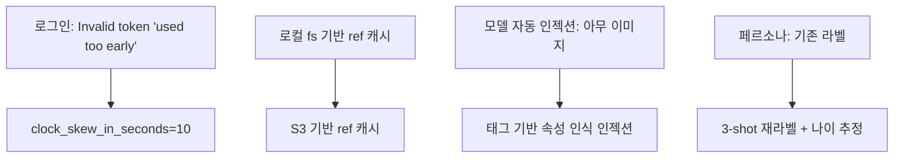

## 개요

짧지만 날카로운 주간. 커밋 5개 모두 프로덕션 보강. Google OAuth 클럭 스큐 로그인 블로커 픽스, PM2용 ecosystem.config.js 호스트 이식성 확보, 레퍼런스 이미지 key 캐시를 로컬 파일시스템에서 S3 기반으로 이관(dev와 prod가 동일 상태 보도록), 속성 인식 모델 자동 인젝션 배선, 페르소나를 3-shot 프롬프트로 나이 추정 포함 재라벨링.

이전 글: [hybrid-image-search-demo 개발 로그 #13](/posts/2026-04-13-hybrid-search-dev13/)

<!--more-->



---

## Google OAuth 클럭 스큐

### 배경
로그인 차단 `Invalid Google token: Token used too early, 1776217862 < 1776217863. Check that your computer's clock is set correctly.` 서버 시계가 Google보다 ~1초 빠른 상태 — JWT `iat`가 서버 관점에서 미래였다.

### 해결
`backend/src/auth.py`의 `id_token.verify_oauth2_token(...)`에 `clock_skew_in_seconds=10` 추가:

```python
id_token.verify_oauth2_token(
    token, google_requests.Request(), GOOGLE_CLIENT_ID,
    clock_skew_in_seconds=10,
)
```

즉시 복구. 서버가 자기 시계를 3자의 `iat`와 초 단위로 신뢰하면 안 된다 — JWT 검증에서 10초 톨러런스는 표준이며 의미있는 공격 표면을 열지 않는다.

---

## S3 기반 레퍼런스 key 캐시

### 배경
모델/레퍼런스 이미지 캐시를 로컬 파일시스템에서 구축하고 있었다. 프로덕션에서 S3 마운트 경로가 항상 최신 업로드를 반영하지는 않아서 깨졌고, dev와 prod의 로컬 상태가 divergent했기 때문에도 깨졌다. "tone only" 모드에서 유저가 재생성하면 경로가 로컬 상태에서 resolve되어 UI가 잘못된 레퍼런스 이미지를 보여줬다.

### 해결
`ce33906 fix(storage): build ref key cache from S3, not local filesystem` — 캐시 구축을 S3 객체 나열로 바꿈. 모든 이미지 retrieval 경로가 S3 key 기준으로 resolve. 과거 생성 이력도 backfill해서 오래된 레코드가 올바른 S3 URL을 가리키게 수정.

---

## 속성 인식 모델 자동 인젝션

### 배경
이전 인젝션 로직은 느슨한 조건에 매치되는 *아무* 이미지나 끌고 왔다. 비교 모드("tone + angle" vs "tone only")에서 태그된 속성과 맞지 않는 모델 이미지가 인젝션되기도 했고, 유저는 출력 그리드에서 엉뚱한 레퍼런스를 봤다.

### 해결
`d492ee1 feat(gen): attribute-aware model auto-injection` — 요청된 모델 폴더의 태그된 속성(angle, tone) 기준으로 인젝션. `s3://diffs-studio-hybrid-search/.../01. Model` 하위 서브폴더가 속성 그룹으로 취급되며 그룹당 레퍼런스 1개.

전제: 각 모델 레퍼런스를 재라벨링해서 속성을 신뢰할 수 있게 만들어야 함. 폴더 단위 그룹핑은 라벨이 파일시스템에서 가시적인 스키마라는 뜻이다. DB 컬럼이 아니라서 운영팀이 S3 브라우징만으로 라벨을 감사하고 편집할 수 있다.

---

## 페르소나 재라벨링 (3-shot + 나이)

### 배경
페르소나 라벨은 이전에 zero-shot 프롬프트로 설정되었고 나이 추정이 없었다. 유저 페이싱 필터가 나이 세분화를 요구했다.

### 해결
`2743eaf chore(labels): re-label personas with 3-shot prompt and age estimates` — 요청당 인컨텍스트 예시 3개와 age-range 필드로 라벨러 재실행. 라벨을 리포에 push해서 모든 서버가 pick up, 인스턴스별 라벨 drift 방지.

---

## PM2 / TSC 픽스

- `95f8bbc fix(deploy): make ecosystem.config.js host-portable` — 하드코딩된 절대 경로 제거로 dev와 prod에서 같은 config 동작. PM2가 어떤 `$HOME`에서든 동일하게 부팅.
- `6ebab0d fix(ui): drop unused generatingCount state to unblock tsc build` — 최근 정리 후 tsc 빌드를 막던 dead state 변수. 삭제하고 빌드 통과.

---

## 커밋 로그

| 메시지 | 영역 |
|--------|------|
| fix(deploy): make ecosystem.config.js host-portable | PM2 |
| fix(storage): build ref key cache from S3, not local filesystem | 스토리지 |
| feat(gen): attribute-aware model auto-injection | 생성 로직 |
| fix(ui): drop unused generatingCount state to unblock tsc build | 프론트엔드 |
| chore(labels): re-label personas with 3-shot prompt and age estimates | 라벨링 |

---

## 인사이트

락인할 만한 패턴 둘. 첫째, "source of truth에서 캐시를 빌드"하는 게 "캐시를 source of truth와 동기화"하는 것보다 언제나 낫다. ref-key 캐시는 로컬 상태에서 시작해서 나중에 S3와 reconcile하려는 한 취약했다. S3에서 직접 빌드하면 drift 버그 카테고리 하나가 통째로 사라진다. 둘째, 클럭 스큐 픽스는 프로덕션 OAuth 실패가 거의 항상 crypto 이슈가 아니라 분산 시스템 이슈(클럭 동기화, DNS 전파, 키 로테이션)라는 리마인더다 — 10분 로그 읽고 1줄 고치면 끝나는 게 성숙한 스택에서 이 종류 이슈가 느껴져야 하는 모양이다.
