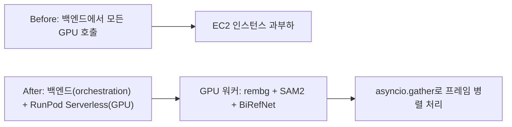

## 개요

popcon의 이미지·영상 처리 파이프라인을 두 개의 서로 다른 환경으로 쪼갠 주간이다. 가벼운 오케스트레이션은 그대로 백엔드에 남기고, 무거운 GPU 추론(rembg, SAM2, BiRefNet)은 RunPod Serverless GPU 워커로 이관했다. 덤으로 프레임별 GPU 호출을 `asyncio.gather`로 병렬화하고 gstack skill 라우팅 규칙을 CLAUDE.md에 추가했다.

이전 글: [popcon 개발 로그 #6](/posts/2026-04-13-popcon-dev6/)

<!--more-->

---

## GPU 워커 분리 (RunPod Serverless)

### 배경
이전 구조에서는 백엔드 서버가 rembg와 SAM2를 직접 호출했다. 12 프레임짜리 애니메이티드 이모지 한 세트를 만드는 데 백엔드 CPU가 수 분간 묶였고, 동시에 들어오는 생성 요청이 쌓이면서 전체 레이턴시가 비선형으로 증가했다. EC2 CPU 인스턴스로는 물리적으로 감당이 안 되는 워크로드였다.

### 구현
- `d04a14e feat: add gpu_worker for RunPod Serverless (rembg + SAM2)` — 별도 모듈로 분리된 GPU 워커. RunPod Serverless 엔드포인트가 받아서 처리.
- `995d655 refactor: delegate rembg + SAM2 inference to GPU worker` — 백엔드는 오케스트레이션만. HTTP로 워커 호출, 결과만 조립.
- `9ffddfd test: add GPU worker smoke test script` — 엔드포인트 연결과 I/O 포맷 검증용 smoke test.

RunPod 엔드포인트 설정: max workers 3, idle timeout 30s, RTX A5000 24GB. `max=3`은 동시 요청 허용치, `idle=30s`은 컨테이너 종료 전 대기 시간이다. cold start가 있기는 하지만 idle 30초로 유지하면 연속 요청에선 warm 상태로 재사용된다.

### 문제 해결
워커가 잡을 제대로 집지 않는 이슈 → 로그 확인 → 24GB 메모리를 설정했는데 RTX A5000이 할당된 상태 → 컨테이너 disk만 조정 가능하고 GPU 스펙은 endpoint 설정에서 별도 지정이 필요했음. `.env`에 `POPCON_DASHSCOPE_*`, `RUNPOD_ENDPOINT_ID`, `RUNPOD_API_KEY`를 모두 모아서 환경 변수 관리 일원화.

---

## 프레임 병렬화 (asyncio.gather)

### 배경
12 프레임 애니메이션 생성에서 프레임마다 독립적인 GPU 호출이 필요한데 직렬로 돌리면 워커 하나당 12배 레이턴시가 찍혔다. RunPod worker는 max=3으로 동시에 받을 수 있으니 병렬화 가능 구조.

### 구현
`aed7573 perf: parallelize per-frame GPU calls with asyncio.gather` — 프레임 배열을 `asyncio.gather(*[process_frame(f) for f in frames])`로 한 번에 디스패치. RunPod 쪽에서 동시성을 max=3으로 수용하고 나머지는 워커가 큐잉.

실측: 12프레임 처리 시간이 프레임당 직렬 호출 대비 병렬 호출로 ~3배 단축(RunPod max=3 설정과 일치). 워커 수를 늘리면 이론상 더 빠르지만 비용 증가 곡선이 가파르다.

---

## 매팅 모델 업그레이드 준비 (BiRefNet)

세션에서 rembg vs BiRefNet 비교 테스트를 진행했다. 별도 테스트베드 리포([popcon-matting-bench](https://github.com/ice-ice-bear/popcon-matting-bench))에서 ViTMatte, Matanyone, BiRefNet, rembg를 같은 입력으로 돌려 비교. 결론: BiRefNet이 배경 디테일을 훨씬 깨끗하게 제거하되 엣지 주변에 미세한 할로가 남는 경우가 있어 defringe 후처리 검토 중.

BiRefNet은 이 주의 별도 포스트로 정리([BiRefNet 독립 리뷰](/posts/2026-04-15-birefnet/)).

---

## 인프라 자잘한 정리

- `332b083 merge: integrate main branch changes into SAM2 worktree` — SAM2 실험 worktree를 main과 동기화하고 삭제.
- `5d16046 chore: add gstack skill routing rules to CLAUDE.md` — /fix-visual, /fix-behavior, /walkthrough 같은 skill 호출 시 컨텍스트 우선순위 규칙.
- `4f7a524 chore: add Makefile for native dev workflow` — `make dev`, `make stop` 표준화.
- `dcbf915 feat: wire up custom retry prompts, frame candidate swap, preset list` — 생성 실패 시 사용자가 커스텀 프롬프트로 재시도, 프레임 후보 중 수동 선택, 포즈 프리셋 리스트.
- `87d18a5 chore: ignore .playwright-mcp/ artifacts` — playwright-mcp 임시 파일 gitignore.

---

## 커밋 로그

| 메시지 | 비고 |
|--------|------|
| merge: integrate main branch changes into SAM2 worktree | worktree 정리 |
| chore: add gstack skill routing rules to CLAUDE.md | 스킬 컨텍스트 규칙 |
| chore: add Makefile for native dev workflow | make dev/stop |
| feat: wire up custom retry prompts, frame candidate swap, preset list | UX 개선 |
| feat: add gpu_worker for RunPod Serverless (rembg + SAM2) | GPU 워커 분리 |
| refactor: delegate rembg + SAM2 inference to GPU worker | 백엔드 경량화 |
| perf: parallelize per-frame GPU calls with asyncio.gather | 12 프레임 병렬 |
| test: add GPU worker smoke test script | 워커 연결 검증 |
| chore: ignore .playwright-mcp/ artifacts | gitignore 업데이트 |

---

## 인사이트

핵심 교훈은 레이어 분리다. 백엔드는 오케스트레이션과 상태 관리에 특화, GPU 워커는 stateless 추론에 특화하면 각자를 독립적으로 스케일할 수 있다. RunPod Serverless는 이 분리를 저렴하게 제공한다 — max=3, idle=30으로 돌리면 평상시 유휴 비용이 거의 0이고 burst 순간에만 과금된다. 또한 `asyncio.gather`의 효과는 워커 측 동시성 설정과 1:1 매칭될 때만 나온다. 앞으로 max=5 이상으로 늘리려면 RunPod의 GPU 할당 전략과 비용 곡선을 같이 봐야 한다. BiRefNet 도입은 다음 주의 defringe 후처리 플로우와 함께 프로덕션 투입 예정.
