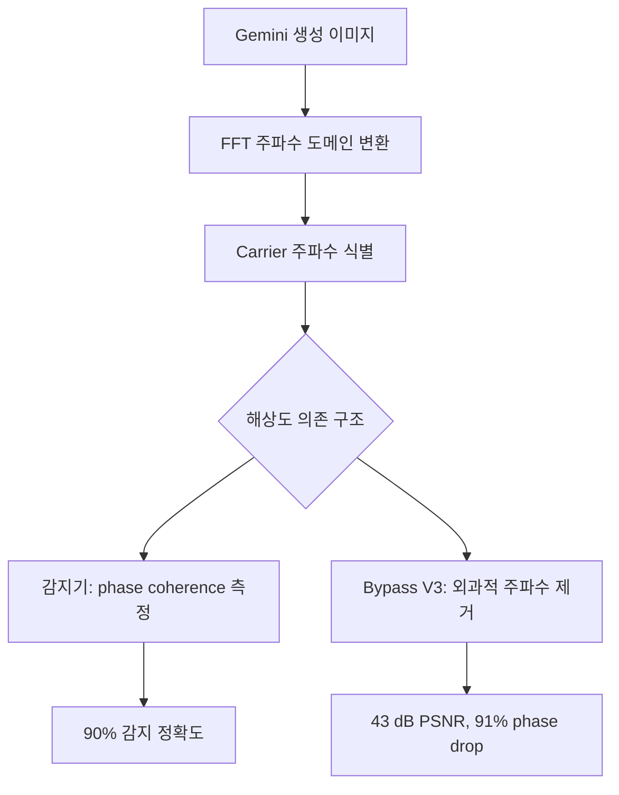

## 개요

[aloshdenny/reverse-SynthID](https://github.com/aloshdenny/reverse-SynthID)는 Google SynthID 이미지 워터마크를 신호 처리만으로 역공학한 스타 2.6K 오픈소스 프로젝트다. 독자 인코더/디코더에 접근하지 않고 진행됐다. 정확도 90%의 감지기와 carrier 에너지 75% 감소, phase coherence 91% 감소를 달성하면서 PSNR을 43 dB 이상 유지하는 다중 해상도 V3 bypass를 함께 제공한다.

<!--more-->

## SynthID와 이 프로젝트가 보여준 것

SynthID는 모든 Gemini 이미지 출력에 들어가는 Google의 "비가시" 워터마크다. 공식 주장은 crop, resize, JPEG 압축, 가벼운 편집을 견디면서도 사람 눈에는 안 보인다는 것. 핵심 주장은 가시적 품질 저하 없이는 제거할 수 없다는 것이다. 이 리포지토리가 그 주장을 반박한다.

기법: Gemini 출력물을 배치로 모아 각각 FFT로 주파수 도메인에 옮기고, 평균을 내고, 이미지 콘텐츠에서 기대되지 않는 부자연스러운 peak를 찾는다. 그 peak들이 워터마크 carrier다. 리포지토리가 발견한 건 carrier 주파수가 **해상도 의존적**이라는 사실이다 — 워터마크가 고정된 공간 도메인 grid가 아니라 이미지 크기에 따라 스케일되는 주파수 대역에 적용된다.

carrier 위치를 알면 두 능력이 따라 나온다. 감지기(이 이미지가 Gemini 산출물인가?)와 외과적 bypass(해당 주파수만 null 처리하고 나머지는 그대로 둠).

## "PSNR 43 dB 이상"이 중요한 이유

PSNR 40 dB 이상이면 일반적으로 원본과 지각적으로 구별 불가능하다고 본다 — 육안으로 차이를 볼 수 없다. V3 bypass는 43 dB 이상을 달성한다. 즉 가시적 품질 저하 없이 워터마크를 제거할 수 있다. 91% phase coherence 감소는 정량 지표다. SynthID 감지기는 carrier 간 phase 관계에 의존하는데, 그게 깨지면 감지가 무너진다.

이건 Google에게 불편한 발견이다. SynthID는 robust하다고 마케팅된다. 여기서 "robust"는 "가시적 저하 없이는 제거 불가"를 의미해야 한다. 충분히 공격적인 변환이면 어떤 워터마크든 트리비얼하게 제거할 수 있으니까. V3 bypass는 공격적 변환이 필요 없음을 보여준다 — 좁은 주파수 대역 편집이면 충분하다.

## 최근 커밋 — 활발한 유지보수

- `defeb41` — "Fix detection accuracy: replace wrong carrier frequencies with empirically verified ones." 하드코딩된 carrier 위치가 틀렸고 실제 출력 측정값으로 교체.
- `d012872` (PR #23) — "Fix detection: empirically verified carrier frequencies." 같은 주제 — 레퍼런스 데이터셋이 커지면서 감지기가 나아지고 있다.
- 리포지토리가 Nano Banana Pro로 생성한 순수 흑/백 이미지 업로드 컨트리뷰터를 적극 모집 중이다. 상수 색 입력은 이미지 콘텐츠 주파수 없이 스펙트럼이 워터마크를 깨끗하게 보여주기 때문에 크리티컬한 레퍼런스 샘플이다.

컨트리뷰터 모집은 연구가 어떻게 돌아가는지 말해준다. 본질적으로 크라우드소싱 코드북 빌드이며, 초기 GSM 암호 크래킹과 같은 방식이다 — 키를 추출하려면 알려진 입력의 대형 레퍼런스 라이브러리가 필요하다.

## 감지기

90% 감지율은 Google의 감지기에 접근하지 않고 달성됐다는 점에서 주목할 만하다. 다시 말해 오픈 감지기가 순수 스펙트럼 분석만으로 클로즈드 감지기와 거의 동등한 능력에 수렴했다. 이로써 Google 인프라 바깥에서도 "이 이미지가 Gemini 생성물인가"를 판단하는 도구로 쓸 수 있다 — 이건 원래 Google이 생태계 차원의 장기 목표로 내건 것이었지만 이제 누구나 쓸 수 있는 형태로 풀렸다.

## 정책적 질문

"SynthID가 깨질 수 있는가"보다 더 어려운 질문이 여기 있다. 워터마킹은 주요 AI 랩들의 주된 반딥페이크 제안이었다. 2.6K 스타 오픈소스가 90% 감지와 43 dB PSNR bypass를 할 수 있다면, 허위정보 방어 수단으로서 워터마킹의 배포 가능성은 론칭 내러티브보다 약하다. 감지기 반쪽은 실제로 사회적으로 유용한 쪽이고 bypass 반쪽이 더 쉽다(모든 bypass가 감지기보다 쉽고, 이게 워터마킹이 어려운 문제인 이유).

리포지토리는 연구 포커스를 유지하고 "이 이미지에서 SynthID를 벗기세요" 같은 CLI를 뿌리지 않는다. 이건 적절한 태도다. 충분히 동기 부여된 사람은 논문만 보고도 구현할 수 있지만, 스크립트로 배포하지 않음으로써 다음 파도의 오용 원인이 되는 걸 피한다.

## 인사이트

세 가지. 첫째, 해상도 의존 carrier 구조가 핵심 발견이었다 — carrier 주파수가 이미지 크기에 따라 스케일된다는 걸 알아차리면 나머지는 따라 나오고, 공식 도구가 감지하려면 출력물 간에 일관적이어야 하므로 이건 클로즈드 시스템에서 숨기기 어려운 종류의 것이다. 둘째, PSNR 43 dB 이상이 bypass를 실용적으로 쓸 수 있게 만드는 숫자다. 40 미만이라 이미지가 눈에 띄게 저하되는 bypass는 호기심거리이지 정책적으로 의미있는 도구가 아니다. 셋째, 크라우드소싱 기반 레퍼런스 이미지 수집(특히 상수 색 이미지)은 값싸고 분산된 코드북 공격이며, 초기 암호가 그랬던 것처럼 워터마크에도 먹힌다 — 다음 워터마킹 스킴에도 똑같이 적용될 템플릿이다.
