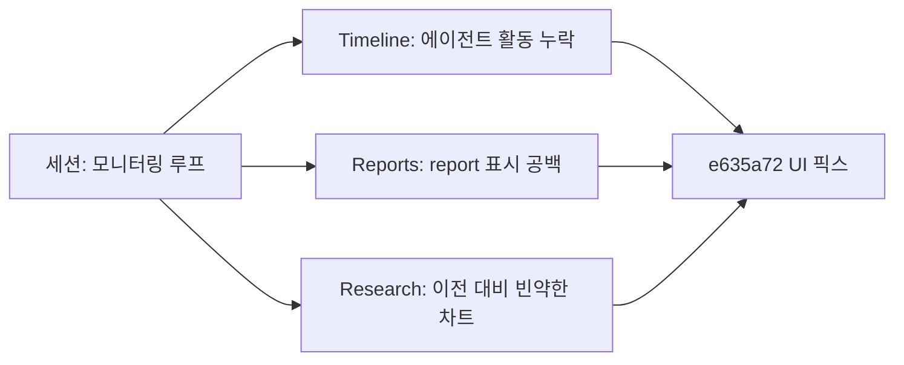

## 개요

커밋 1개짜리 인터벌이지만 포커스는 명확. 이전 레이아웃 리팩터링에서 사라진 페이지 패딩 복구, 오버레이/시그널 텍스트 가독성 폴리시, Research 페이지 차트가 렌더는 되지만 series 데이터가 빠지던 문제 수정. 2시간 라이브 모니터링 세션이 실제 UI 아티팩트를 기반으로 픽스를 끌어냈다.

이전 글: [trading-agent 개발 로그 #11](/posts/2026-04-13-trading-agent-dev11/)

<!--more-->

---

## 라이브 모니터링 세션의 맥락

세션 시작 프롬프트가 `read @CLAUDE.md and run the monitoring loop`였다. 에이전트가 2시간 대부분을 라이브 UI를 지켜보며 이슈가 뜰 때마다 플래그:

- Timeline에서 오전에 돌린 3개 에이전트 활동이 안 보임.
- Reports 섹션에서 report display 공백.
- Research 페이지가 동작은 하지만 이전 스냅샷 대비 "훨씬 덜 풍부함"(플롯 적음, 메트릭 희박).
- 긴 페이지의 스크롤 동작 regression.

모두가 하나의 픽스 커밋으로 귀결: `e635a72 fix(ui): restore page padding, polish overlay/signal text, fix Research chart`.

---

## 실제 배포된 것

### 페이지 패딩 복구
이전 레이아웃 리팩터링에서 full-bleed 처리 일환으로 outer padding을 제거했었다. 와이드 모니터에선 콘텐츠가 뷰포트 가장자리에 달라붙어 삭막해 보이고, 모바일에선 텍스트가 스크린 끝에 딱 붙었다. 콘텐츠가 숨쉴 수 있도록 일관된 outer padding 복원.

### 시그널 오버레이 텍스트 폴리시
캔들 차트 위에 트레이딩 시그널이 오버레이된다. 이전에는 오버레이 텍스트가 기본 font weight로 차트 배경 위에 바로 앉아 있어서, 차트 라인이 텍스트 아래로 지나갈 때 가독성이 떨어졌다. 폴리시: font weight 살짝 올리고 tracking 좁히고, 오버레이 뒤에 미묘한 background scrim 추가해서 어떤 차트 배경에서도 읽히게.

### Research 차트 픽스
Research 페이지 차트가 emit은 되는데 series가 누락된 채 렌더되고 있었다. 근본 원인: 백엔드 데이터 contract에 새 필드가 추가됐는데 프론트엔드가 구형 shape로 필터링하면서 매치 안 되는 엔트리를 조용히 드롭. 프론트엔드 projection을 업데이트해서 새 필드를 통과시키도록 수정. 차트가 풍부했던 이전 상태로 복귀.

---

## 커밋 로그

| 메시지 | 영역 |
|--------|------|
| fix(ui): restore page padding, polish overlay/signal text, fix Research chart | UI |

---

## 인사이트

인터벌이 커밋 하나로 끝났지만, 그 커밋이 2시간 라이브 모니터링 런에서 나온 산물이라는 게 UI 중심 에이전트 프로젝트에 더 적절한 작업 단위다. 돌아가는 UI를 보면서 읽으면 레이아웃(패딩), 타이포그래피(오버레이 가독성), 데이터 contract drift(누락된 series) 세 카테고리의 regression을 동시에 잡는다. 합성 테스트 스위트는 세 개 중 하나 정도 잡을 수 있다. 나머지는 사람(혹은 모니터링 에이전트)이 실제로 픽셀을 봐야 한다. 교훈: UI가 곧 제품인 프로젝트에서 "모니터링 루프"는 단순 ops가 아니라 기본 QA 표면이며, 에이전트가 스크린샷 찍고 diff 뜨고 픽스를 파일링할 수 있는 이상 자동화로 스케일된다.
