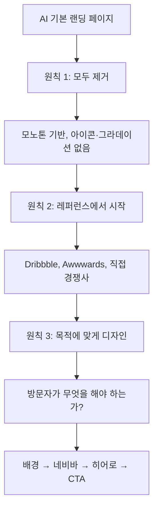

## 개요

"바이브코딩 디자인 풀코스 | 10분만에 AI 티 완전히 없애기" 10분짜리 튜토리얼이 세 가지 원칙으로 generic AI 생성 랜딩 페이지를 의도적인 페이지로 전환하는 과정을 보여준다. 원칙은: 필요 없는 건 다 제거, 레퍼런스에서 시작, 목적에 맞게 디자인. 원칙이 특정 예시를 넘어서 일반화되고, 바이브코딩 사이트의 "AI 티"가 실제 제품 liability가 되어가고 있기 때문에 정리할 가치가 있다.

<!--more-->

## 원칙 1 — 모두 제거하라

LLM 기본 랜딩 페이지는 그라데이션, 다색 팔레트, 장식 아이콘, 이모지, 관심을 놓고 경쟁하는 CTA 최소 3개로 가득하다. 본능은 이를 다듬어 내려가는 것. 튜토리얼은 반대를 주장한다 — 먼저 다 지워라. 모노톤으로 떨어뜨려라. 아이콘 전부 죽여라. 장식 요소 전부 제거해라. 그러고 나서 필요한 것만 다시 추가하라.

근거는 인지적이다. 분주한 캔버스에서 시작하면 다음에 뭘 제거할지 결정하는 데 에너지를 쓰고 그 결정이 끝나지 않는다. 빈 캔버스에서 시작하면 다음에 뭘 추가할지 결정하는 데 에너지를 쓰고, 페이지가 목적을 수행하는 순간 추가가 종료된다. 같은 종착지, 훨씬 깨끗한 경로.

바이브코딩 랜딩을 출시하는 사람에게 가장 실행 가능한 한 가지 조언이다. LLM 기본 출력은 "스크린샷에서 인상적으로 보이기"에 맞춰 캘리브레이션되어 있다 — 제거만이 시그널을 복구하는 유일한 방법이다.

## 원칙 2 — 레퍼런스에서 시작

레퍼런스는 두 종류. 미적 레퍼런스(Dribbble, Awwwards)는 현재 좋은 디자인으로 여겨지는 것을 보여준다. 열망적이다. **경쟁 레퍼런스**(같은 카테고리의 실제 제품)는 유저가 기대하도록 훈련된 것을 보여준다. 둘 다 중요하지만 경쟁 레퍼런스가 더 중요하다. 예술을 만드는 게 아니라 제품을 만들고 있으니까.

튜토리얼의 영상 생성 예시에서 경쟁 레퍼런스는 Kling, Wan, Runway — 이미 같은 유저 니즈를 서빙하는 제품들. 이들 사이트의 공통 패턴이 Dribbble이 보여주는 어떤 것보다 가치 있다. 히어로 CTA 위치, 생성 샘플 전시 방식, 가격 제시 방식. 경쟁 규범과의 divergence는 우연이 아니라 의도적 선택이어야 한다.

실용 팁: 평소 브라우징하면서 예뻐 보이는 사이트를 스크랩해둬라. 뭔가 디자인하러 앉을 때 레퍼런스 폴더는 이미 큐레이트되어 있다. 코딩을 시작한 *후* 레퍼런스를 찾는 건 뒤집어진 접근이다 — 코딩은 가진 것으로 끝내도록 압박하고, 그게 보통 AI 기본값이다.

## 원칙 3 — 목적에 맞게 디자인

포커싱 질문: *방문자가 무엇을 하길 원하는가?* 페이지의 모든 요소는 그 답에 상대적으로 자리를 얻어야 한다. 쿠팡이나 무신사는 방문자가 제품을 브라우징 시작해야 하니 페이지가 제품 그리드로 열린다. Claude나 ChatGPT는 방문자가 입력해야 하니 입력박스가 above the fold. 영상 생성 도구는 방문자가 영상을 생성해야 하니 생성 버튼이 히어로.

당연해 보이지만 실제로 AI 생성 랜딩 페이지는 이를 일관되게 실패한다. LLM은 당신의 비즈니스 모델을 모르기 때문이다. 랜딩 페이지처럼 보이는 템플릿을 뽑아낼 뿐, *당신의* 랜딩 페이지의 목적을 위한 랜딩 페이지가 아니다. 목적을 명시적으로 말해주는 것("멋진 랜딩 페이지를 만들어줘"가 아니라)이 가장 큰 단일 프롬프트 업그레이드다.

## 튜토리얼의 실행 순서

1. **배경** — 색상, 이미지, 영상. 영상 배경은 비주얼 중심 제품에 맞지만 콘텐츠와 싸우면 안 된다.
2. **네비바** — 초기 상태 투명, 테두리 없음, 스크롤시 불투명 전환, 목적에 정렬된 단일 CTA.
3. **히어로** — 제품이 해결하는 문제를 한 문장으로. 기본 폰트를 특색 있는 Google Font로 바꿔라. 주 CTA 배치.
4. **보조 섹션** — 목적이 요구하는 것만.

순서가 중요하다. 각 단계가 다음 단계를 제약하기 때문. 배경과 네비바 스타일을 정하면 폰트·색상 선택지가 좁아진다. 히어로 카피를 정하면 섹션 구조가 좁아진다. 넷을 병렬로 디자인하려 하면 AI 기본값이 나온다.

## 왜 바이브코딩에 특히 중요한가

바이브코딩의 가장 큰 약점은 코드 품질이 아니다 — 최신 LLM은 쓸만한 코드를 쓴다. 약점은 taste다. LLM이 훈련 분포를 평균하는데, 그 분포 자체가 이제 AI 기본값으로 가득 차 있기 때문이다. 출력은 랜딩 페이지의 통계적 중앙값이고, 통계적 중앙값은 제품이 고심한 것처럼 느껴지길 바랄 때 정확히 탈출하려는 대상이다.

세 원칙은 이 약점을 워크플로우로 바꾼다. Strip은 AI 중앙값에서 빠져나오게 한다. Reference는 의도된 목표 쪽으로 당긴다. Purpose는 모든 추가를 닻에 묶어둔다. 적은 규율이지만 "AI 생성물 같지 않다"는 결과로 곧바로 번역된다.

## 인사이트

두 가지가 눈에 띈다. 첫째, "AI 티"는 이제 측정 가능한 제품 liability다 — AI 생성물로 읽히는 랜딩 페이지는 유저가 이번 분기에 수천 개의 변종을 봤기 때문에 스킵당한다. 둘째, 세 원칙은 도메인 일반적이다. CLI 사이트, 모바일 앱스토어 리스팅, 피치덱에도 작동한다. 먼저 지우는 동작이 레버리지가 가장 높다. 레퍼런스 기반 디자인은 쌓는 데 가장 오래 걸리는 스킬이다. 목적 우선 필터링은 디자이너와 스타일리스트를 가르는 지점이다. 유저 페이싱 무언가를 바이브코딩하고 있다면, 이게 자동 생성된 게 아니라 의도된 느낌의 제품을 출시하는 최단 경로다.
