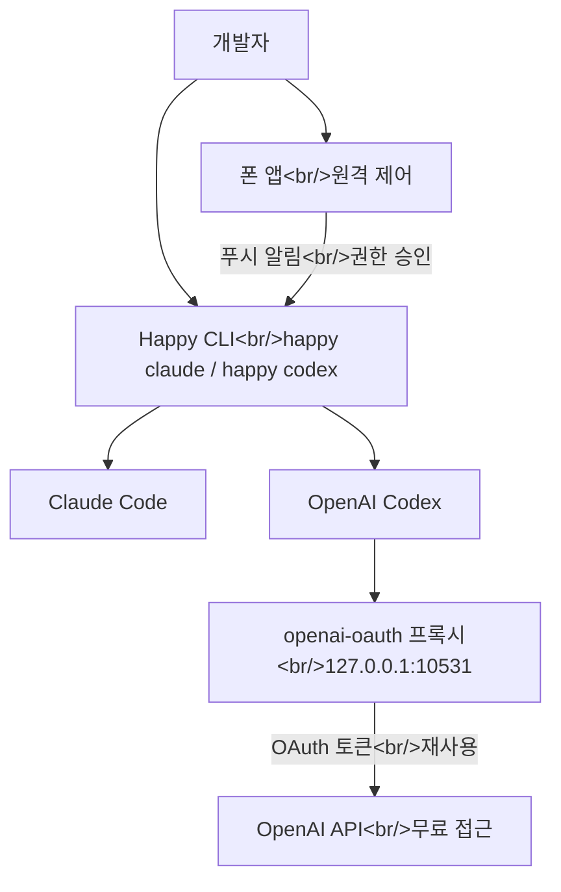

## 개요

이번 주 눈에 띈 두 커뮤니티 프로젝트가 있습니다. 둘 다 AI 코딩 에이전트 생태계를 서로 다른 방향으로 확장합니다. **openai-oauth**는 ChatGPT 구독의 OAuth 토큰을 무료 API 프록시로 활용하고, **Happy**는 푸시 알림과 E2E 암호화로 Claude Code 및 Codex 세션을 모바일에서 제어할 수 있게 해줍니다.

<!--more-->

## 생태계 아키텍처



## openai-oauth — ChatGPT 토큰으로 무료 API 접근

이 도구는 기존 ChatGPT 계정의 OAuth 토큰을 사용하여 별도의 API 크레딧 구매 없이 OpenAI API에 접근합니다. `npx openai-oauth`를 실행하면 `127.0.0.1:10531/v1`에 로컬 프록시가 시작됩니다.

**동작 방식:**

- Codex CLI가 내부적으로 사용하는 것과 동일한 OAuth 엔드포인트 활용
- `npx @openai/codex login`으로 인증
- `/v1/responses`, `/v1/chat/completions`, `/v1/models` 지원
- 스트리밍, 도구 호출, 추론 트레이스 완전 지원

**중요한 주의사항:**

- 비공식 커뮤니티 프로젝트로 OpenAI 공인이 아님
- 개인 용도 전용 — 계정 리스크 존재
- 흥미롭게도 Claude/Anthropic은 유사한 접근을 차단했지만, OpenAI는 이를 허용하는 듯 보임 (이 분야의 프로젝트인 OpenClaw를 인수)

## Happy — AI 코딩 에이전트의 모바일 제어

Happy는 Claude Code와 Codex를 래핑하는 모바일/웹 클라이언트로, 휴대폰에서 AI 세션을 모니터링하고 제어할 수 있습니다.

**주요 기능:**

- CLI 래퍼: `happy claude` 또는 `happy codex`
- 권한 요청 및 에러에 대한 푸시 알림
- 모든 통신에 E2E 암호화
- 오픈소스 (MIT 라이선스), TypeScript 코드베이스

**구성 요소:**

- **App** — Expo 기반 모바일 앱
- **CLI** — AI 에이전트용 터미널 래퍼
- **Agent** — CLI와 서버 간 브릿지
- **Server** — 원격 통신용 릴레이

**설치:**

```bash
npm install -g happy
```

이후 모바일 앱에서 QR 코드를 스캔하여 휴대폰과 터미널 세션을 페어링합니다.

## 의미

두 도구 모두 같은 근본적 필요를 다룹니다: AI 코딩 에이전트는 강력하지만 제약이 있습니다. openai-oauth는 API 접근의 비용 장벽을 제거하고 (계정 약관 위반 리스크가 있지만), Happy는 에이전트 세션 관리의 물리적 근접성 요구를 제거합니다. 이 두 도구는 커뮤니티가 AI 에이전트 도구를 공급자들이 공식적으로 지원하는 범위 너머로 확장하고 있음을 보여줍니다.

생태계가 빠르게 진화하고 있으며, 개발자들은 도구 간 브릿지를 만들고, 모바일 제어 플레인을 구축하고, 기존 구독의 가치를 극대화하는 창의적인 방법을 찾고 있습니다.
