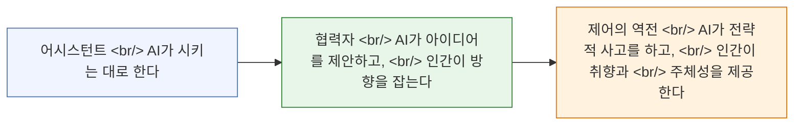

Anthropic의 교육 총괄 Drew Bent가 EO Korea에 출연해 AI 생산성에 대한 신선한 관점을 제시했다: **AI를 빠르게 쓰는 것이 AI를 잘 쓰는 것은 아니다**. 과외와 교육 분야에서 쌓은 그의 배경은 인간-AI 협업을 바라보는 독특한 시각을 제공한다 — 단순한 속도 향상이 아닌, 일하고 배우는 방식의 근본적 전환으로서.

<!--more-->

## AI 마인드셋의 전환

인터뷰의 핵심 주장은 대부분의 사람들이 AI를 과소 활용하고 있다는 것이다. 더 빠른 검색 엔진이나 자동완성처럼 취급하며, 작년 수준의 문제에만 적용한다. Drew는 **야망을 높여야** 한다고 주장한다 — AI에게 더 어려운 문제를, 이전에는 시도조차 하지 않았을 문제를 던져야 한다.

이것은 **AI 네이티브** 사람들에 대한 더 넓은 관찰과 연결된다. 르완다나 인도 같은 곳에서 수십 년간의 전통적 컴퓨팅에서 온 레거시 멘탈 모델 없이 AI를 처음 접하는 사람들은 현재의 AI 능력을 더 명확하게 본다. "이건 그냥 챗봇이야"라는 선입견 없이 — 진정으로 새로운 무언가로 바라본다.

## 어시스턴트에서 협력자로, 그리고 제어의 역전으로

Drew는 인간이 AI와 관계 맺는 방식의 진화 단계를 설명한다:

대부분의 사람들은 **어시스턴트** 단계에 머물러 있다 — 단순한 작업을 위임하는 수준. 진짜 도약은 **협력자** 단계로 넘어갈 때 일어난다. AI가 아이디어를 제안하고 함께 반복하며 발전시키는 단계다. 궁극적 목적지는 **제어의 역전**: AI가 전략적 중량물을 처리하고 인간은 취향, 판단력, 주체성을 가져오는 것이다.

## Anthropic 연구: 속도 vs. 이해도

가장 인상적인 데이터 포인트: Anthropic이 진행한 연구에서 AI를 사용한 그룹은 작업을 **17% 더 빠르게** 완료했지만, 기본 개념에 대한 이해도는 **17% 더 낮았다**.

하지만 여기에 뉘앙스가 있다 — **탐구 모드**로 AI를 사용한 참가자들 (질문하고, 탐색하고, 답 기계가 아닌 사고 파트너로 활용한 사람들)은 속도와 이해도 모두에서 좋은 성과를 보였다.

핵심: AI를 **쓰느냐 마느냐**보다 **어떻게** 쓰느냐가 훨씬 중요하다.

## 실전 원칙들

### 맥락이 전부다

Drew는 질문하기 전에 **맥락을 로딩하는 데** 대부분의 시간을 쓰라고 강조한다. AI 출력의 품질은 제공하는 맥락의 품질에 정비례한다. "X를 작성해줘"로 바로 뛰어들지 말고 — 먼저 AI가 당신의 상황을 깊이 이해하는 데 필요한 모든 것을 제공하라.

### 해결책이 아닌 문제를 가져와라

열린 문제가 미리 정해진 해결책보다 더 나은 AI 응답을 얻는다. "Y 방식으로 X를 하는 함수를 작성해줘" 대신 "내가 해결하려는 문제는 이것이다 — 가장 좋은 접근법은 무엇인가?"를 시도하라. AI가 해결 공간을 탐색하도록 하라.

### R&D 마인드셋

오늘 시간을 잃더라도, 시간의 일부를 AI의 한계에서 실험하는 데 투자하라. 이 투자는 능력이 향상됨에 따라 보상을 받는다. 차세대 AI를 가장 효과적으로 사용할 사람들은 현 세대 AI를 한계까지 밀어붙이고 있는 사람들이다.

## 코드를 넘어서: 학습을 위한 Claude Code

놀라운 인사이트: 사람들이 **Claude Code** — 표면적으로는 코딩 도구 — 를 코딩이 아닌 학습에 사용하고 있다. 언어, 경제학, 연구. 이것은 당신의 속도와 스타일에 맞춰 적응하는 **AI 학습 동반자**의 미래를 가리킨다. 단순히 질문에 답하는 것이 아니라.

## 2030 비전

Drew의 2030년 비전: 당신의 커리큘럼을 알고, **당신**을 아는 AI. 교실에서 보이지 않는 기술이 되는 것. 학생들이 여는 화려한 앱이 아니라 학습 경험에 녹아든 인프라 — 전기처럼, 의식하지 않지만 혜택을 받는 것.

---

출처: [Drew Bent on EO Korea](https://www.youtube.com/watch?v=XwjfzwR4XO0)
