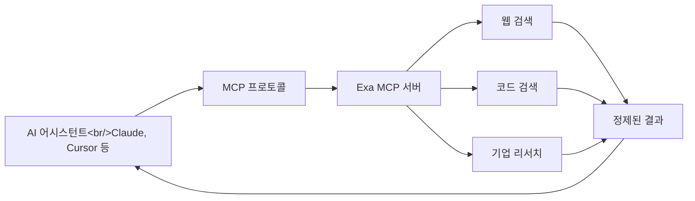

## 개요

[exa-labs/exa-mcp-server](https://github.com/exa-labs/exa-mcp-server) (스타 4,251개)는 AI 어시스턴트에 실시간 웹 검색 기능을 제공하는 MCP 서버입니다. 거의 모든 주요 AI IDE를 지원합니다: Claude Code, Cursor, VS Code, Codex, Gemini CLI, Windsurf, Zed, Warp, Kiro, Roo Code, v0 등. `https://mcp.exa.ai/mcp`의 호스팅 엔드포인트 하나로 별도 설정 없이 어디서든 사용할 수 있습니다.

<!--more-->

## 아키텍처



## 제공 도구

서버는 세 가지 주요 MCP 도구를 노출합니다:

- **`web_search_exa`** — AI에 최적화된 결과를 제공하는 일반 웹 검색
- **`web_fetch_exa`** — 임의의 URL에서 깔끔한 콘텐츠를 가져와 추출
- **`web_search_advanced_exa`** — 도메인, 날짜 범위, 콘텐츠 유형 필터를 지원하는 고급 검색

## 설정

가장 쉬운 방법은 호스팅 MCP 엔드포인트입니다. AI IDE의 MCP 설정에 이 URL만 추가하면 됩니다:

```
https://mcp.exa.ai/mcp
```

로컬 서버가 필요 없습니다. MCP 프로토콜을 지원하는 모든 곳에서 작동합니다.

셀프 호스팅의 경우, TypeScript 코드베이스를 클론하여 로컬에서 실행할 수 있습니다.

## 사전 구축 Claude Skills

Exa는 일반적인 리서치 워크플로우를 위한 사전 구축 Claude Skills를 제공합니다:

- **기업 리서치** — 제품, 펀딩, 팀, 기술 스택에 대한 심층 분석
- **경쟁 분석** — 실시간 데이터로 여러 차원에서 기업 비교

## IDE 지원

IDE 지원 범위가 인상적입니다. 모든 주요 AI 코딩 환경이 포함됩니다: Cursor, VS Code (Copilot), Claude Desktop, Claude Code, OpenAI Codex, Windsurf, Zed, Warp, Kiro, Roo Code, v0 등. 호스팅 MCP 방식 덕분에 새 IDE 지원 추가는 단순한 설정 변경으로 끝납니다.

## 정리

Exa MCP Server는 실질적인 불편함을 해결합니다: 코드는 작성할 수 있지만 최신 문서나 API를 웹에서 검색하지 못하는 AI 어시스턴트의 한계를 넘어섭니다. 단일 URL의 호스팅 MCP 엔드포인트가 로컬 서버 운영의 마찰을 제거하여, 어떤 AI 워크플로우에든 웹 검색을 손쉽게 추가할 수 있게 합니다.
