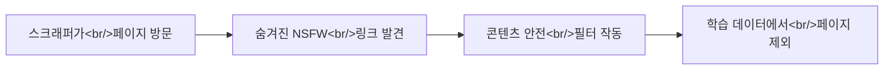

## 개요

[vivienhenz24/fuzzy-canary](https://github.com/vivienhenz24/fuzzy-canary) (스타 268개)는 AI 스크래핑 군비경쟁에 사회공학적 접근을 취하는 TypeScript npm 패키지입니다. 기술적으로 스크래퍼를 차단하는 대신, HTML에 포르노 웹사이트로 향하는 보이지 않는 링크를 심어둡니다. AI 학습 파이프라인이 페이지를 크롤링할 때 콘텐츠 안전 필터가 NSFW 링크를 감지하고 해당 페이지 전체를 학습 데이터에서 제외합니다.

<!--more-->

## 동작 원리



원리는 단순합니다. AI 학습 파이프라인에는 보편적으로 콘텐츠 안전 필터가 있습니다. 스크래퍼가 페이지에서 NSFW 링크를 발견하면 해당 페이지 전체를 안전하지 않은 것으로 분류하고 학습 데이터셋에서 제외합니다. Fuzzy Canary는 사람에게는 보이지 않지만 스크래퍼는 반드시 찾는 숨겨진 링크를 삽입하여 이를 악용합니다.

## 사용법

설치는 간단합니다:

```bash
npm i @fuzzycanary/core
```

두 가지 모드가 있습니다:

- **서버사이드 (권장)**: React 컴포넌트 `<Canary />`를 루트 레이아웃에 추가합니다. 렌더링 시점에 링크가 주입됩니다.
- **클라이언트사이드**: 페이지 로드 후 링크를 주입하는 자동 초기화 스크립트입니다.

클라이언트사이드 주입은 JavaScript를 실행하지 않는 스크래퍼에게 포착되지 않을 수 있으므로 서버사이드 방식이 권장됩니다.

## 주의사항

주요 트레이드오프는 SEO 영향입니다. 숨겨진 링크는 Googlebot 같은 정상적인 검색엔진 크롤러를 포함한 **모든 방문자**에게 주입됩니다. 링크가 사용자에게는 보이지 않지만, 검색엔진이 여전히 인덱싱하고 페이지에 패널티를 줄 수 있습니다. 검색 트래픽에 의존하는 프로덕션 사이트에서는 현실적인 고려사항입니다.

## 정리

Fuzzy Canary는 AI 기업들의 자체 안전 메커니즘을 역으로 이용하는 기발한 솔루션입니다. 커스텀 파이프라인을 가진 결연한 스크래퍼를 막지는 못하지만, 표준 학습 인프라를 사용하는 스크래퍼에게는 비용을 높입니다. 콘텐츠 제작자와 AI 학습 데이터 수집 간의 지속되는 군비경쟁에서 창의적인 한 수입니다.
