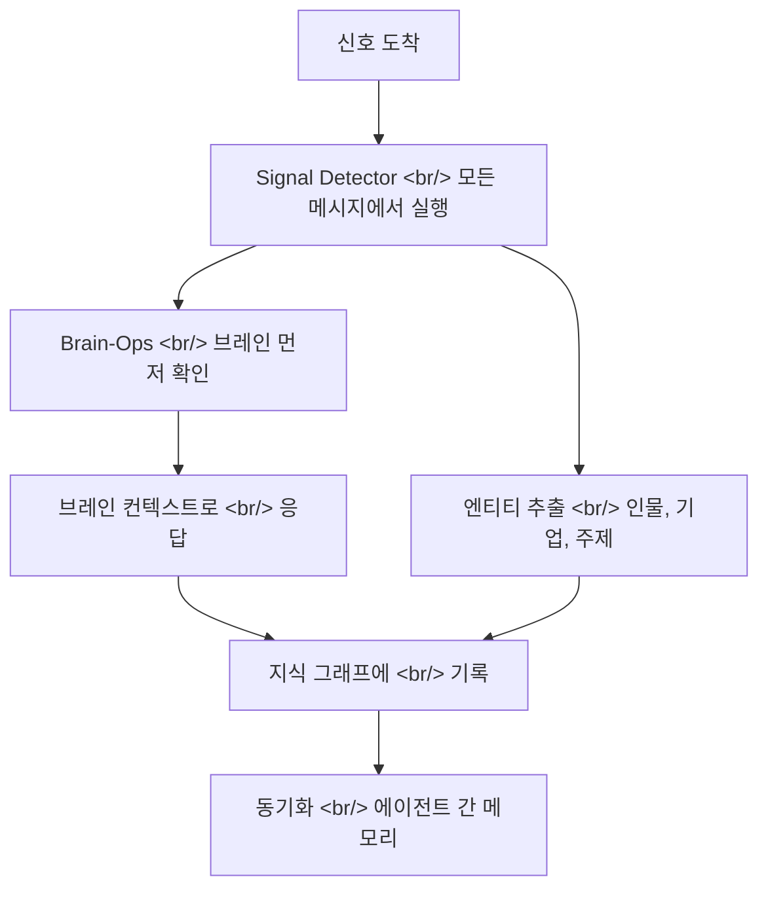

## 개요

"당신의 AI 에이전트는 똑똑하지만 건망증이 있다. GBrain은 그 에이전트에게 뇌를 준다."

GBrain은 Y Combinator의 대표이자 CEO인 Garry Tan이 만든 오픈소스 AI 에이전트 메모리 시스템이다. 데모나 장난감이 아니다 — Tan이 실제로 사용하는 에이전트를 위해 구축한 프로덕션 시스템이다. GitHub에서 이미 8,349개의 스타와 931개의 포크를 기록했으며, TypeScript와 PLpgSQL로 작성되었다.

<!--more-->

## 프로덕션 규모

GBrain의 프로덕션 배포 수치가 모든 것을 말해준다:

| 지표 | 수량 |
|------|------|
| 수집된 페이지 | 17,888 |
| 추적 중인 인물 | 4,383 |
| 인덱싱된 기업 | 723 |
| 실행 중인 크론 작업 | 21 |
| 구축 소요 시간 | 12일 |

개념 증명이 아니다. 매일 실제 에이전트 워크플로를 구동하는 실 서비스 지식 그래프다.

## 아키텍처: 신호에서 메모리로의 루프

핵심 루프는 단순하다: 모든 메시지는 신호이고, 모든 신호는 브레인을 통해 처리된다.

핵심 통찰은 signal detector가 **모든 메시지에 대해** 병렬로 실행된다는 점이다. 메인 응답이 시작되기도 전에 에이전트의 사고 과정을 포착하고 엔티티를 추출한다. 이는 명시적으로 요청할 때만이 아니라 항상 컨텍스트가 축적된다는 뜻이다.

## 철학: Thin Harness, Fat Skills

GBrain은 독특한 설계 철학을 따른다: **지능은 런타임이 아니라 스킬에 있다**.

하네스 자체는 의도적으로 가볍다 — 메시지 라우팅, 데이터베이스 연결, 신호 감지 루프만 처리한다. 나머지는 모두 `RESOLVER.md`가 관리하는 25개의 스킬 파일로 밀어넣었다:

- **signal-detector** — 항상 켜져 있으며, 모든 메시지에서 실행
- **brain-ops** — 외부 호출 전 5단계 조회 프로토콜
- **ingest** — 페이지, 문서, 피드 수집
- **enrich** — 메타데이터 추가, 분류, 엔티티 연결
- **query** — 지식 그래프에서 구조화된 검색
- **maintain** — 가비지 컬렉션, 중복 제거, 헬스 체크
- **daily-task-manager** — 반복 워크플로
- **cron-scheduler** — 21개(그리고 계속 늘어나는) 크론 작업
- **soul-audit** — 성격 및 행동 일관성 점검

"skill files are code"라는 표현이 이를 잘 포착한다. 각 스킬은 전체 워크플로를 인코딩하는 두꺼운 마크다운 문서다 — 단순한 프롬프트 템플릿이 아니라 의사결정 트리, 에러 처리, 출력 포맷을 포함한 완전한 운영 명세서다.

## Brain-First 규칙

에이전트가 외부 API를 호출하기 전에, 반드시 엄격한 5단계 브레인 조회를 거친다:

1. 지식 그래프에서 기존 정보 확인
2. 최근 신호에서 컨텍스트 확인
3. 엔티티 관계 확인
4. 시간적 패턴 확인
5. 그래야만 필요시 외부 API 호출

이 "brain-first" 규칙은 중복 API 호출을 극적으로 줄이고, 에이전트의 응답이 축적된 지식에 기반하도록 보장한다. 매번 새로 가져온 (그리고 잠재적으로 일관성 없는) 데이터에 의존하지 않는다.

## 기술 스택

**PGLite**는 특별히 언급할 가치가 있다. Postgres 서버를 요구하는 대신, GBrain은 PGLite를 사용하여 즉시 데이터베이스를 구축한다 — 제로 상태에서 실행 가능한 지식 그래프까지 약 2초. Docker도, 서버 프로비저닝도, 커넥션 스트링도 필요 없다.

시스템은 **MCP 서버**로도 제공되므로, Claude Code, Cursor, Windsurf와 직접 통합된다. MCP 호환 도구라면 무엇이든 브레인에 접근할 수 있다.

설치는 약 30분이 걸리며, 에이전트가 자체 셋업을 처리한다 — 레포를 지정하면 데이터베이스를 부트스트랩하고, 스킬을 설치하고, 크론 작업을 설정한다.

## 왜 중요한가

대부분의 AI 에이전트 프레임워크는 오케스트레이션에 집중한다: LLM 호출을 어떻게 체이닝할지, 도구 사용을 어떻게 관리할지, 에러를 어떻게 처리할지. GBrain은 완전히 다른 문제를 다룬다 — **세션과 에이전트를 넘나드는 영속적이고 구조화된 메모리**.

12일 만에 구축되어 이미 프로덕션 규모(17,888 페이지, 4,383 인물)로 운영되고 있다는 사실은 "thin harness, fat skills" 접근법이 철학적으로 깔끔할 뿐 아니라 실용적으로도 효과적임을 시사한다.

GitHub: [garrytan/gbrain](https://github.com/garrytan/gbrain)
