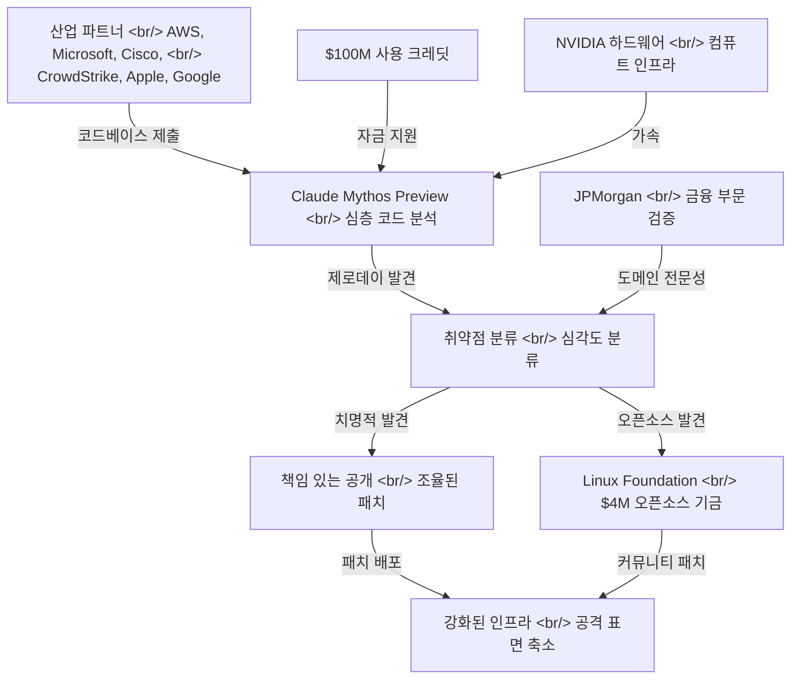
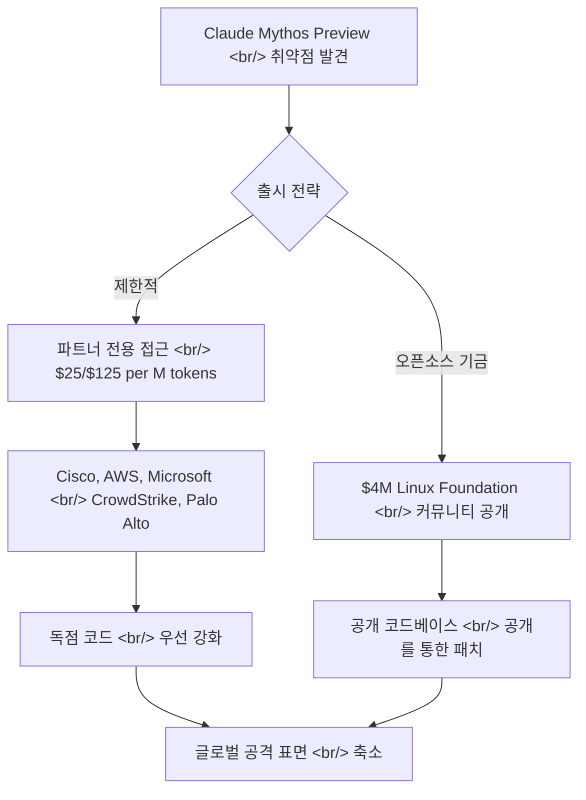

## 개요

Anthropic이 AWS, Apple, Google, Microsoft, Cisco, CrowdStrike, NVIDIA, JPMorgan, Linux Foundation과 함께 Project Glasswing을 발표했다. 공격자보다 먼저 소프트웨어 취약점을 발견하고 패치하는 것을 목표로 하는 AI 기반 방어 연합이다. 이 이니셔티브의 핵심에는 Claude Mythos Preview가 있다. 심층 코드 분석을 위해 특별히 만들어진 미공개 프론티어 모델로, 이미 모든 주요 운영체제와 브라우저에서 수천 개의 제로데이 취약점을 발견했다.

<!--more-->

## Glasswing 아키텍처

"Glasswing"이라는 이름은 투명한 날개를 가진 나비에서 따왔다. 불투명한 코드베이스를 보안 분석에 투명하게 만든다는 적절한 비유다. 프로젝트는 협력적 방어 파이프라인으로 운영된다. 파트너가 코드를 제출하면 Mythos가 기존 자동화 도구가 도달하지 못한 깊이로 분석하고, 확인된 취약점은 책임 있는 공개 절차를 통해 환류된다.

기존의 버그 바운티 프로그램이나 정적 분석 도구와 다른 점은 추론의 깊이다. Mythos는 단순히 알려진 취약점 패턴을 매칭하는 것이 아니라, 함수 경계, 라이브러리 인터페이스, 심지어 프로세스 간 통신 채널을 넘나드는 프로그램 동작의 의미론적 모델을 구성한다.

## Mythos 벤치마크 성능

수치가 Mythos와 현재 프론티어 모델 사이의 격차를 명확하게 보여준다.

| 벤치마크 | Claude Mythos Preview | Claude Opus 4.6 | 차이 |
|---|---|---|---|
| SWE-bench Verified | **93.9%** | 80.8% | +13.1pp |
| CyberGym | **83.1%** | 66.6% | +16.5pp |
| Terminal-Bench 2.0 | **82.0%** | — | — |

CyberGym 격차가 특히 주목할 만하다. 이 벤치마크는 현실적인 코드베이스에서 취약점을 찾고 익스플로잇하는 능력을 테스트한다. 단순한 프로그래밍 문제 풀이가 아니다. Opus 4.6 대비 16.5 퍼센트포인트 향상은 Mythos가 코드 이해의 점진적 개선이 아닌 취약점 추론에서 진정으로 새로운 능력을 갖추었음을 시사한다.

SWE-bench Verified 93.9%도 놀랍다. 나머지 실패 사례가 모호한 명세나 논쟁의 여지가 있는 정답 패치를 반영할 가능성이 높은 천장에 도달하고 있다.

## 핵심 발견 사항

세 가지 발견이 기존 보안 도구의 한계를 보여준다.

### 27년 된 OpenBSD 버그

OpenBSD는 보안 의식이 높은 엔지니어들이 감사 문화 *때문에* 선택하는 운영체제다. 수십 년간 줄 단위 수동 감사를 수행해왔다. Mythos가 27년간의 이 검증을 통과한 취약점을 발견했다는 것은, 이 버그가 의미론적 틈새에 존재했음을 시사한다. 컴포넌트 간 상호작용이 만들어낸 취약점으로, 함수 수준 추론으로는 보이지 않는 곳이다.

### 16년 된 FFmpeg 버그

이것이 더 인상적이라고 볼 수 있다. FFmpeg는 500만 회 이상의 자동 퍼징 테스트를 통과해왔다. 퍼징은 메모리 손상 버그를 찾는 표준 자동화 접근법이다. 무작위 입력을 넣어 크래시를 관찰한다. 이 버그가 500만 회 퍼징을 통과했다는 것은 무작위 바이트 패턴이 아닌 *의미론적* 조건에 의해 트리거된다는 뜻이다. Mythos는 코드가 어떤 입력에 크래시하는지가 아니라 코드가 *무엇을 의미하는지*를 이해해서 이것을 찾았다.

### Linux 커널 권한 상승 체인

권한 상승 체인은 단일 버그가 아니다. 개별적으로는 무해한 동작들이 조합되어 보안 위반을 구성하는 시퀀스다. 이를 발견하려면 별개의 서브시스템이 특정 조건에서 어떻게 상호작용하는지 이해해야 한다. 이는 역사적으로 엘리트 인간 연구자들이 수개월의 집중 노력을 투자해야 하는 취약점 클래스다.

## 보안 지형에 대한 시사점

### 비대칭 문제

소프트웨어 보안은 항상 근본적인 비대칭에 시달려왔다. 방어자는 가능한 모든 경로를 확보해야 하지만, 공격자는 하나의 결함만 찾으면 된다. Glasswing은 방어자에게 인간 리뷰어와 기존 자동화 도구가 도달할 수 없는 깊이와 속도로 취약점 공간을 체계적으로 탐색할 수 있는 도구를 제공함으로써 이 역학을 역전시킨다.

### 오픈소스 문제

Linux Foundation을 통한 오픈소스 보안에 $4M을 약정한 것은 주목할 만하지만 총 $100M 크레딧에 비하면 소박하다. 오픈소스 코드베이스는 사실상 모든 상용 소프트웨어의 기반이다 — OpenSSL, Linux 커널, FFmpeg 등이 모든 파트너의 제품을 뒷받침한다. 이 비율은 핵심 가치 제안이 파트너의 독점 코드 보호이며, 오픈소스는 이차적 수혜자임을 시사한다.

### 통제된 출시 전략

Mythos는 공개 출시되지 않는다. 파트너 전용으로, 입력 토큰 100만 개당 $25, 출력 토큰 100만 개당 $125의 가격이다. 의도적인 선택이다. 취약점 발견에 이 정도로 뛰어난 모델은 잠재적으로 *익스플로잇*에도 뛰어날 수 있다. 검증된 파트너를 통한 통제된 배포는 모델이 공격보다 패치를 더 많이 만들어내도록 하려는 Anthropic의 시도다.

## 초기 파트너 결과

파트너들은 이미 결과를 보고하고 있다. Cisco, AWS, Microsoft, CrowdStrike, Palo Alto Networks 모두 기존 도구 체인이 놓친 취약점을 Mythos가 발견하고 있음을 확인했다. 구체적인 내용은 공개 일정에 따라 비공개이지만, 클라우드 제공업체와 보안 벤더 양쪽에서 폭넓게 확인된다는 것은 이것이 특정 코드베이스나 취약점 유형에 한정된 좁은 능력이 아님을 시사한다.

*보안 회사들* — 취약점을 찾는 것이 사업 전부인 조직들 — 이 Mythos로 새로운 결과를 찾고 있다는 사실이 가장 강력한 신호다. CrowdStrike와 Palo Alto Networks는 이미 세계 최고 수준의 취약점 연구자를 고용하고 있다. Mythos가 그들의 역량조차 보강한다는 것은 모델의 깊이를 말해준다.

## AI 개발에 대한 시사점

Project Glasswing은 새로운 패러다임을 제시한다. 방어적 보안을 위해 특별히 만들어진 AI 모델이 공개 API가 아닌 산업 컨소시엄을 통해 배포되는 것이다. Mythos가 대규모로 성과를 낸다면, 프론티어 AI 능력이 민감한 도메인에서 어떻게 배포될 수 있는지에 대한 템플릿을 확립한다 — 통제된 접근, 기관 파트너십, 책임 있는 공개 프레임워크.

남은 질문은 이 방어적 우위가 지속 가능한가이다. Mythos급 모델이 결국 널리 보급되면 공격자도 동일한 분석 깊이를 얻게 된다. Glasswing 모델은 암묵적으로 우위의 창 — 방어자는 접근하지만 공격자는 접근하지 못하는 기간 — 을 가정한다. 이 창이 얼마나 지속되는지가 이 이니셔티브가 지속적인 보안 개선을 만들어내는지, 아니면 단순히 군비 경쟁을 가속화하는지를 결정할 것이다.

## 참고 자료

- [Project Glasswing — Anthropic](https://www.anthropic.com/glasswing)
- [Glasswing 분석 — tilnote.io](https://tilnote.io/pages/69d57107e020f9fdf26ccefc)
