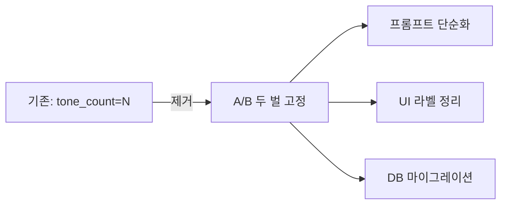

## 개요

톤 카운트(tone_count) 시스템을 프로젝트 전반에서 완전히 제거하고, 생성 이미지를 A/B 두 벌로 깔끔하게 정리한 회차다. 백엔드 로직, DB 기존 데이터, 프론트엔드 UI까지 한꺼번에 손봐야 해서 커밋이 7개로 늘어났다. 배포 환경 이슈와 앵글/렌즈 전용 재생성 버그도 함께 수정했다.

[이전 글: hybrid-image-search-demo 개발 로그 #14](/posts/2026-04-15-hybrid-search-dev14/)

<!--more-->

## 변경 요약

### 톤 카운트 제거 — 왜?

기존에는 생성 시 톤(색조) 변형 장수를 `tone_count`로 관리했다. 실제 사용해보니 A/B 두 벌이면 충분했고, 톤 장수 개념이 UI와 프롬프트를 불필요하게 복잡하게 만들고 있었다. 이번 회차에서 이를 전면 제거했다.

### DB 마이그레이션 (Alembic)

`injection_reason` 컬럼에 `_tone2`, `_tone3` 같은 접미사가 붙어 있던 기존 행들을 strip하는 마이그레이션을 추가했다. `app_utils.py`의 파싱 로직도 접미사를 무시하도록 수정했다.

### 백엔드 변경

- `app_utils.py` — reason 문자열에 tone_count 접미사 붙이는 로직 제거, 파싱 시 접미사 strip
- `routes/generation.py` — tone_count 파라미터 제거
- `generation/injection.py` — 톤 비율 관련 로직 제거
- `generation/prompt.py` — B 변형의 디테일을 강화하는 프롬프트 개선
- `routes/history.py` — 히스토리 조회 시 톤 접미사 호환 처리
- `schemas.py` — tone_count 필드 제거

### 프론트엔드 변경

- `App.tsx` — 톤 N장 배지 제거, A/B 네이밍으로 통일
- `GeneratedImageDetail.tsx` — 동일하게 톤 관련 라벨 제거
- `api.ts` — tone_count 파라미터 제거

### 앵글/렌즈 전용 재생성 수정

앵글이나 렌즈만 바꿔서 재생성할 때 프롬프트가 제대로 구성되지 않던 버그를 수정했다. 속성 인젝션 없이 앵글/렌즈만 변경하는 케이스를 명시적으로 처리한다.

### 배포 스크립트 수정

EC2에서 `uv` 바이너리가 `~/.local/bin`에 설치되는데, deploy 스크립트의 PATH에 포함되지 않아 실패하던 문제를 수정했다.

## 커밋 로그

| 순서 | 범위 | 설명 |
|:---:|:---:|:---|
| 1 | db | 기존 injection_reason 행에서 tone_count 접미사 strip하는 마이그레이션 |
| 2 | gen | reason 문자열에 tone_count 접미사 붙이는 로직 제거 |
| 3 | history | reason 파싱 시 tone_count 접미사 strip 처리 |
| 4 | ui | 톤 카운트 배지 제거, A/B 네이밍 적용 |
| 5 | ui | 남은 '톤 N장' 라벨을 A/B로 교체 |
| 6 | deploy | EC2에서 uv 경로를 PATH에 추가 |
| 7 | gen | 톤 비율 전면 제거, 앵글/렌즈 전용 재생성 수정, B 변형 디테일 강화 |

## 인사이트

- **점진적 제거가 안전하다** — tone_count를 한 커밋에서 다 지우지 않고, DB 마이그레이션 → 백엔드 로직 → 프론트엔드 순으로 나눠 진행했다. 각 단계에서 기존 데이터 호환성을 확인할 수 있었다.
- **A/B가 N장보다 낫다** — 사용자 입장에서 "톤 3장" 같은 표현보다 "A / B"가 직관적이다. 선택지를 줄이는 것이 UX를 개선한다.
- **배포 환경과 개발 환경의 PATH 차이** — 로컬에서는 잘 되는데 EC2에서 실패하는 전형적인 케이스. deploy 스크립트에 PATH를 명시적으로 설정하는 습관이 필요하다.
