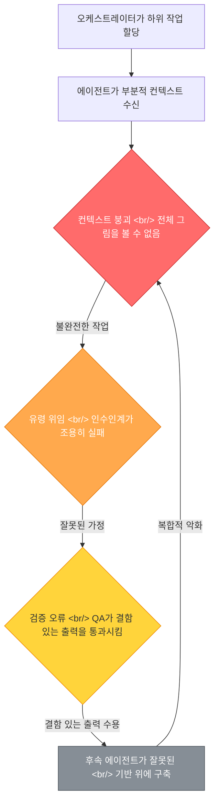
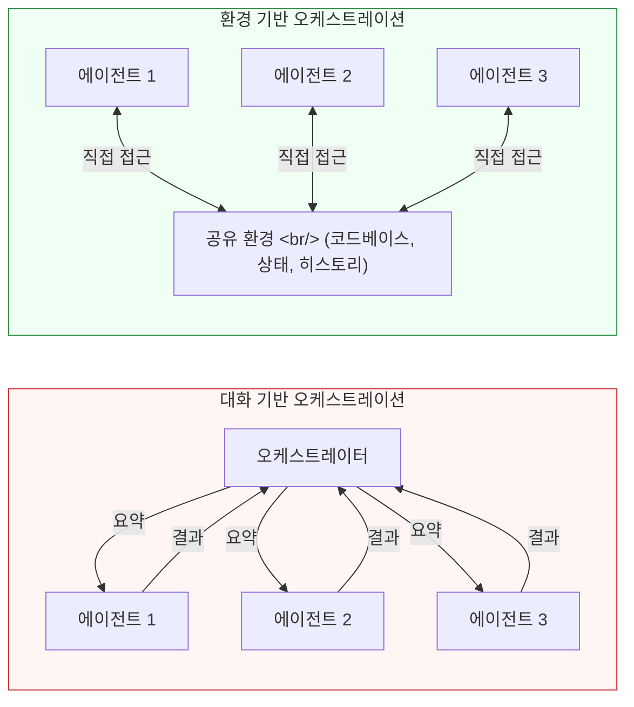

멀티 에이전트 오케스트레이션은 AI 기반 개발의 자연스러운 다음 단계처럼 들린다. 복잡한 작업을 하위 작업으로 나누고, 각각을 전문 에이전트에 할당하고, 협업하게 만든다. 하지만 실제로는 예측 가능하고 구조적인 방식으로 실패한다. shalomeir는 Claude Code 에이전트 팀, Gastown(도시 스타일 오케스트레이션), Paperclip(회사 스타일 오케스트레이션) 등의 시스템을 테스트하면서 약 5,000달러 상당의 토큰을 소모한 끝에, 모든 멀티 에이전트 시스템에 공통으로 나타나는 세 가지 근본적인 병목 현상을 발견했다.

이 글에서는 그 병목 현상을 분석하고, 왜 정교한 오케스트레이션 프레임워크가 아니라 기존의 단일 에이전트 도구에서 이미 답을 찾을 수 있는지 살펴본다.

<!--more-->

## 세 가지 구조적 병목 현상

멀티 에이전트 시스템이 실패하는 것은 개별 에이전트가 약하기 때문이 아니라, 에이전트 간 연결이 복합적 실패를 만들어내기 때문이다. 세 가지 병목 현상 -- 컨텍스트 붕괴(Context Collapse), 유령 위임(Ghost Delegation), 검증 오류(Verification Error) -- 은 독립적인 문제가 아니다. 서로 연쇄적으로 작용하며, 각 부분의 합보다 더 심각한 실패 모드를 만들어낸다.

각 병목 현상은 면밀한 검토가 필요하다. 메커니즘을 이해하는 것이 단순히 에이전트를 더 추가하거나 프롬프트를 개선해도 문제가 해결되지 않는 이유를 이해하는 핵심이기 때문이다.

## 병목 1: 컨텍스트 붕괴 (Context Collapse)

오케스트레이터가 하위 작업을 에이전트에 위임할 때, 어떤 컨텍스트를 전달할지 결정해야 한다. 여기서 첫 번째 실패가 발생한다. 오케스트레이터는 전체 프로젝트 컨텍스트를 전달할 수 없다 -- 토큰 한도, 비용, 지연 시간이 모두 이를 막기 때문이다. 그래서 요약하거나, 자르거나, 선택적으로 정보를 전달한다. 이 과정을 거칠 때마다 중요한 세부 사항이 손실된다.

프론트엔드 컴포넌트가 특정 백엔드 API 계약에 의존하는 웹 애플리케이션을 생각해 보자. 오케스트레이터가 프론트엔드 작업을 에이전트 A에, 백엔드 작업을 에이전트 B에 할당한다. 에이전트 A는 API 스펙의 요약을 받지만, 그 스펙을 형성한 오류 처리 에지 케이스에 대한 미묘한 논의는 받지 못한다. 에이전트 A는 합리적이지만 틀린 가정을 하게 되고, 결과 코드는 컴파일되지만 통합 시 실패한다.

이것은 프롬프팅 문제가 아니다. 근본적인 정보 이론적 제약이다. 오케스트레이터는 에이전트와 전체 프로젝트 상태 사이의 손실 압축 계층(lossy compression layer)으로 작동한다. 아무리 프롬프트 엔지니어링을 해도 정보 손실을 제거할 수 없다 -- 어떤 세부 사항이 누락될지가 바뀔 뿐이다. 하나의 긴 컨텍스트 윈도우에서 작업하는 단일 에이전트는 이전의 모든 결정이나 제약 조건을 직접 참조할 수 있기 때문에 이 문제에 직면하지 않는다.

아이러니한 점은, 프로젝트가 복잡해질수록(따라서 병렬화가 더 필요해질수록) 전체 컨텍스트가 더 중요해지고, 컨텍스트를 손실 없이 에이전트들에게 분배하기가 더 어려워진다는 것이다.

## 병목 2: 유령 위임 (Ghost Delegation)

유령 위임은 에이전트 간 인수인계가 성공한 것처럼 보이지만 실제로는 조용히 실패할 때 발생한다. 에이전트 A가 하위 작업을 완료하고 결과를 오케스트레이터에 전달하면, 오케스트레이터가 이를 에이전트 B에 전달한다. 하지만 인수인계 과정에서 뉘앙스가 사라진다: 에이전트 A의 암묵적 가정, 특정 선택의 이유, 실행 중 발견한 제약 조건 등이 모두 누락된다.

Gastown과 Paperclip 실험에서 이것은 에이전트들이 미묘하게 잘못된 기반 위에 자신 있게 구축하는 것으로 나타났다. 데이터베이스 스키마 에이전트가 스키마를 생성하고, 백엔드 에이전트가 그 위에 API를 구축하고, 프론트엔드 에이전트가 UI 컴포넌트를 만든다 -- 각 단계가 기술적으로는 성공적으로 완료되지만, 원래 의도에서 점점 벗어나는 누적적 드리프트가 발생한다.

핵심 문제는 에이전트 간 통신이 명시적 아티팩트 -- 코드 파일, JSON 스펙, 텍스트 요약 -- 로 제한된다는 것이다. 하지만 소프트웨어 개발에는 방대한 양의 암묵적 지식이 관여한다: 왜 특정 접근 방식이 대안보다 선택되었는지, 어떤 트레이드오프가 고려되었는지, 어떤 에지 케이스가 알려져 있지만 미뤄졌는지. 이 암묵적 지식은 모든 인수인계 경계에서 증발한다.

실제 소프트웨어 팀은 공유 환경을 통해 이 문제를 해결한다 -- 같은 코드베이스, 같은 이슈 트래커, 컨텍스트가 유기적으로 축적되는 같은 Slack 채널. 환경이 아닌 대화를 공유하는 멀티 에이전트 시스템은 이 주변 컨텍스트(ambient context)를 완전히 잃어버린다.

## 병목 3: 검증 오류 (Verification Error)

마지막 병목 현상이 가장 교활하다. 에이전트 B가 에이전트 A의 출력을 기반으로 작업을 완료하면, 결과가 올바른지 검증하는 무언가가 필요하다. 대부분의 멀티 에이전트 프레임워크에서 이 검증은 다른 에이전트나 오케스트레이터 자체가 수행한다. 하지만 검증에는 첫 번째 병목에서 이미 손실된 것과 동일한 전체 컨텍스트가 필요하다.

출력과 명세서만 보는 검증 에이전트는 전달되지 않은 컨텍스트에서 비롯된 오류를 잡을 수 없다. 구문을 검사하고, 테스트가 있으면 실행하고, 표면적 정확성을 검증할 수 있다. 하지만 아키텍처 접근 방식이 세 번의 인수인계 전에 논의되었지만 스펙에 반영되지 않은 제약 조건과 모순된다는 것은 감지할 수 없다.

실제로 이것은 멀티 에이전트 시스템이 자동화된 검사를 통과하지만 통합이나 실제 환경에서 실패하는 출력으로 수렴한다는 것을 의미한다. 검증 단계가 거짓 확신을 제공한다: 시스템이 성공을 보고하고, 오케스트레이터가 다음으로 넘어가며, 후속 단계에서 오류가 복합된다.

여기서 연쇄 효과가 진정으로 파괴적이 된다. 검증 오류는 컨텍스트 붕괴로 피드백된다 -- 하류 에이전트들은 이제 검증자가 승인한 잘못된 가정을 포함하는 확장된 컨텍스트를 갖게 된다. 오류가 수용된 진실로 세탁된 것이다.

## 오케스트레이터 설계 문제

실험 결과는 직관에 반하는 통찰을 보여준다: 병목 현상은 에이전트의 품질이나 수가 아니라 오케스트레이터 설계에 있다. 잘못 설계된 오케스트레이션에 에이전트를 더 추가하면 상황이 나아지는 것이 아니라 악화된다. 각 추가 에이전트가 컨텍스트가 붕괴되고 위임이 유령화될 수 있는 또 다른 인수인계 지점을 추가하기 때문이다.

핵심적인 구분은 대화 기반 오케스트레이션과 환경 기반 오케스트레이션 사이에 있다. 대화 기반 시스템에서는 에이전트들이 오케스트레이터를 통해 통신하며, 오케스트레이터가 병목이 된다. 환경 기반 시스템에서는 에이전트들이 공통 작업 공간 -- 파일 시스템, git 히스토리, 실행 중인 애플리케이션 -- 을 공유하며, 컨텍스트가 메시지 전달이 아닌 환경 자체에 보존된다.

이것이 Claude Code 같은 도구가 실제 개발 작업에서 대부분의 멀티 에이전트 프레임워크보다 이미 더 잘 작동하는 이유다. 전체 코드베이스에 직접 접근하고, 명령을 실행할 수 있으며, 세션 내에서 지속적 컨텍스트를 가진 단일 에이전트는 설계상 세 가지 병목 현상을 모두 회피한다. 컨텍스트를 잃을 인수인계가 없고, 유령화될 위임이 없으며, 컨텍스트가 부족한 별도의 검증자가 없다.

## 도메인 내부는 깊게, 경계 간에는 느슨하게

실용적인 핵심 메시지는 한 마디로 요약된다: "도메인 내부는 깊게, 경계 간에는 느슨하게(deep within domains, loose across boundaries)." AI 에이전트는 잘 정의된 도메인에 깊이 들어가야 한다 -- 특정 모듈, 서비스, 기능의 전체 컨텍스트를 이해하면서. 하지만 도메인 간 경계는 느슨하게 처리되어야 한다: 에이전트 간의 긴밀한 결합이 아니라, 잘 정의된 인터페이스, 공유 환경, 인간의 감독을 통해서.

이것은 효과적인 인간 팀의 작동 방식과 잘 맞는다. 시니어 엔지니어는 자신의 컴포넌트에 깊이 들어가고, 다른 팀과는 API, 설계 문서, 코드 리뷰를 통해 소통한다 -- 관리자가 요약된 지시 사항을 중계하는 방식이 아니라. 관리자(오케스트레이터)는 방향을 설정하고 갈등을 해결하지만, 기술적 세부 사항의 소통 채널 역할을 하지 않는다.

에이전트에 얼마나 위임할지 결정하는 다섯 가지 평가 기준이 도출된다: 작업 범위의 명확성, 컨텍스트 자체 완결성, 검증 용이성, 롤백 비용, 도메인 전문성 깊이. 다섯 가지 모두에서 높은 점수를 받는 작업 -- 명확한 범위, 자체 완결적 컨텍스트, 검증 용이, 되돌리기 저비용, 깊은 도메인 일치 -- 은 에이전트 위임의 훌륭한 후보다. 어느 하나라도 낮은 점수를 받는 작업은 인간이나 전체 컨텍스트를 가진 단일 에이전트가 처리하는 것이 낫다.

## 메타포 자체가 틀렸을 수도 있다

아마도 가장 도발적인 통찰은 AI 에이전트에 대한 직원 메타포가 근본적으로 오해를 불러일으킨다는 것이다. 우리는 에이전트를 "고용"하고, 작업을 "위임"하고, 에이전트의 "팀"과 "회사"를 구축한다고 말한다. 하지만 에이전트는 직원이 아니다. 세션 간에 조직적 지식을 축적하지 않는다. 시간이 지나면서 협업을 개선하는 다른 에이전트와의 관계를 구축하지 않는다. 같은 사무실에 앉아 있어서 생기는 주변 인식(ambient awareness)이 없다.

에이전트는 비싼 호출 비용의 순수 함수에 더 가깝다: 입력 컨텍스트를 받고, 출력을 생성하고, 모든 것을 잊는다. 에이전트를 직원처럼 오케스트레이션하는 것 -- 조직도, 보고 구조, 위임 계층 -- 은 시스템 설계자를 세 가지 병목 현상을 극대화하는 아키텍처로 적극적으로 오도하는 메타포를 적용하는 것이다.

더 나은 메타포는 뛰어난 도구를 가진 단일 전문가일 수 있다. 강력한 IDE, 좋은 문서, 전체 코드베이스에 대한 접근 권한을 가진 숙련된 개발자 한 명이, 파편화된 컨텍스트를 가진 열 명의 에이전트 "팀"보다 항상 더 나은 성과를 낸다. AI 기반 개발의 미래는 더 큰 에이전트 팀을 구축하는 것이 아니다. 개별 에이전트를 더 깊게 만들고, 더 풍부한 환경 접근 권한을 부여하며, 경계를 도입하는 시점과 위치에 대해 신중하게 생각하는 것이다.

5,000달러의 소모된 토큰은 낭비가 아니었다 -- 답이 이미 우리 앞에 있었다는 것을 배우는 비용이었다.

---

*Claude Code 에이전트 팀, Gastown, Paperclip에서의 멀티 에이전트 오케스트레이션 실패에 대한 [shalomeir의 분석](https://shalomeir.substack.com/p/multi-agent-orchestration-problems)을 기반으로 작성.*
