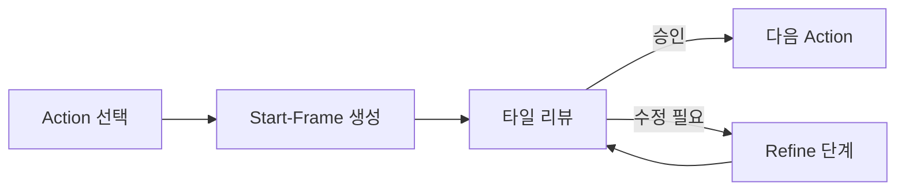

## 개요

Archive 페이지를 추가해 과거 작업을 브라우징하고 원하는 단계부터 재개할 수 있게 했다. Start-frame 생성 후 per-action 리뷰 플로우를 도입해 각 액션별로 결과를 확인하고 refine 단계로 넘어갈 수 있게 구성했다. BiRefNet matting이 모션 라인이나 스파크 같은 VFX 요소까지 제거하는 문제를 발견하고, 이를 복구하는 `rescue_vfx_elements()` 로직을 구현했다.

이전 글: [popcon 개발 로그 #7 — RunPod GPU Worker, BiRefNet Matting, and Parallel Frame Inference](/posts/2026-04-15-popcon-dev7/)

<!--more-->

## Archive 페이지 — 과거 작업 브라우징과 재개

파이프라인이 길어지면서 중간 결과물을 다시 보거나, 특정 단계부터 재작업하고 싶은 경우가 자주 생겼다. Archive 페이지를 새로 만들어 이 문제를 해결했다.

- `/archive` 경로에 과거 job 목록을 카드 형태로 표시
- 각 job 카드에서 현재 상태(어느 단계까지 완료됐는지)를 확인 가능
- 원하는 단계를 선택하면 해당 지점부터 파이프라인을 재개

레이아웃에 Archive 링크를 네비게이션에 추가해서 어디서든 접근할 수 있게 했다.

## Per-Action Start-Frame 리뷰 플로우

기존에는 모든 액션의 start-frame을 한꺼번에 생성하고 한 번에 리뷰했다. 이번에 per-action 방식으로 변경해서 각 액션별로 start-frame을 확인하고, 필요하면 즉시 refine으로 넘어갈 수 있게 했다.

### 주요 변경

- `backend/pipeline/start_frame_gen.py` — 액션 단위로 start-frame을 생성하도록 분리
- `frontend/components/StartFrameReview.tsx` — 타일 레이아웃을 재디자인하고 인라인 per-emoji 비디오 프리뷰 추가
- `frontend/components/ActionSelector.tsx` — 액션 선택 UI를 리뷰 플로우에 통합
- `backend/models.py` — per-action 상태 추적을 위한 모델 확장

Refine resume 로직도 개선해서, refine 중간에 중단되더라도 마지막 상태부터 이어서 작업할 수 있게 했다.

## BiRefNet VFX 복구 문제

BiRefNet은 배경 제거 품질이 rembg보다 훨씬 좋지만, 한 가지 문제가 있었다. 모션 라인, 스파크, 집중선 같은 VFX 요소를 배경으로 판단하고 함께 제거해 버리는 것이다.

### 문제 분석

VFX 요소의 특징:
- 크기가 작은 non-white blob
- 캐릭터 주변에 흩어져 있음
- BiRefNet의 salient object detection 관점에서는 "배경 노이즈"로 분류됨

### rescue_vfx_elements() 구현

BiRefNet matting 결과에서 누락된 VFX 요소를 복구하는 후처리 함수를 추가했다.

1. 원본 이미지에서 non-white 픽셀 영역을 검출
2. BiRefNet mask에서 제거된 영역 중 일정 크기 이하의 blob을 식별
3. 해당 blob이 VFX 요소일 가능성이 높으면 mask에 다시 추가

rembg와 BiRefNet을 비교 테스트한 결과, BiRefNet + VFX 복구 조합이 가장 좋은 결과를 보였다.

## Start-Frame 타일 재디자인

`StartFrameReview.tsx`를 전면 재디자인했다.

- 타일 그리드 레이아웃으로 각 이모지의 start-frame을 한눈에 비교
- 각 타일에 인라인 비디오 프리뷰를 넣어서 애니메이션 결과를 바로 확인
- 승인/재생성 버튼을 타일 단위로 배치

## 커밋 로그

| 메시지 | 변경 |
|--------|------|
| feat(archive): browse past jobs and resume any step | 2 files |
| feat(pipeline): per-action start-frame review + refine resume | 12 files |
| feat(gpu-worker): replace rembg with BiRefNet matting | 7 files |
| feat(review): redesign start-frame tiles and inline per-emoji video | 1 file |

## 인사이트

- **BiRefNet의 한계는 후처리로 보완 가능하다.** Salient object detection 모델은 "주요 피사체"에만 집중하기 때문에 VFX 요소를 놓칠 수 있다. 작은 blob을 별도로 복구하는 패턴은 다른 matting 파이프라인에서도 유용할 것이다.
- **파이프라인이 길어질수록 재개 기능이 필수다.** Archive 페이지 없이는 매번 처음부터 다시 시작해야 했다. 각 단계의 결과를 저장하고 원하는 지점부터 재개하는 구조가 개발 속도를 크게 높여준다.
- **리뷰 단위는 작을수록 좋다.** 모든 액션을 한 번에 리뷰하면 문제를 찾기 어렵다. Per-action으로 쪼개니 피드백 루프가 빨라졌다.
