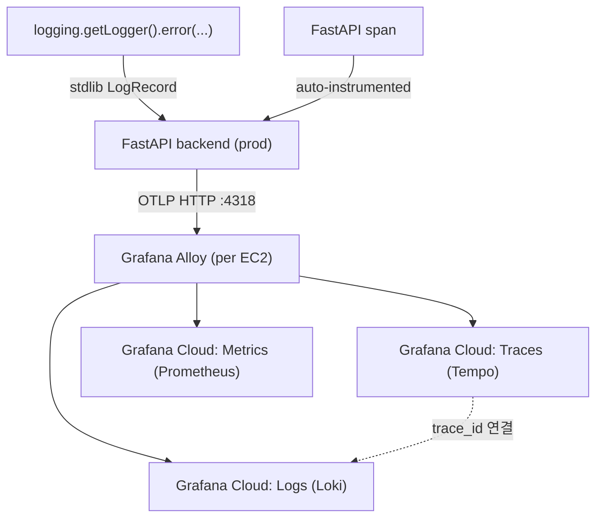
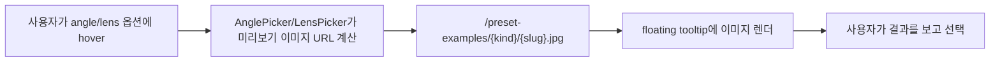
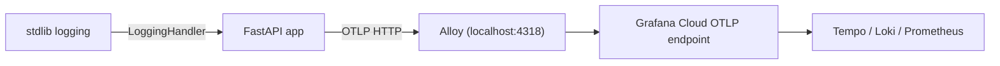

## 개요

세 개 커밋, 세 개 주제. Lens 프리셋을 5개 general + 뷰티용 Briese 라이팅 프리셋으로 확장했고, AnglePicker·LensPicker에 hover-preview 썸네일 31장을 붙여 사용자가 프리셋의 실제 결과를 미리 볼 수 있게 만들었다. 마지막으로 프로덕션 FastAPI 백엔드의 trace/metric/log를 모두 Grafana Alloy에 OTLP로 쏘고, Alloy가 다시 Grafana Cloud로 포워딩하게 세팅했다. 이후 실제 프로덕션 장애(auto-fill 톤 이미지가 상세보기에서 안 보이는 현상) 디버깅에 이 텔레메트리를 처음 써 본 세션까지 포함된다. 2개 세션, 커밋 3개, 총 5시간 54분.

[이전 글: hybrid-image-search-demo 개발 로그 #15](/posts/2026-04-16-hybrid-search-dev15/)

<!--more-->

## Lens 프리셋 5 + 뷰티 1

`c4fb076 feat(gen): expand lens presets to 5 general + beauty w/ Briese lighting`는 백엔드 `backend/src/generation/lens_presets.py`를 건드렸다. 이전까지 렌즈 선택은 3개뿐이었고, 그 셋이 모든 생성 시나리오를 커버하기엔 부족하다는 피드백이 누적됐다. 이번 확장은 두 가지를 했다.

1. **General 5개로 확장** — 24mm (wide), 35mm (street/environmental), 50mm (natural), 85mm (portrait), 135mm (tight). 포토그래피 표준 초점거리 톺아보기 그대로.
2. **Beauty 전용 프리셋 추가 — Briese 라이팅**. Briese는 광고·뷰티 업계에서 쓰이는 대형 반사형 조명. 초점거리뿐 아니라 조명 스타일을 프롬프트에 함께 주입하는 첫 케이스다. `prompt.py`의 `build_generation_prompt`가 렌즈 텍스트를 뷰티 카테고리일 때 조명 디렉티브와 조합하도록 확장됐다.

테스트는 `backend/tests/test_lens_presets.py` 하나가 추가됐다 — 각 프리셋이 프롬프트 빌더를 통과했을 때 기대 문자열이 나오는지 확인하는 unit test.

프론트엔드 쪽 `frontend/src/components/LensPicker.tsx`는 라디오 그룹의 옵션을 5개로 늘리고 뷰티 프리셋을 별도 그룹으로 묶었다. `GeneratedImageDetail.tsx`는 선택된 렌즈 텍스트를 인포 패널에 보여 주도록 했다.

## Hover-Preview 썸네일 31장

`4b886a9 feat(ui): hover-preview examples for angle/lens pickers`는 파일 31개짜리 커밋이다. 이 중 대부분은 `frontend/public/preset-examples/angles/*.jpg`와 `lens/*.jpg`에 들어간 실제 예시 이미지들 — bird's-eye-view, close-up-cu, dutch-angle, extreme-close-up-ecu, extreme-long-shot-els, eye-level, high-angle, insert-shot, long-shot-ls, low-angle, master-shot, medium-close-up-mcu 등.

생성 스크립트 `backend/scripts/generate_preset_examples.py`가 이 썸네일들을 일괄 생성했다. 이전 글에서 소개한 것과 같은 이미지 생성 파이프라인을 호출하고, 각 프리셋을 동일한 reference character로 돌려 예시를 만든 뒤 `frontend/public/preset-examples/`에 덤프한다. `.gitignore`에 원본 비디오/모델 파일 제외 규칙을 추가했다.

`AnglePicker.tsx`와 `LensPicker.tsx`는 hover 시 floating tooltip을 띄우는 공통 패턴을 공유한다. 사용자가 프리셋 이름만 보고 고르게 하지 말고 실제 결과 감각을 미리 주자는 UX 결정이다. 이전까지는 "extreme-long-shot (ELS)"이라는 약어만 보고 눌러야 했다.

## Grafana OTLP 텔레메트리

가장 무게가 실린 커밋이 `7a55e9b feat(telemetry): ship prod logs to Alloy/Grafana Cloud via OTLP`다. 4개 파일만 바뀌었지만 운영 레벨로는 큰 변화.

### 요구사항

사용자 브리프는 명확했다 — "무료 Grafana 계정을 쓰고 있는데, 각 API 로그, 아니면 최소한 에러 있는 API만이라도 붙이고 싶다. 무료 계정 안에서 가능한지 확인해 달라." prod만 수집, 패키지 관리는 전역 `pyproject.toml`로, 환경변수 `.env`로 prod에서만 활성화되게.

### 아키텍처

FastAPI 앱은 로컬에서 돌아가는 Alloy 에이전트에 OTLP HTTP(4318)로 쏜다. Alloy는 Grafana Cloud의 OTLP endpoint로 포워딩한다. 이 방식은 앱에 Grafana Cloud 자격증명을 직접 박지 않고, Alloy 설정 파일에만 두게 한다 — prod EC2 이미지를 갈아끼울 때 노출 면적이 줄어든다.

### 구현 포인트

- **`backend/src/telemetry.py`** — `_telemetry_enabled` 플래그로 감싼 초기화. 이 플래그는 `DEPLOYMENT_ENV` 환경변수가 `"prod"`일 때만 true. Traces(OTLPSpanExporter), Metrics(OTLPMetricExporter), Logs(OTLPLogExporter)를 각각 붙이고 `FastAPIInstrumentor`, `SQLAlchemyInstrumentor`, `LoggingInstrumentor`를 활성화.
- **stdlib logging → OTLP로**. 핵심 디테일. 루트 로거에 `LoggingHandler`를 달아서 `logging.getLogger(...)`로 나오는 모든 로그(uvicorn access, SQLAlchemy, 앱 `logger.error`)가 OTLP로 흐르게 했다. Handler는 emit 시점의 active span context를 읽어 trace_id를 LogRecord에 attach한다 — Grafana에서 로그 한 줄 클릭하면 해당 trace로 점프 가능.
- **`pyproject.toml`에 OpenTelemetry 스택 전역 추가**. `opentelemetry-instrumentation-fastapi`, `opentelemetry-instrumentation-sqlalchemy`, `opentelemetry-instrumentation-logging`, `opentelemetry-exporter-otlp-proto-http`, `opentelemetry-exporter-otlp-proto-grpc` 모두 `>=0.54b0` / `>=1.33.0`.
- **`infra/alloy/config.alloy`** — Alloy 설정. OTLP receiver가 grpc(4317)·http(4318) 양쪽을 열고, batch processor를 거쳐 Grafana Cloud로 forward. 설정은 짧고 단순하다.
- **`infra/alloy/SETUP.md`** — EC2 인스턴스마다 Alloy를 설치하는 수동 절차. `sudo apt install grafana-alloy`, config 파일 배치, systemd 활성화.

### 배포와 PM2 주의

`/deploy-diff` 워크플로우로 dev → prod 순으로 배포했다. Prod에서 실제로 Grafana Cloud 대시보드에 trace가 들어오는지 확인했고, 잘 들어왔다. 하나 남은 함정이 있었다.

`ecosystem.config.js`의 `DEPLOYMENT_ENV: process.env.DEPLOYMENT_ENV || ""`는 PM2 daemon의 shell env에 의존한다. Prod EC2가 재부팅되거나 `pm2 kill` 후 resurrect되면 PM2 daemon이 로그인 shell 밖에서 시작되므로 `DEPLOYMENT_ENV`가 다시 빈 문자열이 된다. 그럼 `_telemetry_enabled`가 false가 되어 prod에서 조용히 텔레메트리가 꺼진다. 해결은 systemd에서 PM2를 띄울 때 `Environment=DEPLOYMENT_ENV=prod`를 박는 것. 이번 인터벌엔 메모만 남기고 다음에 반영.

## 실전 투입 — 장애 디버깅

세션 4에서 실제로 이 텔레메트리가 유용했다. 사용자 khk@diffs.studio 이미지가 "우주의 신비로운 모습" 프롬프트로 4/16 13:20경 생성됐는데 auto-fill 톤 이미지가 상세보기에서 안 보인다는 제보. 원래라면 SSH로 프로덕션 서버에 붙어 로그 grep부터 시작했을 텐데, 이번엔 Grafana Loki에서 바로 `{service_name="hybrid-image-search"} |= "khk@diffs.studio"`를 찍어 해당 생성 로그를 찾았다.

혼재된 에러들:
- `blob:http://...` URL이 insecure connection으로 로드된다는 브라우저 경고 → HTTPS 전환이 아직 안 된 EC2 호스트.
- 502 Bad Gateway → 이 역시 HTTPS로 전환하면 nginx upstream 설정과 함께 풀릴 가능성.
- 401 에러 → 다른 서버에서, 세션 만료 후 토큰 미갱신.

추적 패턴은 간결했다. Grafana trace 링크를 따라가면 FastAPI span이 나오고, 거기서 연결된 log record로 점프해 에러 메시지를 읽는다. "prod에 접속해서 로그 tail" 워크플로우가 "Grafana 탭에서 trace 클릭" 워크플로우로 바뀐 첫 실전이었다. 수정은 다음 인터벌 과제로 이월.

## 커밋 로그

| 메시지 | 변경 |
|---|---|
| feat(gen): expand lens presets to 5 general + beauty w/ Briese lighting | 5 files |
| feat(ui): hover-preview examples for angle/lens pickers | 31 files (다수 이미지) |
| feat(telemetry): ship prod logs to Alloy/Grafana Cloud via OTLP | 4 files |

## 인사이트

텔레메트리를 붙이는 작업과 텔레메트리를 처음 쓰는 작업이 같은 인터벌에 겹친 것이 이번의 가장 좋은 신호였다. "언젠가 유용할 테니 깔아 두자"라는 투자는 보통 몇 주간 회수되지 않지만, OTLP + Alloy 스택은 배포 당일 바로 사용자 장애에 투입됐다. 두 가지 효과. 첫째, 지금 Grafana 뷰에 뭐가 찍히고 뭐가 안 찍히는지가 명확해졌다 — trace_id가 log와 연결되는 건 잘 되고, 브라우저 쪽 에러는 당연히 안 찍힌다(OTLP는 서버 측만 커버). 둘째, "누가 어떤 프롬프트를 언제 어떤 에러로 돌렸나"를 사용자 이메일 한 줄로 찾는 쿼리를 Loki에 그대로 둘 수 있게 됐다 — 다음 지원 티켓에 2초 안에 답할 수 있는 준비. 도구가 도착한 날 그 도구로 문제를 풀 수 있었던 건 프로덕션에 실제 사용자가 있고, 그들의 에러가 부드럽지 않고, 기억력 대신 조회 가능한 로그가 필요하다는 신호다. 그 신호가 맞게 잡힌 인터벌이다.
