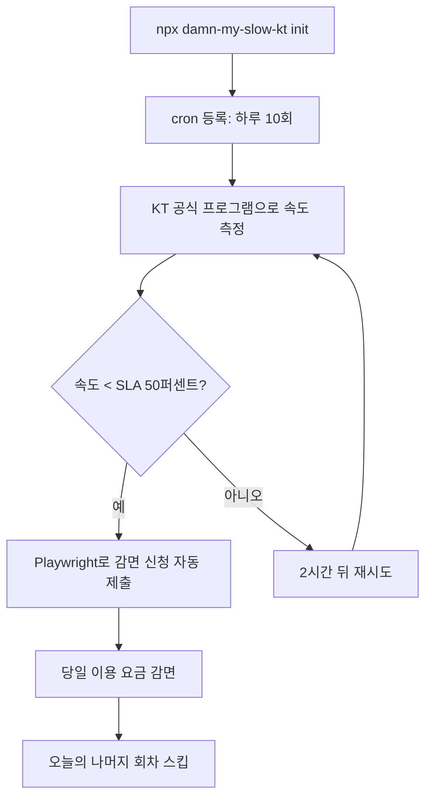
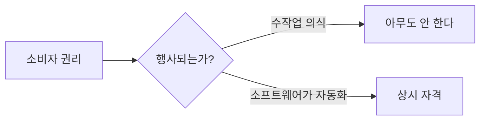

## 개요

[kargnas/damn-my-slow-kt](https://github.com/kargnas/damn-my-slow-kt)는 KT 인터넷 약관에 존재하지만 거의 행사되지 않는 조항 — 측정 속도가 계약 속도의 50% 미만이면 해당일 이용 요금을 감면해야 한다는 의무 — 을 `npx` 명령 한 줄로 자동화한다. 도구는 하루 최대 10회까지 KT 공식 속도측정 프로그램으로 측정을 스케줄하고, 기준에 미달하면 감면 신청을 자동으로 제출하고, 하루에 한 번 성공하면 나머지는 스킵한다. GitHub 스타 445, TypeScript + Playwright + Commander + SQLite. 재미있는 토이 프로젝트를 넘어서, 규제된 소비자 권리를 "깔려 있는 소프트웨어"로 전환하는 구체적인 예시다.

<!--more-->

## 아무도 행사하지 않는 계약 조항

KT 가정용 인터넷 약관은 **최저속도 보장제도(SLA)**를 포함한다. 측정 속도가 최저속도(약관상 계약 속도의 50%)에 미달하면 — 정확히는 30분간 5회 측정 중 60%(3회 이상) 미달 시 — KT는 해당일 이용 요금을 감면해야 한다. 핵심 함정은 이것이다.

> 측정 1회 = 하루 치 감면. 미달 30일 = 전액 감면.

감면은 **매일**이지 매월이 아니다. 월 요금을 0원으로 만들려면 30일이 필요하고, 하루를 만들려면 25분짜리 공식 측정을 견디고 엉성한 웹폼으로 이의 신청까지 해야 한다. 아무도 안 한다. 제도는 형식상 존재할 뿐이다.

`damn-my-slow-kt`의 제품 인사이트는 장벽이 법적인 것이 아니라 **조작 편의성(ergonomics)**이라는 점이다. 이 도구는 25분짜리 수작업 루틴을 백그라운드 cron 작업으로 바꾼다.

## 실제 동작 방식

README는 담담하지만 촘촘한 스택을 나열한다.

- **언어**: TypeScript (ES2020, strict CommonJS)
- **CLI**: Commander + Inquirer + Chalk v4 (전형적인 Node.js CLI 3종)
- **브라우저 자동화**: Playwright로 헤드리스 Chromium을 구동해 이의 신청 제출
- **저장소**: Node 22+에서는 `node:sqlite`, 그 이하에서는 JSON 폴백
- **설정**: `~/.damn-my-slow-isp/config-kt.yaml` YAML 파일
- **테스트**: Vitest, Node 20·22 매트릭스 CI

스케줄러는 OS별 네이티브 cron(macOS는 launchd, Windows는 Task Scheduler)에 2시간 간격 하루 최대 10회 실행을 등록한다. 하루에 한 번 성공하면 이후 실행은 "오늘 이미 감면"이라고 로그를 찍고 바로 종료한다. 선택사항으로 Discord·Telegram 웹훅으로 감면 성공 알림도 가능하다.

**KT 공식 속도측정 프로그램이 하드 의존성**이다. 이 프로그램은 macOS와 Windows만 지원한다 — Linux는 KT 자체가 지원하지 않는다. 그래서 프로젝트 초기 Docker/Synology NAS 배포 경로는 죽었고, README는 해당 섹션에 정중하게 취소선을 긋는다. KT가 Linux 바이너리를 내면 Playwright 생태계가 바로 받을 준비를 해 두고 있다.

## 설계가 주는 교훈

눈에 띄는 작은 결정 세 가지.

**1. 저장소의 우아한 다운그레이드.** 도구는 Node 22의 내장 SQLite를 선호하지만 JSON 파일로 폴백한다. 이 프로젝트는 개발자 노트북만이 아니라 어떤 소비자 머신에서도 돌아가야 한다. 소비자용 도구에는 맞는 선택 — 호환성이 우아함을 이긴다.

**2. 솔직한 하드웨어 고지.** macOS는 ✅ 네이티브, Windows는 ⚠️ 미테스트, Linux는 아예 불가능. GitHub Actions CI는 웹페이지 로드 테스트만 돌린다(측정 바이너리 설치 불가). 로그인 플로우는 검증하지만 속도 측정은 검증하지 않는다. 상태 표가 희망이 아니라 현실에 맞춰져 있다.

**3. 하루 실행 상한 + 조기 종료.** 하루 10회, 2시간 간격은 잘 고른 주기다. SLA 미달은 피크 타임(저녁·주말)에 몰리는 경향이 있어, 20시간에 걸쳐 10회를 뿌리면 KT 서버를 괴롭히지 않으면서도 잘 잡아낸다. 첫 성공 시 조기 종료 덕에 평균적인 하루에는 측정이 한 번만 돌아간다 — 10번이 아니라.

## 법적 근거

README는 KT 2025년 3월 이용약관 원문을 꼼꼼하게 인용한다. 별표2 조항까지.

> 제13조 ⑦5 — 케이티에 책임있는 사유로 최저속도 보장제도에 미달하여 이용고객이 해지를 원하는 경우 할인반환금 없이 해약 가능.
>
> 제19조 ⑤ — 케이티는 속도측정 결과 최저속도 미달 시 이용요금을 감면한다. 세부 기준은 별표2.

별표2 나항은 정확한 측정 프로토콜까지 정의한다(30분, 5회 측정, 60% 미달 기준). 이 도구는 허점을 찌르는 것이 아니라 — KT 스스로의 약관이 이행하기로 한 절차를 자동화할 뿐이다. 측정 소스로 KT 공식 속도측정 프로그램을 고른 이유도 같다. 제3자 속도 측정을 쓰면 KT가 이의 신청을 간단하게 거절할 명분이 생긴다.

## 더 큰 패턴 속 위치

인터넷 품질, 배송 보장, 항공 지연 보상, 구독 해지 주변의 소비자 규제는 모두 같은 구조적 실패 모드를 공유한다. 권리는 존재하지만, 행사하는 편의성 비용이 보상액을 초과한다. `damn-my-slow-kt`는 그 격차를 메우는 작지만 성장 중인 소프트웨어 카테고리의 일부다 — 항공 지연의 AirHelp, 주차 티켓의 DoNotPay, 구독 감사 Truebill 같은 도구들. 개발자에게 흥미로운 질문은 이것이다. 아직 아무도 Playwright 스크립트를 안 짜서 행사되지 않고 있는 SLA성 조항이 또 얼마나 있을까?

## 빠른 링크

- [kargnas/damn-my-slow-kt GitHub](https://github.com/kargnas/damn-my-slow-kt) — 스타 445, TypeScript
- [KT 최저속도 보장제도 FAQ](https://ermsweb.kt.com/search/faq/faqAnswerM.do?kbId=KNOW0002301063) — 공식 규정
- [speed.kt.com](https://speed.kt.com) — KT SLA 측정 포털

## 인사이트

이 프로젝트가 울리는 지점은 구체적인 감면 자체가 아니라 템플릿이다. 300줄짜리 TypeScript CLI가 잠들어 있던 소비자 권리 하나를 백그라운드 서비스로 바꾼다. 작업의 본질은 법적 리서치가 아니다(KT 약관은 공개되어 있다). 작업의 본질은 스케줄링, Playwright 스크립팅, 에러 처리, 저장소 마이그레이션, 설치 편의성이다. 이것들은 평범한 엔지니어링 과제이며, 유사한 수천 개의 조항(통신사 SLA부터 은행 수수료 공시 규정까지)이 행사되지 않는 병목이다. 함의는 이렇다 — 자격을 자동화하는 소프트웨어는 소비자 방어 레이어가 된다. 미래의 LLM이나 에이전트 프레임워크가 이런 자동화기를 온디맨드로 생성할 수 있게 되면("내 계약을 스캔해서 받을 수 있는 감면을 전부 신청해 줘"), 리걸테크와 개인 금융 사이에 완전히 새로운 제품 표면이 열린다. 그때까지 `damn-my-slow-kt` 같은 도구들은 그 모습의 프로토타입 역할을 한다 — SLA 하나씩, 조용히.
