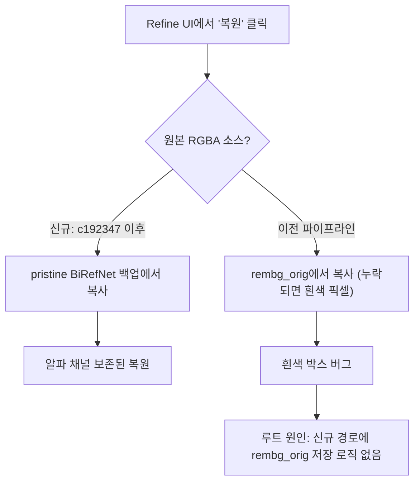

## 개요

핵심은 refine 플로우 수리였다. SAM2로 지운 영역을 복원할 때 원본 RGBA가 아니라 흰 배경이 그대로 들어와 "흰색 박스"가 찍히는 문제를 추적했다. 근본 원인은 `rembg_orig`가 신규 파이프라인에서 저장되지 않는다는 것. 루트 원인을 고친 뒤 파이프라인 전체에서 `rembg`라는 이름을 `matte`로 통일하는 리네임을 돌려 코드베이스 어휘를 정리했다. 병행으로 RunPod 워커의 Docker 이미지 pull denied 장애를 잡고, Google 로그인 + SQLite 사용자 로그 설계 스펙을 문서로 확정했다. 3개 세션, 커밋 5개, 총 3시간 54분.

[이전 글: popcon 개발 로그 #8](/posts/2026-04-16-popcon-dev8/)

<!--more-->



## SAM2 복원이 왜 흰 박스를 남겼나

첫 번째 세션에서 시작한 관찰은 이랬다 — "이전에는 흰 배경만 지우고 이펙트·요소를 다 잡아냈는데, 지금은 이펙트가 사라진다". Refine 화면에서 직접 클릭·복원을 반복하다 보니 SAM2 마스크가 정상인데도 복원 결과에 흰색 박스가 찍혔다.

백엔드 코드를 따라가 보니 `backend/main.py:211` 복원 경로가 이랬다.

```python
# 복원 로직 (수정 전)
for path in mask_paths:
    src = rembg_orig_dir / path.name   # 원본 RGBA가 여기 있어야 함
    if not src.exists():
        # fallback: 흰 배경 이미지에서 픽셀 복사
        src = rembg_dir / path.name
    shutil.copy(src, restore_dst)
```

문제는 `rembg_orig/` 디렉터리가 빈 채로 있는 잡이 많다는 점이었다. 두 가지 경로가 그렇다.

- **레거시 잡**: `rembg_orig`를 채우는 코드가 아직 커밋되지 않은 상태(`git status`에 `M backend/main.py`로만 남아 있던)로 처리된 잡들. `/tmp/popcon/jobs/`에 쌓인 대부분이 이 경우.
- **신규 파이프라인 잡**: GPU 워커에서 rembg를 BiRefNet으로 스왑한 뒤에도 백엔드는 디렉터리 이름을 그대로 `rembg/`로 쓰고 있었고, 복원 로직은 여전히 `rembg_orig`만 찾았다.

즉 `rembg_orig`가 "원본 RGBA를 백업해 두는 장소"라는 계약이 **일부 경로에서만 지켜지고 있었다**. 복원은 이 계약에 의존하고 있었고, 계약이 깨진 잡에서 폴백이 흰 배경 이미지를 집어서 픽셀을 복사한 것이 증상이었다.

## 수정 — pristine BiRefNet 백업

`c192347 fix(refine): hybrid SAM restore + pristine BiRefNet backup`의 핵심은 두 가지다.

1. **복원 소스를 `rembg_orig`에서 pristine BiRefNet 출력으로 변경.** BiRefNet이 뽑아낸 RGBA는 이미 투명도 마스크가 그대로 살아 있으므로, "이 프레임의 지우기 전 상태"로 항상 유효한 소스다.
2. **저장 타이밍을 BiRefNet 호출 직후로 이동.** SAM2가 지우기 전에 원본을 한 벌 복사해 두는 것이 아니라, BiRefNet 단계에서 파일을 쓰면서 백업도 같이 쓴다. 복원 경로는 이 백업을 읽는다.

프론트엔드 쪽 `frontend/app/refine/page.tsx`, `frontend/components/RembgRefineCanvas.tsx`, GPU 워커의 `birefnet_service.py`, `sam_service.py`가 함께 움직였다. Refine 캔버스는 복원 시 "저장된 pristine 상태"로 돌아가고, SAM2는 지우기 전 상태를 더 이상 별도 디렉터리에 저장할 필요가 없다.

## rembg → matte 리네임

복원이 고쳐진 뒤 사용자는 분명히 짚었다 — "근데 배경 제거 프로세스는 rembg에서 BiRefNet으로 바꾸기로 했잖아?" 맞는 지적이다. 커밋 `5af85f2`가 GPU 워커 안에서는 rembg → BiRefNet 스왑을 했지만, 백엔드 여기저기엔 아직 `rembg`라는 이름이 남아 있었다.

- 디렉터리 이름: `frames/{emoji}/rembg/` — BiRefNet 결과물이 들어 있는데 이름만 rembg.
- 엔드포인트: `POST /api/emoji/{id}/rembg-apply` — 함수 이름과 라우트가 모두 rembg.
- 프론트엔드 컴포넌트: `RembgRefineCanvas`.
- API 클라이언트: `rembgApply()`, `rembgFrames`.
- 타입: `RembgRefineCanvasProps`.

용어 불일치는 두 가지 비용을 낳는다. 첫째, 새로 들어오는 기여자가 "rembg"를 보고 `rembg` 파이썬 패키지를 떠올려서 틀린 멘탈 모델을 만든다. 둘째, 실제 백엔드에서 모델을 또 바꾸고 싶을 때(ToonOut 같은 anime 특화 포크로의 교체 등) 이름이 또 한 번 바뀌어야 한다.

`9e8d27c refactor: rename rembg to matte across the background-removal pipeline`에서 백엔드·GPU 워커·프론트엔드 10개 파일을 한꺼번에 `matte`로 바꿨다. Matte는 모델 독립적인 용어 — 배경 제거 알파 마스크를 가리키는 VFX 업계 표준 단어. 나중에 BiRefNet을 ToonOut으로 바꾸든 u2net으로 바꾸든 이 이름은 안 바뀐다. 프론트엔드는 `MatteRefineCanvas`로 대체되고 `RembgRefineCanvas`는 같은 커밋 안에서 삭제됐다. `backend/scripts/migrate_rembg_to_matte.py`는 기존 잡의 디스크 레이아웃을 옮기는 일회성 마이그레이션.

## RunPod Docker 이미지 pull denied

두 번째 세션은 RunPod 워커가 "image pull: wildboar7693/popcon-gpu-worker" 메시지에 영원히 걸려 있는 문제였다. 로그의 실제 에러는 이랬다.

```
error pulling image: Error response from daemon: pull access denied for
wildboar7693/popcon-gpu-worker, repository does not exist or may require
'docker login': denied: requested access to the resource is denied
```

RunPod에는 Docker Hub 자격증명이 등록되어 있지 않았고, 이미지는 private이었다. Docker 데몬은 auth-denied 실패를 계속 재시도하는 상태였다 — RunPod UI에는 "pending"으로만 보였지만 내부적으로는 계속 실패 중이었다. 당장의 조치는 이미지를 public으로 공개하고 이전에 access-error로 죽은 워커들을 제거한 것. 장기적으로는 RunPod의 Docker Registry Credential 기능으로 private을 유지할 방법을 짧은 마크다운 가이드로 정리했다.

Supply 이슈도 섞여 있었다 — "Supply of your primary GPU choice is currently low"라는 배너가 함께 떠 있었고, 12개 잡이 큐에 쌓여 있었다. 둘은 별개 문제다. GPU supply는 리전을 추가해 완화했고, Docker auth는 이미지를 public으로 풀어서 풀었다.

## 액션별 start frame 프롬프트 + 이모지 셋 24개 캡

세 번째 주제는 비교적 가벼운 기능 추가. `41aea71 feat: action-specific start frame prompts + cap emoji sets at 24`가 다음을 했다.

- **start frame 프롬프트를 액션별로 분리**. 지금까지 start frame 생성은 일반화된 프롬프트 하나로 모든 액션을 처리했는데, 액션별 프리셋을 `backend/presets.py`에 추가해 "angry"는 angry에 맞는 표정·자세 지침을 받도록 바꿨다.
- **이모지 셋을 24개로 캡**. 액션 선택 UI에서 사용자가 한 번에 생성할 수 있는 이모지 수를 24개로 제한. 이전에는 24를 넘겨도 받아들여지다가 파이프라인 중간에서 타임아웃이 났다. 프론트엔드·백엔드 양쪽에 상한을 박았다.

`frontend/components/ActionSelector.tsx`와 `CharacterUpload.tsx`가 상한을 시각화하고, `backend/pipeline/start_frame_gen.py`가 프리셋 딕셔너리를 소비한다.

## Google 로그인 + 사용자 로그 설계 스펙

마지막 주제는 코드가 아니라 문서. `0aaae34 docs(spec): Google login + user logs design`는 `docs/superpowers/specs/2026-04-17-google-login-user-logs-design.md`에 Google OAuth와 사용자 로그 DB 아키텍처를 확정했다. 스펙 자체는 네 가지 결정을 기록한다.

1. **인증 = Firebase Auth**. Google 로그인만 필요한 지금 단계에서 전용 auth 서버를 세우는 비용이 과하다. Firebase가 Google provider를 내장하고 Korea KYC까지 커버한다.
2. **사용자·잡 DB = SQLite (stage 1)**. 첫 스테이지는 유저 수가 적어 SQLite가 충분히 견딘다. 스키마는 `users`, `jobs`, `events` 세 테이블로 시작.
3. **전체 감사 추적(full audit trail)**. 결제는 아직 없지만 이벤트 테이블로 사용자 행동을 기록해 두고 과금 필드는 나중에 추가. `users`·`jobs`가 참조 대상, `events`는 append-only.
4. **익명 잡은 user_id=NULL로 기록**. 로그아웃 상태에서 시작한 잡은 유지하되, 로그인 후 뒤섞이지는 않는다. Job claim 로직을 지금 넣지 않는다(스테이지 2 이후).

이 스펙은 아직 구현되지 않았다 — 다음 인터벌에서 작업 시작할 스케폴딩이다.

## 커밋 로그

| 메시지 | 변경 |
|---|---|
| update the docker file | +? -? (Dockerfile만) |
| feat: action-specific start frame prompts + cap emoji sets at 24 | 5 files |
| docs(spec): Google login + user logs design | 1 file |
| fix(refine): hybrid SAM restore + pristine BiRefNet backup | 5 files |
| refactor: rename rembg to matte across the background-removal pipeline | 10 files |

## 인사이트

이번 인터벌의 중심 교훈은 **"이름 교체"와 "동작 교체"를 분리하면 치러야 할 비용이 복리로 커진다**는 것이다. `5af85f2`에서 GPU 워커만 rembg→BiRefNet으로 바꾸고 백엔드·프론트·디렉터리 레이아웃의 이름은 그대로 둔 결과, 복원 경로가 더 이상 존재하지 않는 계약(`rembg_orig` 백업)에 의존하게 됐고, 증상이 "흰색 박스"라는 애매한 UI 버그로만 보였다. 리팩터링할 때는 이름이 계약의 껍데기라는 점을 기억해야 한다. 내부 구현을 바꿀 거면 이름도 같이 바꾸거나, 이름을 유지하기로 결정했다면 외부에서 관찰 가능한 계약까지 유지해야 한다. 이번에는 이름을 바꾸기로 했고(matte), 앞으로 ToonOut·u2net·다른 어떤 matter로 바꿔도 이 용어는 안정적으로 살아남는다. SQLite 첫 스테이지 결정도 같은 패턴이다 — Firebase + Postgres 풀스택 세팅을 지금 하는 것이 "미래를 위한 투자"처럼 보이지만, 유저 수가 실제로 많아지기 전까지는 그 세팅이 비용만 낳고 편익은 없다. 작은 단계에서 작은 계약으로 시작하고, 계약이 깨지기 시작할 때만 키우는 것이 맞다.
