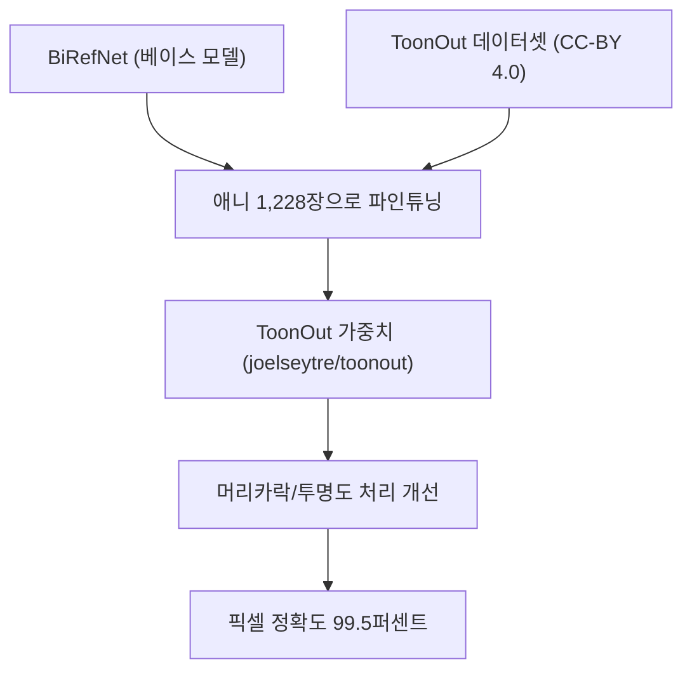
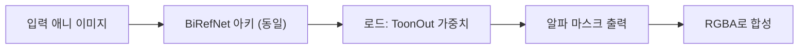

## 개요

[MatteoKartoon/BiRefNet](https://github.com/MatteoKartoon/BiRefNet) — 브랜드명 **ToonOut** — 은 인기 있는 고해상도 세그멘테이션 모델 [BiRefNet](https://github.com/ZhengPeng7/BiRefNet)의 포크로, 애니메이션 스타일 캐릭터에 특화 파인튜닝되었다. 가중치, 1,228장 학습 데이터셋, [arXiv:2509.06839](https://arxiv.org/abs/2509.06839) 논문, 그리고 작지만 잘 정돈된 코드베이스가 함께 공개됐다. GitHub 스타 92, 코드·가중치는 MIT, 데이터셋은 CC-BY 4.0. 수치가 인상적이다 — 도메인 파인튜닝 후 테스트셋 픽셀 정확도가 **95.3% → 99.5%**로 뛴다.

<!--more-->

## 왜 플러그인이 아니라 포크인가

범용 배경 제거 모델 — U²-Net, rembg, 심지어 일반 BiRefNet — 은 사진 이미지를 대상으로 학습된다. 애니메이션 캐릭터는 이 모델들이 조용히 가정하는 세 가지 전제를 무너뜨린다.

1. **머리카락 가장자리가 단단하다.** 사진의 머리카락은 가늘고 대비가 낮은 결이 섞여 있지만, 애니 머리카락은 단색 실루엣에 내부 구멍이 간헐적으로 있을 뿐이다. 사진 기반 모델은 머리카락 사이 틈에 배경이 번지게 하거나, 뾰족한 삐침을 지워 버린다.
2. **투명도가 광학이 아닌 스타일 요소다.** 반투명 마법 이펙트, 유리 장식, 베일 같은 요소는 사진에서처럼 부드러운 광 감쇠 없이 50% 알파로 그려진다. 사진 투명도로 학습된 모델은 없는 그라디언트를 환각한다.
3. **선화는 피사체의 일부다.** 캐릭터를 감싸는 얇은 검은 외곽선은 신호지 노이즈가 아니다. 사진 학습 세그멘터는 가끔 이걸 "엣지 아티팩트"로 잘라낸다.

ToonOut은 이 세 가지 케이스를 명시적으로 어노테이션한 데이터셋으로 파인튜닝해 해결한다. 논문은 이 모델이 "애니 스타일 이미지에 대한 배경 제거 정확도가 뚜렷하게 향상됐다"고 보고하고 — 보류셋에서 픽셀 정확도 4.2 포인트 상승이 그 주장의 측정 가능한 부분이다.

## 엔지니어링 디테일이 알차다

레포 구조를 보면 이건 연구 코드 투하가 아니라 재사용을 염두에 두고 다시 짠 결과물이다.

- **`train_finetuning.sh`** — 파인튜닝 중 NaN 그래디언트 폭발을 피하기 위해 데이터 타입을 **bfloat16**으로 명시적으로 전환한 설정. BiRefNet을 fp16으로 파인튜닝해 본 사람이라면 이게 어떤 고통을 피하는지 정확히 안다.
- **`evaluations.py`** — 원본 `eval_existingOnes.py`를 올바른 설정으로 깔끔하게 재작성. 원본 BiRefNet 평가 스크립트는 까다롭기로 유명해서, 신뢰할 수 있는 평가기를 확보하는 것이 절반의 승리다.
- **정돈된 폴더 구조** — 코드는 `birefnet/` (라이브러리), `scripts/` (Python 진입점), `bash_scripts/` (각 스크립트용 셸 래퍼)로 분리. 다섯 개 스크립트가 전체 라이프사이클을 커버한다: 분할, 학습, 테스트, 평가, 시각화. 세 개 유틸리티는 베이스라인 예측, 알파 마스크 추출, Photoroom API 비교를 담당.

하드웨어 고지는 솔직해서 신선하다 — "이 레포는 24GB VRAM의 GeForce RTX 4090 2개 환경에서 사용됐다." 번역: 더 작은 카드로 파인튜닝한다면 배치 사이즈를 조정해야 한다. 이 경고를 각주에 숨기지 않았다는 점이 좋다.

## 데이터셋 투명성

1,228장의 애니 이미지가 `train` / `val` / `test`로 분할되고, 각 분할은 다시 generation 폴더별로 조직된다(데이터셋이 감정·의상·액션 같은 여러 어노테이션 라운드에 걸쳐 반복적으로 구축됐음을 암시). 각 이미지는 세 가지 뷰로 존재한다.

- `im/` — 원본 RGB
- `gt/` — 정답 알파 마스크
- `an/` — 투명도가 합성된 RGBA

CC-BY 4.0 라이선스는 저작자를 표기하는 한 상업적 사용을 허용한다. 애니 관련 데이터셋치고는 드문 일이다 — 이 분야는 대개 비상업 라이선스 아니면 출처에 대해 침묵하는 "제발 소송 걸지 마세요" 영역에 머문다.

## 파이프라인에 어떻게 꽂히나

프로덕션 배경 제거 스택을 운영하는 사람(나도 [popcon](/posts/2026-04-15-popcon-dev7/)과 [hybrid-image-search-demo](/posts/2026-04-15-hybrid-search-dev14/)에서 운영 중)에게 ToonOut은 BiRefNet 모델 파일의 드롭인 교체다.

추론 경로는 그대로다 — 같은 아키텍처, 같은 입출력 스펙. 체크포인트만 바꾸면 애니 피사체의 머리카락·투명도가 개선된다. 단점: 사진 피사체 성능은 회귀한다. 파인튜닝이 도메인 특화이기 때문이다. 파이프라인이 실사와 스타일화된 입력을 모두 다룬다면, 앞단에 분류기를 두거나 모델 엔드포인트를 둘로 나눠야 한다.

## 빠른 링크

- [MatteoKartoon/BiRefNet GitHub](https://github.com/MatteoKartoon/BiRefNet) — 가중치·데이터셋·논문이 포함된 포크
- [arXiv:2509.06839](https://arxiv.org/abs/2509.06839) — 논문
- [joelseytre/toonout Hugging Face](https://huggingface.co/joelseytre/toonout) — 바로 쓸 수 있는 가중치
- [원본 BiRefNet](https://github.com/ZhengPeng7/BiRefNet) — 비교 대상

## 인사이트

ToonOut은 도메인 파인튜닝 경제학의 좋은 케이스 스터디다. 현대 기준으로 1,228장은 아주 작은 데이터셋이고 — 그럼에도 메운 픽셀 정확도 격차(이미 95% 이상이던 베이스라인에서 4.2 포인트)는 프로덕션에서 가장 중요한 라스트마일 개선에 해당한다. 흥미로운 패턴은 오픈소스 세그멘테이션 모델이 이제 패션·의료 분류기가 몇 년째 해 오던 방식으로 도메인 특화되고 있다는 것이다. 강력한 범용 백본을 가져오고, 도메인 데이터셋을 큐레이션하고, 파인튜닝하고, 둘 다 공개한다. 좋은 범용 모델의 비용이 충분히 낮아지면, 경쟁의 표면은 데이터 큐레이션과 도메인 특화로 옮겨 간다. 그래서 가중치와 데이터셋을 함께 공개하는 것이 어느 한쪽만 공개하는 것보다 중요하다 — 다음 포크가 500장을 더 추가해 재학습하고 수치를 다시 움직일 수 있기 때문이다.
