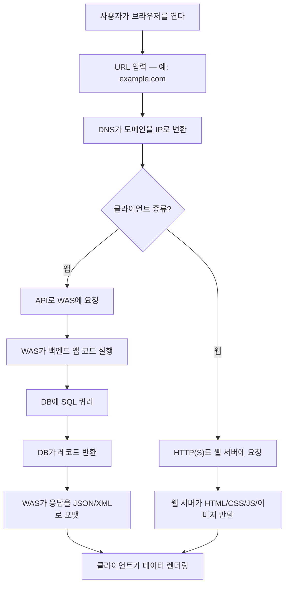
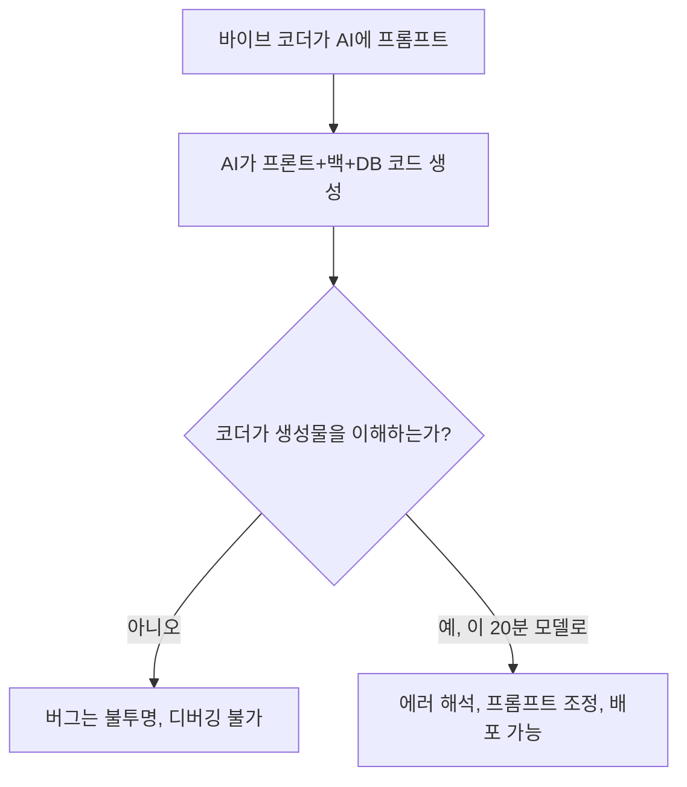

## 개요

**기솔루트 알렉**의 유튜브 영상 "프론트엔드 백엔드 데이터베이스 전체를 20분만에 보이게 해드립니다"는 스코프 압축의 작은 마스터클래스다. 약 20분 동안 브라우저 주소창에서 MySQL 행까지, 전체 요청 경로를 한 번에 훑으면서 모든 프로토콜과 컴포넌트를 — 기억에 남을 만큼만 — 기술적 무게를 실어 이름 붙인다. 영상은 내가 **바이브 코더를 위한 운영 리터러시**라 부를 카테고리에 속한다 — 만들기를 가르치는 영상이 아니라, 지금 만들고 있는 것을 읽는 법을 가르치는 영상이다.

<!--more-->

## 구조적 주장

알렉은 전체 강의의 프레임을 잡는 구조적 주장으로 연다 — **대부분의 시스템은 프론트엔드 + 백엔드로 구성되고, 백엔드는 서버 + 데이터베이스로 이루어지며, 둘 사이는 네트워크 프로토콜로 통신한다**. 거기서부터 각 계층을 펼친다.

프론트엔드가 하는 일은 세 가지뿐이다.

1. **화면 렌더링** — 브라우저의 웹 페이지 또는 폰의 네이티브 화면
2. **이벤트 처리** — 버튼 클릭, 폼 제출, 터치
3. **데이터 송수신** — HTTP(S)로 서버와 주고받기

끝. React 대 Vue 논쟁으로 빠지지도, 프론트엔드 빌드 시스템이나 디자인 시스템 이야기로 새지도 않는다. 요점은 *역할*이지 취향이 아니다.

## DNS와 도메인-IP 다리

좋았던 디테일 — 알렉은 **도메인으로는 접속할 수 없고, 오직 IP로만 접속할 수 있다**는 점을 명시적으로 짚는다. DNS가 번역 레이어다. 프로토콜 이름도 제대로 붙인다. HTTP는 "HyperText Transfer Protocol"이고 HTTPS의 S는 그 위에 얹힌 보안. 바이브 코드된 AI 어시스턴트로 빌드하는 시청자에게 이건 진짜로 쓸모가 있다 — Claude나 Cursor가 생성한 `.env`에 `API_URL=https://...`가 있을 때, 그 문자열이 런타임에 무엇이 되는지에 대한 멘탈 모델이 이제 생긴다.

## 웹 서버 vs 애플리케이션 서버

초보에게 가장 꽂힐 지점이라고 본다. 알렉은 구분한다.

- **웹 서버** (Apache, Nginx): **정적** 파일을 서빙. HTML, CSS, JavaScript, 이미지. 고정된 콘텐츠를 있는 그대로 반환.
- **웹 애플리케이션 서버 — WAS**: **동적** 콘텐츠를 서빙. 코드가 실행되고, 데이터가 쿼리되고, 응답이 요청마다 새로 조립된다.

웹 서버는 콘텐츠가 미리 정해진 경우를 담당한다 — 랜딩 페이지, 마케팅 이미지, JS 번들. WAS는 비즈니스 로직이 사는 곳이다 — API 엔드포인트, DB 쿼리, 인증 체크, 사용자별/요청별로 달라지는 모든 것.

그다음 시청자가 실제로 마주할 스택 선택지를 짚어 준다.

- **Java** → Spring / Spring Boot
- **Python** → Django / Flask
- **JavaScript** → Node.js + Express

이름을 붙인 건 의도적이다. `from flask import Flask`가 적힌 `server.py`를 보는 바이브 코더는 이제 "아, 이게 스택의 WAS 부분이구나"를 안다. 어휘가 이해를 연다.

## CRUD와 SQL — 데이터 어휘

데이터베이스 섹션은 **CRUD** — Create, Read, Update, Delete — 약어를 소개하고, 대부분의 REST API가 쓰는 네 가지 HTTP 메서드와 매핑한다.

| HTTP 메서드 | CRUD 연산 | SQL 키워드 |
|---|---|---|
| POST | Create | INSERT |
| GET | Read | SELECT |
| PUT | Update | UPDATE |
| DELETE | Delete | DELETE |

또한 친숙한 엑셀 시트 비유로 **테이블 / 로우 / 컬럼** 어휘를 도입한다. 로우 = 레코드(한 사용자, 한 상품). 컬럼 = 필드(id, email, name). 신규 가입 = 로우 하나 추가. 추상화를 현실에 붙여 준다. 엑셀을 열어 본 사람이라면 SELECT가 뭘 반환하는지 그려 볼 수 있다.

## 의도적으로 생략한 것

강의는 약 20분이다. 알렉이 *다루지 않는* 것이 다루는 것만큼 시사적이다.

- **마이크로서비스, 큐, 캐시 언급 없음.** 너무 이르다 — 이것들은 베이스라인 위에 얹는 최적화다.
- **프레임워크 취향 없음.** 스택을 나열하지만 처방하지는 않는다.
- **ORM vs 생 SQL 논쟁 없음.** SQL을 통한 CRUD가 개념이고, Prisma냐 Hibernate냐는 디테일.
- **배포·DevOps 없음.** 돌아가게 만드는 것이 확장보다 먼저다.

이 절제 덕분에 강의가 20분 안에서 쓸모 있게 유지된다. "클라우드 제공자"나 "컨테이너 오케스트레이션"에 1분을 쓰는 순간, 핵심 멘탈 모델의 1분이 밀려난다.

## AI 코딩 앱에 왜 중요한가

AI 생성 코드의 부상은 개발자의 일을 작성에서 **감사(audit)**로 옮긴다. 그 일은 정확히 알렉의 강의가 설치해 주는 어휘를 요구한다 — WAS가 뭔지, CRUD가 뭔지, JSON 응답이 뭔지, DNS가 뭘 하는지. 그 어휘 없이는 바이브 코드된 앱이 블랙박스가 되어 에러마다 미스터리가 된다. 있으면 AI는 실제로 리뷰 가능한 동료가 된다.

이 채널의 이전 "IT 개요" 영상이 잘 된 데는 이유가 있고, 알렉은 이 후속 영상을 "기술적 깊이를 한 단계 더 올린 것"이라고 명시적으로 포지셔닝한다. 청중은 분명 AI로 빌드하며 리터러시를 빨리 필요로 하는 사람들이지 — 4년제 CS 학부생이 아니다.

## 빠른 링크

- [유튜브: 프론트엔드 백엔드 데이터베이스 전체를 20분만에 보이게 해드립니다](https://www.youtube.com/watch?v=l5z6UNa-ons) — 원본 영상
- [HTTP MDN 개요](https://developer.mozilla.org/ko/docs/Web/HTTP) — 프로토콜 심화
- [PostgreSQL 튜토리얼](https://www.postgresql.org/docs/current/tutorial.html) — SQL을 손으로 익히기 좋은 곳

## 인사이트

알렉 강의의 가장 큰 가치는 어떤 특정한 사실이 아니라 — **스코프에 대한 약속**이다. 20분 안에 완결된 멘탈 모델을 준다는 것은 설계 선택이고, 그 선택은 깊이 대신 커버리지를 사는 것이다. 청중에게는 그 트레이드가 맞다. 스택의 윤곽을 아는 바이브 코더는 AI에게 백엔드 버그를 고쳐 달라고 프롬프트할 수 있다. React는 깊게 알지만 "WAS"라는 단어를 들어 본 적 없는 바이브 코더는 깨진 API를 배포하고 이유를 모를 것이다. 알렉이 거는 교육적 베팅은 — **AI 시대에는 프레임워크 숙련도보다 운영 리터러시가 더 빨리 복리 이자를 낳는다** — 는 것이며, 옳아 보인다. 프레임워크 지식은 도구가 바뀌며 감가상각되지만 HTTP-DNS-SQL 삼각형은 25년째 안정이고 앞으로 25개 프레임워크보다 더 오래 살 것이다. 모든 바이브 코드된 앱은 결국 그 삼각형 위에 서 있다 — 프롬프트한 사람이 알든 모르든.
