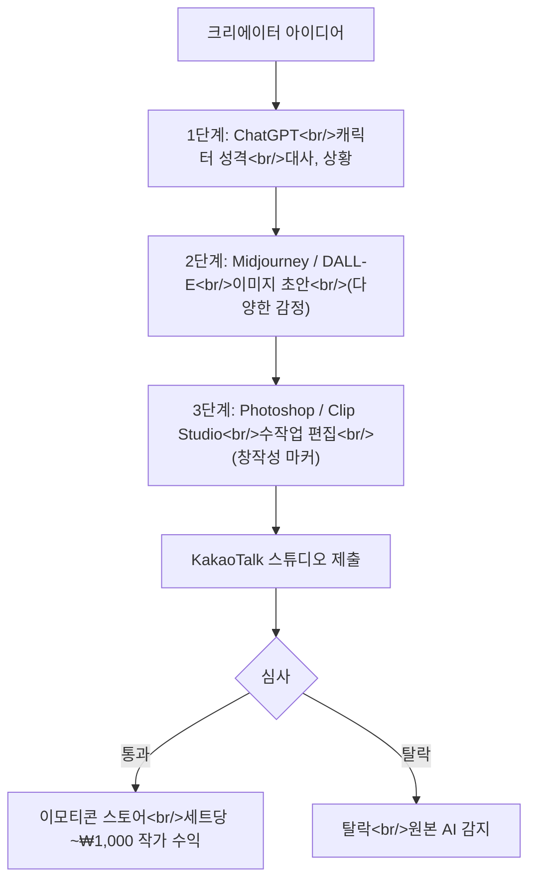

## 개요

YouTube 영상 ["ChatGPT로 만든 이모티콘, 진짜 카톡에 판매 가능할까?🤔"](https://www.youtube.com/watch?v=syJ0TPmJxJI)가 대부분의 AI 이모티콘 글이 얼버무리는 포인트를 짚는다 — **KakaoTalk은 2023년 9월부터 AI 생성 이미지를 바로 쓴 이모티콘 제출을 제한한다.** 그런데도 AI를 활용한 이모티콘을 꾸준히 출하하는 크리에이터가 있다. 이유는 특정 워크플로 — AI는 이데이션에, 수작업 편집은 실제 이미지에 — 이며, 이 구분이 공식적으로 심사를 통과할 만큼의 창작성으로 인정된다.

<!--more-->

## 왜 이게 중요한가

AI에서 이모티콘으로 직행하는 파이프라인은 직관적이다. AI가 대사를 쓰고, AI가 캐릭터를 그리고, 크리에이터가 업로드. 영상에서 인용된 KakaoTalk 공식 입장: *"AI 생성물을 활용한 이모티콘은 해당 이미지의 저작권 문제와 창작성 여부를 꼼꼼히 검토한 후 입점을 제한하고 있습니다."*

두 가지 caveat가 이 상황을 작동하게 한다:

1. **심사는 비공개.** KakaoTalk은 AI 생성을 어떻게 감지하는지 설명하기를 거절했다. *"이모티콘 심사 절차 관련해서는 외부에 공개하지 않고 있습니다."*
2. **도구로서의 AI는 허용.** 콘셉트는 AI로, 전달은 수작업 편집으로 한 크리에이터는 통과한다. 라인은 *최종 산출물에서 증명 가능한 창작성*.

## 3단계 워크플로

### 1단계: 콘셉트용 ChatGPT

ChatGPT는 그림을 그리는 게 아니라 대본을 쓴다. 영상의 예시 프롬프트:

> *"말을 하는 귀여운 햄스터 캐릭터가 혼잣말처럼 말하는 열 가지 짧은 문장을 만들어 줘."*

모델은 이런 대사를 돌려준다:
- "애구 또 간식 숨겨 놨는데 어디더라?"
- "햇살 좋다. 나 오늘 아무것도 안 할 거야."

자연스러운 이모티콘 대사로 읽힌다. 캐릭터 성격·세계관·말투를 앞에 많이 싣을수록 스케일이 좋다. ChatGPT가 가장 잘하는 것 — 내러티브 보이스 생성 — 을 하고 있다.

### 2단계: 초안용 이미지 모델

콘셉트가 잡힌 뒤 Midjourney / DALL-E / Bing Image Creator가 초안을 낸다. 프롬프트 패턴:

> *"귀엽고 통통한 갈색 햄스터가 화난 얼굴로 팔짱 끼고 있는 장면, 이모티콘 스타일."*

**영상의 팁:** 한 장만 만들지 말라. 24개 감정 세트를 먼저 기획하고 배치 프롬프트. 화남, 슬픔, 기쁨, 놀람, 졸림, 배고픔, 호기심, 신남, 지루함, 당황함 등. 이모티콘 세트는 개별 이미지 품질이 아니라 **감정 범위**로 팔린다.

### 3단계: 수작업 편집 (창작성 단계)

심사에 결정적인 단계. 영상의 직접적 조언: *"AI가 생성한 이미지 그대로는 쓸 수 없습니다."*

창작성을 세우는 편집:
- **Clip Studio Paint / Photoshop에서 다시 그리거나 트레이싱.** AI 레퍼런스를 손으로 다시 그린 버전은 명확한 크리에이터 작업.
- **24장에 걸쳐 스타일 통일.** AI 출력은 이미지 사이에서 드리프트한다 — 이를 시각적으로 일관된 세트로 통일하는 건 실질적 창작 작업.
- **테두리·색·비율 조정.** KakaoTalk의 시인성 가이드라인(굵은 테두리, 작은 크기에서 또렷한 모양)에 맞춘다.

편집 후 KakaoTalk 이모티콘 스튜디오의 표준 심사를 거친다.

## 수익 계산

KakaoTalk의 수익 구조:

- **판매가:** 유료 이모티콘 세트당 ₩2,500.
- **작가 수익률:** 대략 35–40%. 세트당 약 ₩1,000.
- **1,000세트 판매 = 약 ₩100만 작가 수익.**

영상은 **취미 작가들이 월 ~₩5만** 부수입을 얻는 사례가 많다고 지적한다. 상방은 비선형으로 스케일한다 — SNS 노출을 탄 히트 세트는 스토어 인기 랭킹에 올라가고, 랭킹이 다시 판매를 끌어올린다. 분포는 롱테일이지만 상위 1%의 상금은 진짜다.

## 심사가 실제로 걸러내는 것

영상이 나열한 KakaoTalk 심사 축:
- **세상도 체크** — 이모티콘이 인지 가능한 캐릭터 세계에 맞는가?
- **말풍선 위치와 투명도** — 기술 준수.
- **텍스트 표현** — 대사가 자연스러운가?
- **저작권** — 큰 것. 크리에이터 수정 없는 AI 생성 이미지가 여기 걸린다.

2023-09 이후 "명백한 AI 출력"의 탈락률이 올랐다. 통과하는 크리에이터는 경험적으로 편집 단계를 넣는 사람들.

## 정책 드리프트

영상에서 플래그할 만한 디테일: **"2024년 하반기부터는 AI 활용 여부와 무관하게 기획력 중심의 심사 기준도 적용될 예정"이다.** 세트에 명확한 콘셉트, 스토리가 있는 캐릭터, 감정을 잘 전달한다면 AI가 워크플로의 일부여도 통과할 확률이 더 높다. 궤적은 *"AI가 탈락 사유"*에서 *"AI는 중립, 창작성이 기준"*으로 이동 중.

## 인사이트

KakaoTalk 상황은 더 넓은 AI 콘텐츠 정책 진화의 구체적 케이스다: **2023년에 AI 출력을 금지한 플랫폼이 "도구로서의 AI는 괜찮다. 가공 없는 AI 출력은 아니다"로 이동하고 있다.** ChatGPT + 그림 도구를 쓰는 크리에이터에게는 워크플로가 생존 가능하고 수익성까지 있지만, 수작업 편집 단계는 선택지가 아니다. AI 초안을 법적·심사적으로 크리에이터 소유 저작물로 변환하는 단계다. 이모티콘 생성 도구 공간(popcon, Amoji)에 대한 병행 함의는 **KakaoTalk에 스케일로 도달하려면 출력이 직접 AI 렌더 이상이어야 한다** — 프로덕트 안에 의미 있는 편집 패스를 넣거나, 완성 이모티콘 도구가 아니라 이데이션 도구로 포지셔닝해야 한다. LINE은 지금은 더 우호적인 첫 시장. 후처리 스토리가 성숙한 뒤에 KakaoTalk.
