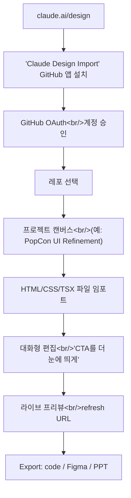

## 개요

Anthropic이 **Claude Design**을 claude.ai/design에 공개했다 — 슬라이드 덱, 웹사이트, 와이어프레임, 3D 그래픽을 만들고 GitHub 레포에서 바로 임포트하며 PowerPoint·Canva·코드로 내보내는 대화형 캔버스. 실제 문제(PopCon 프론트엔드 다듬기)에 써보고 정리한 1차 리뷰다 — 무엇인지, 어디와 붙는지, 어디서 부족한지.

<!--more-->

## Claude Design이란 실제로 무엇인가

커뮤니티의 짧은 YouTube 튜토리얼이 정리한 포지셔닝: "Canva, Figma, Google Slides가 앞으로 필요 없을지도 모른다 … 말로 Claude design에게 시키면 슬라이드 덱, 웹사이트, 와이어프레임을 거의 뭐든 만든다." 셀링 포인트 두 개가 있다. **스크린샷·코드·GitHub 레포로 브랜드 매치**, 그리고 **기존 디자인 툴로 바로 내보내기**. 첫 번째는 Claude Artifacts의 진화를 봐온 사람에겐 친숙하다. 두 번째가 진짜 변화 — 이 부분이 Claude Design을 장난감에서 기존 디자인 워크플로의 한 단계로 바꾼다.

URL 구조가 아키텍처를 드러낸다:

- `claude.ai/design` — 랜딩·프로젝트 표면
- `claude.ai/design/p/{project-uuid}` — 프로젝트
- `claude.ai/design/p/{project-uuid}?file={FileName}.html` — 프로젝트 안 특정 아티팩트
- `{project-uuid}.claudeusercontent.com/v1/design/projects/{project-uuid}/serve/{File}.html?_r={timestamp}` — 프로젝트별 라이브 프리뷰 서브도메인

프리뷰는 `claudeusercontent.com`의 프로젝트별 서브도메인에서 서빙 — Artifacts와 동일 패턴. `?_r=` 쿼리 파라미터는 캐시 무효화 리프레시 토큰.

## GitHub 임포트 플로우

가장 궁금했던 부분 — 실제 레포 임포트 — 이 셋업이 가장 길었다. 플로우:

1. Design 홈에서 "Install Claude Design Import" 클릭 → GitHub 앱 설치 페이지(`github.com/apps/claude-design-import`)로 리다이렉트.
2. 설치 대상(사용자 또는 org)과 접근 허용할 레포 선택. 앱은 스코프가 있다 — Claude Design이 읽을 수 있는 레포를 지정한다.
3. GitHub가 `claude.ai/design/v1/design/github/callback?code=...&state=...`로 OAuth 콜백.
4. 두 번째 라운드 `...github/callback?code=...&installation_id=...&setup_action=install`이 앱 설치를 확정.

여기서부터 레포 기반 프로젝트를 만들면 — 내 경우 **popcon-ui-refinement** — Claude가 파일에 직접 접근한다. 특정 파일을 캔버스로 열고(`PopCon UI Refinement.html`) 대화형으로 반복하면서 라이브 프리뷰가 업데이트된다.

해보려는 사람을 위한 플래그 두 개:

- **앱 스코프는 사용자 단위.** Claude와 쓰는 GitHub 주계정이 다르면 OAuth 2단계를 각 identity마다 거쳐야 한다.
- **프리뷰 서브도메인은 동적.** 프리뷰 URL을 북마크하면 프로젝트 수명 동안은 동작하지만 `?_r` 리프레시 토큰은 만료된다 — `/v1/design/preview/refresh`가 백엔드를 주기적으로 때리는 걸 보게 되는데, 이게 세션을 살아있게 유지하는 콜이다.

## 잘하는 것 (과 못하는 것)

**좋다:** 단일 파일·아티팩트의 빠른 비주얼 반복. "스크린샷에서 브랜드 매치"는 실제다 — 레퍼런스 이미지에서 색과 타입을 꽤 잘 집어낸다. 생성된 레이아웃도 레퍼런스의 스페이싱 관습을 지킨다. 프레젠테이션 덱과 마케팅 페이지라면 내가 써본 가장 빠른 0→초안 툴이다.

**엇갈린다:** *실제* 코드베이스 임포트. GitHub 앱이 접근 권한을 주지만 Cursor나 Claude Code처럼 프론트엔드를 **이해**하지는 않는다. 파일을 컴포넌트 그래프가 아니라 디자인 아티팩트로 읽는다. 그래서 "리액트 코드베이스의 이 버튼을 고쳐줘"는 여전히 Claude Code에 레포를 체크아웃한 쪽이 더 낫다.

**아직이다:** 라운드트립 편집. 코드를 export 할 수 있지만 export가 소스에 대한 PR이 아니라 새 아티팩트다. 레포에 진짜 컴포넌트 라이브러리(Button, Input 등)가 있어도 Claude Design은 그 컴포넌트를 수정하지 않는다 — 그 컴포넌트로 만든 **것처럼** 보이는 디자인을 만든다. 이 간극이 정확히 디자인 툴이 개발 가속기가 아니라 병목으로 바뀌는 지점이다.

## 실제 워크플로에 어떻게 꽂히는가

PopCon의 경우, 가치는 좁지만 실제적이었다: **디자인-핸드오프 HTML을 생성**하면 엔지니어링 쪽(여기선 Claude Code)이 그걸 React 컴포넌트로 번역한다. 그게 popcon 레포의 `docs/design_handoff/README.md`가 하는 일이다 — Claude Design 아티팩트가 비주얼의 단일 진실이 되고, Claude Code가 그걸 읽고 구조적 리팩터링을 수행한다. 루프는:

1. Claude Design: 대화형 디자인 반복, HTML export.
2. Claude Code: HTML을 읽고 실제 컴포넌트 라이브러리로 TSX 구현.
3. 브라우저 프리뷰 + QA, 다음 라운드는 다시 Claude Design.

이건 1-툴이 아니라 2-툴 패턴이다. Claude Design은 이데이션·핸드오프 표면. Claude Code는 구현 표면.

## 인사이트

Claude Design은 **구현 전 루프**에 진짜 유용하다 — 모호한 "더 깔끔하게"를 엔지니어(나 에이전트)가 받을 수 있는 구체적 HTML 아티팩트로 바꾼다. 아직은 레포의 프로덕션 컴포넌트 라이브러리를 in-place로 편집하는 도구가 아니다. Figma·Canva를 겨냥한 포지셔닝은 그린필드 덱과 마케팅에는 합리적이다. 기존 코드베이스 프로덕트 UI 작업에 대해서는 솔직한 프레이밍이 "Claude Design이 비주얼 스펙을 만들고, Claude Code가 구현한다." 그래도 이건 "Figma 목업 → 엔지니어가 눈대중 → 손으로 TSX"보다 한 단계 위다. HTML이 실행 가능하고, 행동 디테일(hover, focus ring, 스페이싱)이 이미 구체적이니까. 빠진 원시 기능은 **실제 컴포넌트 라이브러리를 통한 라운드트립** — 그게 들어오면 2-툴 루프가 1-툴로 접힌다.
