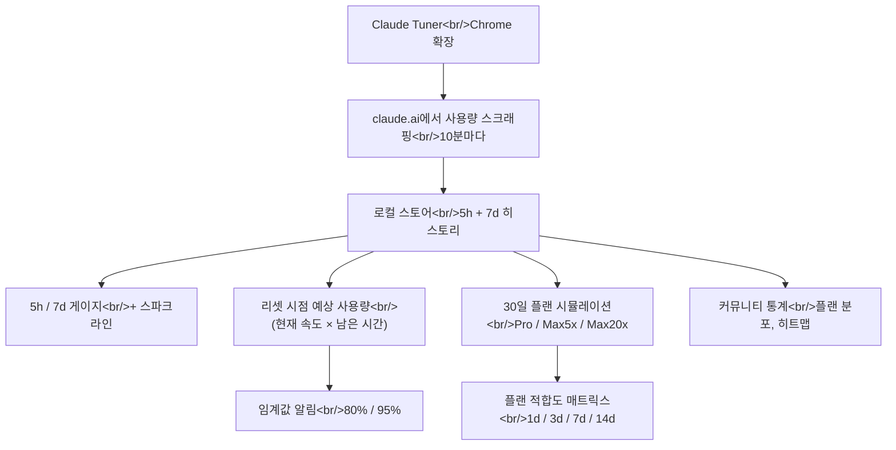

## 개요

[Claude Tuner](https://claudetuner.com/)는 Claude.ai 자신이 거부하는 한 가지를 하는 Chrome 확장이다. **실시간으로 레이트 리밋 근처 어디에 있는지, 다음 리셋까지 한계를 넘을 가능성이 얼마나 되는지 보여준다.** 덤으로 30일의 실제 사용 패턴을 기반으로 맞는 플랜을 추천한다. Max 20x에 있으면서 정작 다 쓰는지는 모르고 있어서 이번 주에 설치했는데, 헤비 유저라면 다들 그렇듯 결과는 놀라웠다.

<!--more-->

## 왜 이게 존재하는가

Anthropic은 각 플랜의 레이트 리밋 수치는 공개하지만, **지금 그 안의 어디쯤인지** 보여주는 대시보드는 주지 않는다. 실제 프로덕트 갭이다. 월 $200을 내는 Max 20x 사용자가 값어치를 뽑는지 모른다는 건 말이 안 되고, Pro 사용자는 경고 없이 세션 중간에 벽을 친다. Claude Tuner는 claude.ai에서 사용량을 직접 긁어서 로컬 히스토리를 유지하며 이 갭을 채운다.

핵심 화면:

- **5h / 7d 듀얼 게이지** + 스파크라인 히스토리 + 리셋 카운트다운. 배지는 OK / Caution / Danger.
- **리셋 시점 예상 사용량.** 현재 속도(예: +3.2%/h)를 받아 외삽. 85.2%에서 +3.2%/h 속도로 1h 42m 남았다면 ~92%에 도달한다고 알려준다.
- **80% / 95% 임계값 알림.** 둘 다 쓸모 있다 — 80%는 행동을 바꿀 시간, 95%는 "지금 멈춰."

## 플랜 적합도 매트릭스

이 기능이 프로덕트를 다르게 보게 만든다. 30일의 실제 사용을 받아 각 플랜의 리밋과 4개 윈도우에서 대조한다:

| Plan      | 1d | 3d | 7d | 14d | Cost   |
|-----------|----|----|----|-----|--------|
| Pro       | ×  | ✓  | ✓  | ✓   | $20    |
| Max 5x ★  | ✓  | ✓  | ↓  | ↓   | $100   |
| Max 20x   | ↓  | ↓  | ↓  | ↓   | $200   |

- **×** 초과 (리밋을 쳤을 것)
- **✓ Tight** 아슬아슬하게 맞음
- **✓ Fit** 여유 있음
- **↓ Overspend** (필요 이상의 플랜)

도구는 모든 윈도우에서 ✓로 표시되는 가장 작은 플랜을 추천한다. 랜딩의 예시에서는 Max 20x 사용자가 "Max 5x로 바꿔, 월 $100 절약" 추천을 받는다 — 30일 히스토리가 Max 5x의 7d 캡에 근접도 하지 않았으니까.

## 커뮤니티 통계 — 의외로 유용

Claude Tuner는 익명화된 커뮤니티 데이터를 집계한다: 플랜 분포, 플랜별 평균 활용, 24h × N-day 활동 히트맵, 토큰 사용 리더보드. 개인 게이지 다음으로 유용한 기능이었다. Max 20x 사용자 중 활용 상위 10%에 있다는 시그널과 하위 20%에 있다는 시그널은 완전히 다르다 — 하나는 플랜을 정당화하고, 하나는 다운그레이드를 시사한다.

참고 수치:

- 활성 사용자 2,300+, 조직 100+.
- Pro, Max 5x, Max 20x, Team + 프리 티어 지원.
- 10분 간격 자동 수집.
- 30일 일별 트렌드와 시간대별 활동 패턴은 로컬 타임존에서 계산.

## 팀 기능 — Team 플랜 없이도

팀 기능이 영리한 쐐기다. Claude의 Team 플랜은 비싸지만, 많은 조직이 원하는 건 "누가 리밋을 치고 있고, 우리 시트가 제대로 사이징 됐는지"에 대한 **가시성**뿐이다. Claude Tuner는 Team 플랜 없이 **도메인 기반 팀 집계**를 제공한다 — 멤버가 확장을 설치하고, 백엔드가 이메일 도메인으로 집계하고, 관리자는 다음을 본다:

- KPI 대시보드 (팀 평균, 브리치 카운트)
- 멤버별 브리치 추적 + 플랜 추천
- 월간 비용 분석 + 멤버별 최적화 시뮬레이션
- 토큰 사용 리더보드
- CSV / Excel / PDF 내보내기

"시트가 제대로 사이징 됐나?"에 답하려고 Team을 지불하는 대안으로 진짜다.

## 우려와 caveat

- **스크래핑 조건.** 확장이 claude.ai에서 사용량을 읽는다. Anthropic ToS가 명시적으로 막지는 않지만, 페이지 구조가 안정적으로 남아있어야 한다는 의존성이 있다. 미래의 Claude.ai 리디자인이 수집을 하룻밤에 깨뜨릴 수 있다.
- **프라이버시.** 사이트는 익명화된 집계 통계를 넘어선 서버사이드 토큰 로깅에 대해 말하지 않는다. Claude로 민감한 것을 다룬다면 설치 전에 개인정보 처리방침을 꼼꼼히 읽어야 한다.
- **예측 정확도.** 리셋-시점-예상은 최근 속도의 선형 외삽이다. 워크로드가 꾸준하면 맞다. 헤비 세션을 끝내기 직전이면 오버슛한다.

## 인사이트

Claude Tuner의 존재 자체가 Claude의 프로덕트 갭에 대한 코멘트다: **대시보드 없는 레이트 리밋은 기능을 가장한 버그다.** 월 $100–200을 내는 사용자가 값어치를 뽑는지 알려고 서드파티 툴을 설치해야 한다는 건 말이 안 된다. 하지만 갭이 있는 상태에서 Claude Tuner는 놀라울 만큼 사려 깊은 필러다 — 플랜 적합도 매트릭스가 특히 모호한 "내가 과지불하고 있나?" 느낌을 30일 데이터에 근거한 구체적 답으로 바꾼다. 개인 레벨 **그리고** 조직 레벨에서 Team 플랜 없이 동작하는 쐐기는 "Chrome 확장일 뿐"을 진짜 프로덕트로 만든다. Claude에 월 $50 이상을 쓰고 있고 사용 모양을 한 문장으로 설명할 수 없다면, 이걸 설치하고 일주일간 보라.
